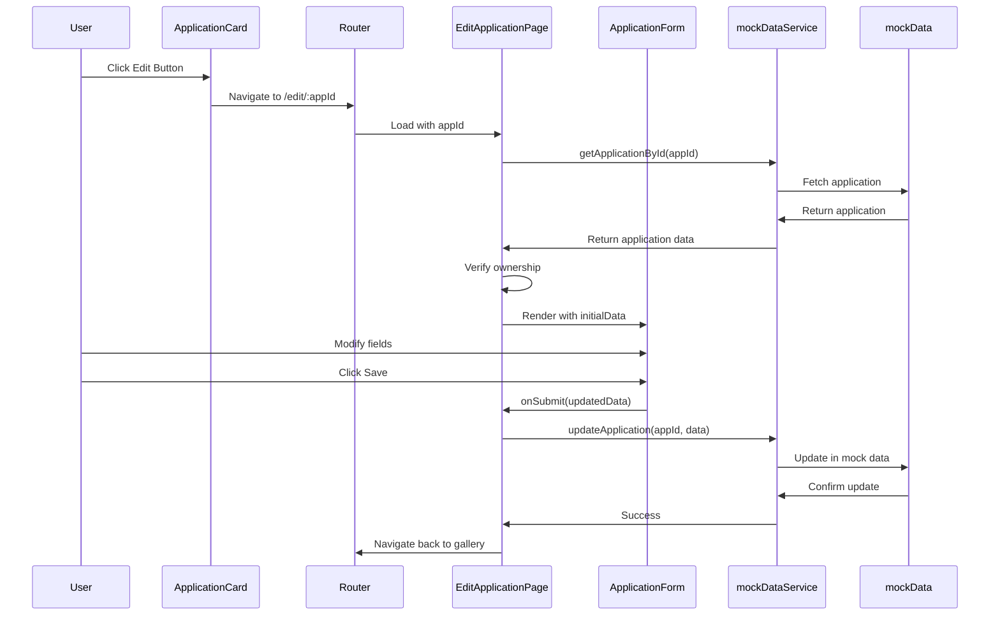
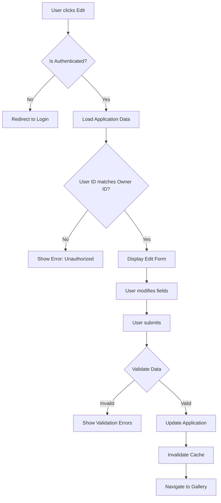

# Design Document

## Overview

The Application Editing feature extends the MadeWithKiro platform to enable application owners to modify their previously submitted applications. This design builds on the existing MVP architecture, reusing the ApplicationForm component in edit mode and adding authorization checks to ensure only owners can edit their applications.

### Key Design Principles

1. **Component Reuse**: Leverage existing ApplicationForm component with edit mode support
2. **Authorization First**: Validate ownership before allowing any edit operations
3. **Optimistic Updates**: Update UI immediately while persisting changes
4. **Mobile-First**: Maintain responsive design for editing on any device
5. **Graceful Degradation**: Handle errors without losing user data

## Architecture

### High-Level Edit Flow



### Authorization Flow



## Components and Interfaces

### 1. ApplicationCard Enhancement

**Add Edit Button:**

```typescript
interface ApplicationCardProps {
  application: Application;
  currentUserId?: string; // From auth context
  onEdit?: (appId: string) => void;
}
```

**Changes:**

- Add conditional edit button when `currentUserId === application.userId`
- Edit button navigates to `/edit/:appId`
- Button only visible to authenticated users viewing their own apps
- Mobile-friendly button with 44x44px minimum touch target

### 2. EditApplicationPage (New Component)

**Purpose:** Page component that handles edit flow and authorization

```typescript
interface EditApplicationPageProps {
  appId: string; // From route params
}

interface EditApplicationPageState {
  application: Application | null;
  isLoading: boolean;
  error: string | null;
  isAuthorized: boolean;
}
```

**Responsibilities:**

- Fetch application data by ID
- Verify user ownership (authorization check)
- Pass data to ApplicationForm as initialData
- Handle form submission
- Navigate back on success or cancel
- Display loading and error states

### 3. ApplicationForm Enhancement

**Current State:** Already supports `initialData` prop for edit mode

**Additional Enhancements:**

- Add `mode` prop to distinguish between "create" and "edit"
- Update button text based on mode ("Save Application" vs "Update Application")
- Preserve original data for cancel functionality (already implemented)
- Add unsaved changes warning on navigation

```typescript
interface ApplicationFormProps {
  onSubmit: (data: ApplicationFormData) => void | Promise<void>;
  onCancel: () => void;
  initialData?: Partial<ApplicationFormData>;
  mode?: "create" | "edit"; // New prop
}
```

### 4. Service Layer Updates

**Add Update Operation:**

```typescript
// mockDataService.ts
export async function updateApplication(
  appId: string,
  data: ApplicationFormData,
  userId: string
): Promise<Application> {
  // Validate ownership
  const existing = getApplicationById(appId);
  if (!existing) {
    throw new Error("Application not found");
  }
  if (existing.userId !== userId) {
    throw new Error("Unauthorized: You can only edit your own applications");
  }

  // Update application
  const updated = updateApplicationInStore(appId, data);
  return Promise.resolve(updated);
}

export async function getApplicationById(
  appId: string
): Promise<Application | null> {
  const app = findApplicationById(appId);
  return Promise.resolve(app ?? null);
}
```

**Mock Data Store Updates:**

```typescript
// mockData.ts
export function updateApplicationInStore(
  appId: string,
  data: Partial<Application>
): Application {
  const index = applications.findIndex((app) => app.appId === appId);
  if (index === -1) {
    throw new Error("Application not found");
  }

  // Preserve immutable fields
  const updated: Application = {
    ...applications[index],
    ...data,
    appId: applications[index].appId, // Never change ID
    userId: applications[index].userId, // Never change owner
    createdAt: applications[index].createdAt, // Never change creation time
    updatedAt: new Date().toISOString(), // Update timestamp
  };

  applications[index] = updated;
  return updated;
}

export function getApplicationById(appId: string): Application | undefined {
  return applications.find((app) => app.appId === appId);
}
```

### 5. Tanstack Query Integration

**Add Mutation Hook:**

```typescript
// hooks/useApplications.ts
export const useUpdateApplication = () => {
  const queryClient = useQueryClient();
  const { currentUserId } = useMockAuth();

  return useMutation({
    mutationFn: ({
      appId,
      data,
    }: {
      appId: string;
      data: ApplicationFormData;
    }) => mockDataService.updateApplication(appId, data, currentUserId!),

    onSuccess: (updatedApp) => {
      // Invalidate and refetch relevant queries
      queryClient.invalidateQueries({ queryKey: ["applications"] });
      queryClient.invalidateQueries({
        queryKey: ["applications", "user", updatedApp.userId],
      });
      queryClient.invalidateQueries({
        queryKey: ["application", updatedApp.appId],
      });
    },

    onError: (error) => {
      console.error("Failed to update application:", error);
    },
  });
};

export const useApplication = (appId: string) => {
  return useQuery({
    queryKey: ["application", appId],
    queryFn: () => mockDataService.getApplicationById(appId),
    staleTime: Infinity, // Mock data never stales
  });
};
```

### 6. Router Configuration

**Add Edit Route:**

```typescript
// routes.tsx
{
  path: "/edit/:appId",
  component: EditApplicationPage,
  // Protected route - requires authentication
}
```

## Data Models

### Updated Application Interface

```typescript
interface Application {
  appId: string;
  userId: string; // Owner ID - immutable
  userName: string;
  name: string;
  description: string;
  appUrl: string;
  githubUrl?: string;
  tags: string[];
  visibility: ApplicationVisibility;
  createdAt: string; // Immutable
  updatedAt: string; // Updated on edit
}
```

### Update Request Type

```typescript
interface UpdateApplicationRequest {
  name: string;
  description: string;
  appUrl: string;
  githubUrl?: string;
  tags: string[];
  visibility: ApplicationVisibility;
}
```

##

Correctness Properties

_A property is a characteristic or behavior that should hold true across all valid executions of a system—essentially, a formal statement about what the system should do. Properties serve as the bridge between human-readable specifications and machine-verifiable correctness guarantees._

### Property 1: Edit button visibility for owners

_For any_ application card and authenticated user, when the user ID matches the application owner ID, the rendered card should contain an edit button.

**Validates: Requirements 1.1**

### Property 2: Edit button hidden for non-owners

_For any_ application card and authenticated user, when the user ID does not match the application owner ID, the rendered card should NOT contain an edit button.

**Validates: Requirements 1.2, 1.3**

### Property 3: Edit form pre-population

_For any_ application, when loading the edit form with that application's data, all form fields should be populated with the application's current values.

**Validates: Requirements 1.5**

### Property 4: Required field validation on edit

_For any_ field modification in the edit form, if a required field becomes empty, the system should display a validation error for that field.

**Validates: Requirements 2.2**

### Property 5: Name length validation

_For any_ application name input, the system should reject names with length less than 1 or greater than 100 characters.

**Validates: Requirements 2.3**

### Property 6: Description length validation

_For any_ application description input, the system should reject descriptions with length less than 1 or greater than 500 characters.

**Validates: Requirements 2.4**

### Property 7: URL format validation

_For any_ URL field input (appUrl, githubUrl), the system should reject malformed URLs and accept properly formatted URLs with http:// or https:// protocol.

**Validates: Requirements 2.5**

### Property 8: Update persistence round-trip

_For any_ valid application update, submitting the changes and then retrieving the application should return the updated values.

**Validates: Requirements 3.1, 3.5**

### Property 9: Invalid data rejection

_For any_ application update with invalid data, the system should prevent submission and display specific validation errors.

**Validates: Requirements 3.2**

### Property 10: Success feedback display

_For any_ successful application update, the system should display a success message to the user.

**Validates: Requirements 3.3**

### Property 11: Cancel preserves original data

_For any_ application being edited, if the user makes changes and then cancels, the application data should remain unchanged from its pre-edit state.

**Validates: Requirements 4.2, 4.4**

### Property 12: Unsaved changes warning

_For any_ edit form with modified fields, attempting to navigate away should trigger a confirmation prompt.

**Validates: Requirements 4.5, 9.5**

### Property 13: Visibility change to private

_For any_ application with visibility changed from "public" to "private", unauthenticated users should no longer see the application in the gallery.

**Validates: Requirements 5.2, 5.5**

### Property 14: Visibility change to public

_For any_ application with visibility changed from "private" to "public", unauthenticated users should see the application in the gallery.

**Validates: Requirements 5.3**

### Property 15: Visibility filtering after update

_For any_ application with updated visibility, the gallery filtering should immediately reflect the new visibility setting.

**Validates: Requirements 5.4**

### Property 16: Tag validation

_For any_ tag modification in the edit form, the system should ensure at least one tag remains present and reject submissions with zero tags.

**Validates: Requirements 6.2**

### Property 17: Tag filtering after update

_For any_ application with updated tags, the application should appear in gallery views filtered by any of its new tags.

**Validates: Requirements 6.4, 6.5**

### Property 18: Owner authorization check

_For any_ edit request, the system should only allow the update if the authenticated user ID matches the application owner ID.

**Validates: Requirements 7.1, 10.2, 10.3, 10.4**

### Property 19: Creation timestamp preservation

_For any_ application update, the createdAt field should remain unchanged from its original value.

**Validates: Requirements 7.2**

### Property 20: Update timestamp modification

_For any_ application update, the updatedAt field should be set to a timestamp newer than the previous value.

**Validates: Requirements 7.3**

### Property 21: User ID immutability

_For any_ application update, the userId field should remain unchanged from its original value.

**Validates: Requirements 7.4**

### Property 22: Cache invalidation

_For any_ successful application update, subsequent queries for that application should return the updated data, not cached stale data.

**Validates: Requirements 7.5**

### Property 23: Loading state display

_For any_ form submission, while the update is processing, the system should display a loading indicator.

**Validates: Requirements 8.1**

### Property 24: Error message display

_For any_ failed edit operation, the system should display a user-friendly error message.

**Validates: Requirements 8.2**

### Property 25: Error state preservation

_For any_ failed edit operation, the form state should be preserved to allow the user to retry without re-entering data.

**Validates: Requirements 8.3**

### Property 26: Field error highlighting

_For any_ validation error, the system should highlight the specific field that has the error.

**Validates: Requirements 8.4**

### Property 27: Error message clearing

_For any_ form field with a validation error, when the user corrects the error, the error message for that field should be cleared.

**Validates: Requirements 8.5**

## Error Handling

### Authorization Errors

**Unauthorized Access:**

- User attempts to edit another user's application
- Display error message: "You don't have permission to edit this application"
- Redirect to gallery or show 403 error page
- Log unauthorized attempt for security monitoring

**Unauthenticated Access:**

- User attempts to access edit form without authentication
- Redirect to login page with return URL
- Preserve intended destination for post-login redirect

### Validation Errors

**Client-Side Validation:**

- Use existing zod schemas from ApplicationForm
- Display inline error messages below fields
- Highlight invalid fields with red border
- Prevent submission until all validation passes
- Clear errors as user corrects fields

**Server-Side Validation (Future):**

- Handle API validation errors
- Map server errors to form fields
- Display general errors at form level
- Preserve form state for retry

### Network Errors

**Update Failure:**

- Display user-friendly error message
- Preserve form state
- Provide retry button
- Log error details for debugging

**Application Not Found:**

- Display error: "Application not found"
- Redirect to gallery
- Handle deleted applications gracefully

### Concurrent Edit Handling (Future)

**Optimistic Locking:**

- Include version field in Application model
- Check version on update
- If version mismatch, show conflict error
- Allow user to review changes and retry

## Testing Strategy

### Unit Testing

**Component Tests:**

- ApplicationCard edit button visibility based on ownership
- EditApplicationPage authorization checks
- ApplicationForm in edit mode with initialData
- Form validation with various invalid inputs
- Cancel functionality restores original data
- Success message display after update

**Service Layer Tests:**

- updateApplication validates ownership
- updateApplication preserves immutable fields
- updateApplication updates updatedAt timestamp
- getApplicationById returns correct application
- Authorization errors thrown for non-owners

**Example Unit Tests:**

- Edit button shown when currentUserId matches application.userId
- Edit button hidden when currentUserId doesn't match
- Edit button hidden when user is not authenticated
- Form pre-populated with application data
- Cancel button restores original form values
- Validation errors displayed for invalid data
- Success message shown after successful update

### Property-Based Testing

**Testing Library:** fast-check (JavaScript/TypeScript property-based testing library)

**Configuration:**

- Minimum 100 iterations per property test
- Use custom arbitraries for domain models
- Seed random generation for reproducibility

**Property Test Implementation:**

- Each property test MUST reference its design document property number
- Use comment format: `// Feature: application-editing, Property X: [property description]`
- Generate random valid and invalid inputs
- Verify properties hold across all generated inputs

**Custom Arbitraries:**

```typescript
// Generate random application updates
const applicationUpdateArbitrary = fc.record({
  name: fc.string({ minLength: 1, maxLength: 100 }),
  description: fc.string({ minLength: 1, maxLength: 500 }),
  appUrl: fc.webUrl(),
  githubUrl: fc.option(fc.webUrl()),
  tags: fc.array(fc.string({ minLength: 1, maxLength: 20 }), {
    minLength: 1,
    maxLength: 10,
  }),
  visibility: fc.constantFrom("public" as const, "private" as const),
});

// Generate invalid names (too short or too long)
const invalidNameArbitrary = fc.oneof(
  fc.constant(""),
  fc.string({ minLength: 101, maxLength: 200 })
);

// Generate invalid descriptions
const invalidDescriptionArbitrary = fc.oneof(
  fc.constant(""),
  fc.string({ minLength: 501, maxLength: 1000 })
);

// Generate user ID pairs (matching and non-matching)
const userIdPairArbitrary = fc.tuple(fc.uuid(), fc.uuid());
```

**Property Test Examples:**

_Property 1: Edit button visibility for owners_

```typescript
// Feature: application-editing, Property 1: Edit button visibility for owners
fc.assert(
  fc.property(applicationArbitrary, fc.uuid(), (app, userId) => {
    const appWithOwner = { ...app, userId };
    const rendered = renderApplicationCard(appWithOwner, userId);
    return rendered.includes("edit-button");
  }),
  { numRuns: 100 }
);
```

_Property 8: Update persistence round-trip_

```typescript
// Feature: application-editing, Property 8: Update persistence round-trip
fc.assert(
  fc.property(
    applicationArbitrary,
    applicationUpdateArbitrary,
    async (originalApp, updateData) => {
      await updateApplication(
        originalApp.appId,
        updateData,
        originalApp.userId
      );
      const retrieved = await getApplicationById(originalApp.appId);

      return (
        retrieved.name === updateData.name &&
        retrieved.description === updateData.description &&
        retrieved.appUrl === updateData.appUrl &&
        retrieved.visibility === updateData.visibility &&
        JSON.stringify(retrieved.tags.sort()) ===
          JSON.stringify(updateData.tags.sort())
      );
    }
  ),
  { numRuns: 100 }
);
```

_Property 18: Owner authorization check_

```typescript
// Feature: application-editing, Property 18: Owner authorization check
fc.assert(
  fc.property(
    applicationArbitrary,
    fc.uuid(),
    applicationUpdateArbitrary,
    async (app, nonOwnerUserId, updateData) => {
      fc.pre(app.userId !== nonOwnerUserId); // Ensure different users

      try {
        await updateApplication(app.appId, updateData, nonOwnerUserId);
        return false; // Should have thrown error
      } catch (error) {
        return error.message.includes("Unauthorized");
      }
    }
  ),
  { numRuns: 100 }
);
```

_Property 19: Creation timestamp preservation_

```typescript
// Feature: application-editing, Property 19: Creation timestamp preservation
fc.assert(
  fc.property(
    applicationArbitrary,
    applicationUpdateArbitrary,
    async (app, updateData) => {
      const originalCreatedAt = app.createdAt;
      await updateApplication(app.appId, updateData, app.userId);
      const updated = await getApplicationById(app.appId);

      return updated.createdAt === originalCreatedAt;
    }
  ),
  { numRuns: 100 }
);
```

### Integration Testing

**End-to-End Edit Flow:**

- Navigate to application card
- Click edit button
- Modify fields
- Submit form
- Verify update in gallery
- Verify update in profile page

**Authorization Flow:**

- Attempt to edit as non-owner (should fail)
- Attempt to edit as owner (should succeed)
- Attempt to edit while unauthenticated (should redirect)

**Visibility Change Flow:**

- Change from public to private
- Verify unauthenticated users can't see it
- Change from private to public
- Verify unauthenticated users can see it

### Test Organization

```
src/
  components/
    __tests__/
      ApplicationCard.test.tsx (add edit button tests)
      EditApplicationPage.test.tsx (new)
  services/
    __tests__/
      mockDataService.test.ts (add update tests)
  __tests__/
    property/
      application-editing.property.test.ts (new)
    integration/
      edit-flow.test.tsx (new)
```

## Mobile Responsiveness

### Edit Form on Mobile

**Layout Adaptations:**

- Single column layout for all fields
- Full-width buttons stacked vertically
- Adequate spacing between form elements (16px minimum)
- Touch-friendly input fields (44x44px minimum)

**Mobile-Specific Considerations:**

- Prevent zoom on input focus (use appropriate font sizes)
- Use native mobile keyboards (type="url", type="text")
- Sticky save/cancel buttons at bottom on mobile
- Unsaved changes warning on back button press

**Responsive Breakpoints:**

```tsx
// Mobile-first edit form layout
<div className="space-y-4 sm:space-y-6">
  {/* Form fields */}
  <div className="flex flex-col sm:flex-row gap-3 sm:gap-4">
    <Button className="min-h-[44px] w-full sm:w-auto">Save</Button>
    <Button className="min-h-[44px] w-full sm:w-auto">Cancel</Button>
  </div>
</div>
```

### Edit Button on Cards

**Mobile Touch Targets:**

- Edit button minimum 44x44px
- Adequate spacing from other buttons
- Clear visual feedback on tap
- Icon-only on mobile, text on desktop

```tsx
<Button className="min-h-[44px] min-w-[44px]">
  <Edit className="h-4 w-4 sm:mr-2" />
  <span className="hidden sm:inline">Edit</span>
</Button>
```

## Performance Considerations

### Optimistic Updates

**Immediate UI Feedback:**

- Update UI immediately on form submission
- Show loading state during persistence
- Revert on error with error message
- Provides better perceived performance

**Implementation:**

```typescript
const { mutate } = useUpdateApplication();

const handleSubmit = async (data: ApplicationFormData) => {
  // Optimistic update
  queryClient.setQueryData(["application", appId], (old) => ({
    ...old,
    ...data,
  }));

  mutate(
    { appId, data },
    {
      onError: (error) => {
        // Revert on error
        queryClient.invalidateQueries(["application", appId]);
        showError(error.message);
      },
    }
  );
};
```

### Cache Management

**Query Invalidation:**

- Invalidate application query after update
- Invalidate user applications query
- Invalidate gallery query
- Tanstack Query handles refetching automatically

**Stale Time Configuration:**

- Mock data: `staleTime: Infinity`
- Real API: `staleTime: 5 * 60 * 1000` (5 minutes)

## Security Considerations

### Authorization

**Client-Side Checks:**

- Hide edit button for non-owners
- Redirect unauthorized users
- Display appropriate error messages

**Server-Side Checks (Future):**

- Validate ownership on every update request
- Use JWT claims to verify user identity
- Return 403 Forbidden for unauthorized attempts
- Log unauthorized access attempts

### Input Validation

**Client-Side:**

- Validate all inputs with zod schemas
- Sanitize user input before display
- Prevent XSS attacks

**Server-Side (Future):**

- Re-validate all inputs on server
- Never trust client-side validation alone
- Use parameterized queries to prevent injection

### CSRF Protection (Future)

- Include CSRF tokens in update requests
- Validate tokens on server
- Use SameSite cookies

## Future Backend Integration

### API Endpoint

```typescript
// PUT /api/applications/:appId
interface UpdateApplicationEndpoint {
  method: "PUT";
  path: "/api/applications/:appId";
  headers: {
    Authorization: "Bearer <token>";
    "Content-Type": "application/json";
  };
  body: UpdateApplicationRequest;
  response: Application;
}
```

### Migration Path

1. **Add API Service:**

```typescript
// apiService.ts
export async function updateApplication(
  appId: string,
  data: UpdateApplicationRequest
): Promise<Application> {
  const response = await fetch(`/api/applications/${appId}`, {
    method: "PUT",
    headers: {
      "Content-Type": "application/json",
      Authorization: `Bearer ${getAuthToken()}`,
    },
    body: JSON.stringify(data),
  });

  if (!response.ok) {
    throw new Error("Failed to update application");
  }

  return response.json();
}
```

2. **Update Mutation Hook:**

```typescript
export const useUpdateApplication = () => {
  const queryClient = useQueryClient();

  return useMutation({
    mutationFn: ({
      appId,
      data,
    }: {
      appId: string;
      data: UpdateApplicationRequest;
    }) => apiService.updateApplication(appId, data),
    // ... rest of mutation config
  });
};
```

3. **Add Error Handling:**

- Handle network errors
- Handle validation errors from server
- Handle authorization errors
- Display appropriate user feedback

4. **Add Loading States:**

- Show loading spinner during update
- Disable form during submission
- Provide cancel option for long requests

## Deployment Considerations

### Feature Flags (Future)

- Enable edit feature gradually
- A/B test edit UI variations
- Roll back if issues arise

### Monitoring

- Track edit success/failure rates
- Monitor authorization failures
- Track edit form abandonment
- Measure time to complete edit

### Analytics

- Track which fields are edited most
- Monitor edit frequency per user
- Identify common validation errors
- Measure edit completion rate
