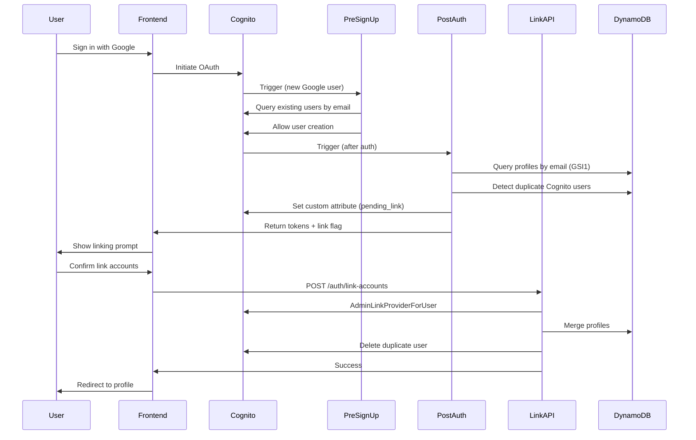
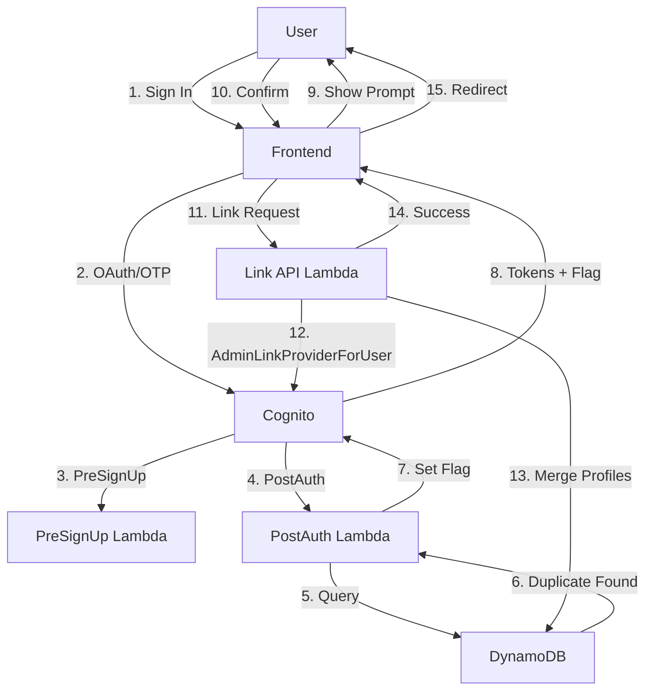

# Design Document: Cognito-Level Account Linking

## Overview

This design implements user-initiated account linking for MadeWithKiro, allowing users to explicitly connect their Google OAuth and Email OTP authentication methods into a single Cognito identity. The system detects duplicate accounts, prompts users for confirmation, and uses AWS Cognito's `AdminLinkProviderForUser` API to merge identities at the Cognito level.

## Architecture

### High-Level Flow



### Component Interaction



## Components and Interfaces

### 1. PreSignUp Lambda Trigger

**Purpose**: Detect potential duplicate accounts during user creation

**Input**: Cognito PreSignUp event

```python
{
    'triggerSource': 'PreSignUp_ExternalProvider',
    'request': {
        'userAttributes': {
            'email': 'user@example.com',
            'email_verified': 'true'
        }
    },
    'userName': 'Google_123456789'
}
```

**Output**: Modified event with auto-confirm

```python
{
    'response': {
        'autoConfirmUser': True,
        'autoVerifyEmail': True
    }
}
```

**Logic**:

- Query Cognito for existing users with same email
- If found, log for monitoring (don't prevent creation)
- Auto-confirm all new users
- Return event unchanged

### 2. PostAuthentication Lambda Trigger

**Purpose**: Detect duplicate accounts after successful authentication

**Input**: Cognito PostAuthentication event

```python
{
    'triggerSource': 'PostAuthentication_Authentication',
    'request': {
        'userAttributes': {
            'sub': 'abc-123',
            'email': 'user@example.com',
            'identities': '[{"providerName":"Google",...}]'
        }
    }
}
```

**Output**: Modified event with custom attribute

```python
{
    'response': {
        'claimsOverrideDetails': {
            'claimsToAddOrOverride': {
                'custom:pending_link': 'true',
                'custom:link_target_sub': 'xyz-789'
            }
        }
    }
}
```

**Logic**:

1. Query DynamoDB GSI1 for profiles with same email
2. Check if profiles belong to different Cognito subs
3. If duplicates found:
   - Set `custom:pending_link` = 'true'
   - Set `custom:link_target_sub` = other user's sub
4. Create/update profile for current user
5. Return event with custom claims

### 3. Link Accounts API Endpoint

**Purpose**: Execute user-confirmed account linking

**Endpoint**: `POST /auth/link-accounts`

**Request**:

```json
{
  "targetUserSub": "xyz-789",
  "confirmLink": true
}
```

**Response** (Success):

```json
{
  "success": true,
  "message": "Accounts linked successfully",
  "linkedIdentities": [
    { "provider": "Google", "userId": "123456789" },
    { "provider": "Cognito", "userId": "user@example.com" }
  ]
}
```

**Response** (Error):

```json
{
  "success": false,
  "error": {
    "code": "LINK_FAILED",
    "message": "Unable to link accounts"
  }
}
```

**Logic**:

1. Verify JWT token and extract current user's sub
2. Validate targetUserSub belongs to same email
3. Determine link direction (Google→OTP or OTP→Google)
4. Call appropriate Cognito API:
   - Google→OTP: `AdminLinkProviderForUser`
   - OTP→Google: `AdminSetUserPassword` then `AdminLinkProviderForUser`
5. Merge DynamoDB profiles
6. Delete duplicate Cognito user
7. Return success with linked identities

### 4. Frontend Link Prompt Component

**Purpose**: Display linking prompt and handle user confirmation

**Component**: `AccountLinkPrompt.tsx`

**Props**:

```typescript
interface AccountLinkPromptProps {
  currentAuthMethod: "google" | "email";
  existingAuthMethod: "google" | "email";
  email: string;
  targetUserSub: string;
  onConfirm: () => Promise<void>;
  onDecline: () => void;
}
```

**UI Elements**:

- Clear explanation of account linking
- Display both authentication methods
- Benefits of linking (single profile, easier sign-in)
- Confirm and Decline buttons
- Loading state during API call
- Error handling and retry

## Data Models

### DynamoDB Profile Schema

```typescript
interface UserProfile {
  PK: string; // USER#{sub}
  SK: string; // PROFILE
  userId: string; // Cognito sub
  email: string; // User's email
  firstName: string;
  lastName: string;
  awsBuilderHandle: string;
  linkedInUsername?: string;
  githubUsername?: string;
  authMethods: string[]; // ['google', 'email']
  createdAt: string; // ISO timestamp
  updatedAt: string; // ISO timestamp
  entityType: string; // PROFILE
  GSI1PK: string; // EMAIL#{email}
  GSI1SK: string; // PROFILE
}
```

### Cognito Custom Attributes

```yaml
custom:pending_link:
  Type: String
  Mutable: true
  Description: "Flag indicating user has duplicate account to link"

custom:link_target_sub:
  Type: String
  Mutable: true
  Description: "Sub of the duplicate account to link with"
```

### Cognito Linked Identity Structure

```json
{
  "identities": [
    {
      "userId": "user@example.com",
      "providerName": "Cognito",
      "providerType": "Cognito",
      "primary": true,
      "dateCreated": 1234567890
    },
    {
      "userId": "123456789",
      "providerName": "Google",
      "providerType": "Google",
      "issuer": "https://accounts.google.com",
      "primary": false,
      "dateCreated": 1234567891
    }
  ]
}
```

## Correctness Properties

_A property is a characteristic or behavior that should hold true across all valid executions of a system-essentially, a formal statement about what the system should do. Properties serve as the bridge between human-readable specifications and machine-verifiable correctness guarantees._

### Acceptance Criteria Testing Prework

**1.1** WHEN a user signs in with Google AND a native Cognito user with the same email already exists THEN the system SHALL detect the duplicate account

- Thoughts: This is about detection logic that should work for any email/user combination. We can generate random users and test that duplicates are always detected.
- Testable: yes - property

**1.2** WHEN a duplicate is detected THEN the system SHALL create a temporary Google user and store a flag indicating a potential link

- Thoughts: This is about the system's behavior when duplicates exist. We can test that the flag is always set correctly.
- Testable: yes - property

**1.3** WHEN the user completes Google authentication THEN the system SHALL redirect them to an account linking prompt page

- Thoughts: This is a UI behavior that depends on the flag being set. We can test the redirect logic.
- Testable: yes - example

**1.4** WHEN the linking prompt is displayed THEN the system SHALL show which authentication methods already exist for that email

- Thoughts: This is UI rendering logic. We can test that the correct methods are displayed.
- Testable: yes - property

**1.5** WHEN the user declines linking THEN the system SHALL allow them to proceed with the new separate Google account

- Thoughts: This is testing a specific user action and outcome.
- Testable: yes - example

**2.1** WHEN a user is shown the account linking prompt THEN the system SHALL display a clear explanation of what linking means

- Thoughts: This is about UI content, not a computable property.
- Testable: no

**2.2** WHEN the user confirms they want to link accounts THEN the system SHALL call AdminLinkProviderForUser to link the identities

- Thoughts: This is testing that the API is called when the user confirms. We can mock the API and verify it's called.
- Testable: yes - example

**2.3** WHEN account linking succeeds THEN the system SHALL merge the accounts into a single Cognito user

- Thoughts: This is about the end state after linking. We can verify that only one user exists with both identities.
- Testable: yes - property

**2.4** WHEN the linked user signs in with either method THEN the system SHALL authenticate them as the same Cognito user (same sub)

- Thoughts: This is a critical property - regardless of auth method, the sub should be the same. This is a round-trip property.
- Testable: yes - property

**2.5** WHEN account linking fails THEN the system SHALL display an error message and allow the user to proceed with separate accounts

- Thoughts: This is testing error handling for a specific scenario.
- Testable: yes - example

**3.1** WHEN the PostAuthentication trigger runs THEN the system SHALL query DynamoDB GSI1 for profiles with the same email

- Thoughts: This is testing that the query happens. We can verify the query is executed.
- Testable: yes - example

**3.2** WHEN multiple profiles are found with the same email THEN the system SHALL check if they belong to different Cognito users

- Thoughts: This is logic that should work for any set of profiles. We can generate random profiles and test the detection.
- Testable: yes - property

**3.3** WHEN duplicate Cognito users are detected THEN the system SHALL set a session flag indicating linking is available

- Thoughts: This is testing that the flag is set when duplicates exist.
- Testable: yes - property

**3.4** WHEN the frontend receives the session flag THEN the system SHALL redirect to the account linking prompt

- Thoughts: This is UI routing logic based on a flag.
- Testable: yes - example

**3.5** WHEN no duplicates are found THEN the system SHALL proceed with normal authentication flow

- Thoughts: This is testing the negative case - no special behavior when no duplicates.
- Testable: yes - example

**5.1** WHEN a user with linked accounts signs in THEN the system SHALL use a single DynamoDB profile keyed by the Cognito sub

- Thoughts: This is an invariant - linked accounts always use one profile.
- Testable: yes - property

**5.2** WHEN a user's profile is updated THEN the system SHALL reflect changes regardless of which authentication method they used

- Thoughts: This is testing that updates work the same way regardless of auth method. This is a property about consistency.
- Testable: yes - property

**5.3** WHEN the PostAuthentication trigger runs THEN the system SHALL create or update only one profile per Cognito user

- Thoughts: This is an invariant - one user = one profile.
- Testable: yes - property

**5.4** WHEN a user has linked accounts THEN the system SHALL store all authentication methods in the authMethods array

- Thoughts: This is testing that the array contains all methods after linking.
- Testable: yes - property

**5.5** WHEN querying by email THEN the system SHALL return the single profile associated with the linked Cognito user

- Thoughts: This is testing the GSI1 query returns the correct profile.
- Testable: yes - property

**7.1** WHEN the user confirms account linking THEN the system SHALL call a POST /auth/link-accounts endpoint

- Thoughts: This is testing the API call happens on user action.
- Testable: yes - example

**7.2** WHEN the endpoint is called THEN the system SHALL verify the user is authenticated with a valid JWT token

- Thoughts: This is testing authentication/authorization. We can test with valid and invalid tokens.
- Testable: yes - property

**7.3** WHEN linking Google to OTP THEN the system SHALL call AdminLinkProviderForUser with the Google identity as source

- Thoughts: This is testing the correct API is called with correct parameters.
- Testable: yes - example

**7.4** WHEN linking OTP to Google THEN the system SHALL set a password on the Google user using AdminSetUserPassword

- Thoughts: This is testing a specific sequence of operations.
- Testable: yes - example

**7.5** WHEN linking succeeds THEN the system SHALL return success and update the user's profile authMethods

- Thoughts: This is testing the end state after successful linking.
- Testable: yes - property

**8.1** WHEN a user signs in with a linked account THEN the system SHALL verify the email claim matches across all identities

- Thoughts: This is an invariant - all identities must have matching emails.
- Testable: yes - property

**8.2** WHEN identity claims are inconsistent THEN the system SHALL log a warning and use the primary identity's claims

- Thoughts: This is testing error handling for a specific edge case.
- Testable: yes - example

**8.3** WHEN a user's ID token is issued THEN the system SHALL include all linked identities in the identities attribute

- Thoughts: This is testing token structure after linking.
- Testable: yes - property

**8.4** WHEN parsing user attributes THEN the system SHALL correctly identify the provider from the identities claim

- Thoughts: This is testing parsing logic works for any identities structure.
- Testable: yes - property

**8.5** WHEN a user has no linked identities THEN the system SHALL identify them as a native OTP user

- Thoughts: This is testing the default case when no identities exist.
- Testable: yes - example

**11.1** WHEN linking accounts THEN the system SHALL only link users with verified email addresses

- Thoughts: This is a security invariant - linking requires verified emails.
- Testable: yes - property

**11.2** WHEN a Google user signs in THEN the system SHALL verify the email_verified claim is true

- Thoughts: This is testing email verification for Google users.
- Testable: yes - property

**11.3** WHEN an OTP user signs in THEN the system SHALL verify the email by successful OTP validation

- Thoughts: This is testing that OTP validation implies email verification.
- Testable: yes - property

**11.4** WHEN email verification fails THEN the system SHALL prevent account linking and log a security warning

- Thoughts: This is testing the security check prevents linking.
- Testable: yes - property

**11.5** WHEN linking accounts THEN the system SHALL only trust identity providers configured in the user pool

- Thoughts: This is a security invariant about trusted providers.
- Testable: yes - property

### Property Reflection

After reviewing all testable properties, I've identified the following redundancies:

- **Properties 1.1 and 3.2** both test duplicate detection - can be combined into one comprehensive property
- **Properties 5.1 and 5.3** both test the one-profile-per-user invariant - can be combined
- **Properties 11.2 and 11.3** both test email verification - can be combined into one property about verified emails

The remaining properties provide unique validation value and should be kept.

### Correctness Properties

Property 1: Duplicate account detection
_For any_ email address, when querying for users with that email, if multiple Cognito users exist, the system should detect and flag them as duplicates
**Validates: Requirements 1.1, 3.2**

Property 2: Linking flag consistency
_For any_ user with a duplicate account, after authentication, the custom:pending_link attribute should be set to 'true' and custom:link_target_sub should contain the other user's sub
**Validates: Requirements 1.2, 3.3**

Property 3: Single profile per Cognito user
_For any_ Cognito user (identified by sub), exactly one DynamoDB profile should exist with PK=USER#{sub}
**Validates: Requirements 5.1, 5.3**

Property 4: Authentication method consistency
_For any_ linked Cognito user, signing in with any linked authentication method should result in the same sub in the issued tokens
**Validates: Requirements 2.4**

Property 5: Profile merge completeness
_For any_ two profiles being merged, the resulting profile should contain the union of authMethods from both source profiles
**Validates: Requirements 5.4**

Property 6: Email-based profile lookup
_For any_ email address, querying DynamoDB GSI1 with GSI1PK=EMAIL#{email} should return all profiles with that email, and after linking, should return exactly one profile
**Validates: Requirements 5.5**

Property 7: Authentication requirement for linking
_For any_ request to the /auth/link-accounts endpoint, the request must include a valid JWT token, otherwise the request should be rejected with 401 Unauthorized
**Validates: Requirements 7.2**

Property 8: AuthMethods update after linking
_For any_ successful account linking operation, the resulting profile's authMethods array should contain both 'google' and 'email'
**Validates: Requirements 7.5**

Property 9: Identity email consistency
_For any_ linked Cognito user, all identities in the identities claim should have the same email address
**Validates: Requirements 8.1**

Property 10: Identities claim completeness
_For any_ linked Cognito user, the ID token's identities claim should contain an entry for each linked authentication method
**Validates: Requirements 8.3**

Property 11: Provider identification
_For any_ user attributes with an identities claim, parsing should correctly extract the provider name from the first identity
**Validates: Requirements 8.4**

Property 12: Email verification requirement
_For any_ account linking operation, both users must have email_verified=true, otherwise linking should be rejected
**Validates: Requirements 11.1, 11.2, 11.3, 11.4**

Property 13: Trusted provider restriction
_For any_ identity being linked, the provider must be in the set of configured user pool identity providers, otherwise linking should be rejected
**Validates: Requirements 11.5**

## Error Handling

### Error Scenarios

1. **Duplicate Detection Failure**

   - Cause: DynamoDB query fails or times out
   - Handling: Log error, proceed without duplicate detection, allow normal auth flow
   - User Impact: User won't see linking prompt, can link manually later

2. **AdminLinkProviderForUser Failure**

   - Cause: Invalid parameters, user already linked, AWS API error
   - Handling: Return error to user, keep accounts separate, log for investigation
   - User Impact: Linking fails, user sees error message, can retry or proceed with separate accounts

3. **Profile Merge Failure**

   - Cause: DynamoDB write fails, concurrent modification
   - Handling: Rollback Cognito linking if possible, log error, return failure
   - User Impact: Linking appears to fail, user can retry

4. **Invalid JWT Token**

   - Cause: Expired token, tampered token, wrong user pool
   - Handling: Return 401 Unauthorized, require re-authentication
   - User Impact: Must sign in again before linking

5. **Email Verification Mismatch**
   - Cause: One account has unverified email
   - Handling: Reject linking, log security warning, return error
   - User Impact: Cannot link until email is verified

### Error Response Format

```json
{
  "success": false,
  "error": {
    "code": "LINK_FAILED" | "UNAUTHORIZED" | "EMAIL_NOT_VERIFIED" | "INVALID_REQUEST",
    "message": "Human-readable error message",
    "details": {
      "field": "Additional context"
    }
  }
}
```

## Testing Strategy

### Unit Tests

1. **PreSignUp Trigger Tests**

   - Test auto-confirm for all trigger sources
   - Test logging when duplicates detected
   - Test error handling for Cognito query failures

2. **PostAuthentication Trigger Tests**

   - Test duplicate detection logic
   - Test custom attribute setting
   - Test profile creation/update
   - Test error handling for DynamoDB failures

3. **Link Accounts API Tests**

   - Test JWT validation
   - Test AdminLinkProviderForUser calls
   - Test profile merging logic
   - Test error responses
   - Test authorization (user can only link their own accounts)

4. **Frontend Component Tests**
   - Test AccountLinkPrompt rendering
   - Test user confirmation flow
   - Test error display
   - Test loading states

### Property-Based Tests

1. **Property 1: Duplicate Detection**

   - Generate random users with same/different emails
   - Verify duplicates are always detected correctly

2. **Property 3: Single Profile Invariant**

   - Generate random Cognito users
   - Verify exactly one profile exists per sub

3. **Property 4: Auth Method Consistency**

   - Generate random linked users
   - Sign in with different methods
   - Verify same sub in all tokens

4. **Property 5: Profile Merge**

   - Generate random profiles with different authMethods
   - Merge them
   - Verify union of authMethods

5. **Property 6: Email Lookup**

   - Generate random profiles with same email
   - Query by email
   - Verify correct profiles returned

6. **Property 7: Auth Requirement**

   - Generate random requests with valid/invalid tokens
   - Verify only valid tokens are accepted

7. **Property 12: Email Verification**
   - Generate random users with verified/unverified emails
   - Attempt linking
   - Verify only verified emails can link

### Integration Tests

1. **End-to-End Linking Flow**

   - Create OTP user
   - Sign in with Google (same email)
   - Verify linking prompt appears
   - Confirm linking
   - Verify single Cognito user with both identities
   - Sign in with both methods
   - Verify same profile accessed

2. **Decline Linking Flow**

   - Create OTP user
   - Sign in with Google (same email)
   - Decline linking
   - Verify two separate Cognito users exist
   - Verify two separate profiles exist

3. **Error Recovery Flow**
   - Simulate AdminLinkProviderForUser failure
   - Verify error message displayed
   - Verify accounts remain separate
   - Retry linking
   - Verify success on retry

## Security Considerations

### Authentication & Authorization

- All linking operations require valid JWT token
- Users can only link their own accounts (verified by JWT sub)
- Email verification required for both accounts
- Only configured identity providers are trusted

### Data Protection

- Email addresses masked in logs
- No sensitive data in error messages
- Cognito handles token encryption
- DynamoDB encryption at rest enabled

### Attack Vectors & Mitigations

1. **Account Takeover via Linking**

   - Risk: Attacker links their account to victim's account
   - Mitigation: Email verification required, user must be authenticated with both accounts

2. **Token Replay**

   - Risk: Stolen JWT used to link accounts
   - Mitigation: Short token expiration (60 minutes), HTTPS only

3. **Race Conditions**

   - Risk: Concurrent linking attempts cause data corruption
   - Mitigation: DynamoDB conditional writes, idempotent operations

4. **Information Disclosure**
   - Risk: Error messages reveal account existence
   - Mitigation: Generic error messages, detailed logs only in CloudWatch

## Deployment Strategy

### Phase 1: Backend Implementation

- Deploy Lambda trigger updates
- Deploy Link Accounts API endpoint
- Test with manual API calls
- Monitor CloudWatch logs

### Phase 2: Frontend Implementation

- Deploy AccountLinkPrompt component
- Deploy routing logic
- Test with test users
- Monitor user feedback

### Phase 3: Gradual Rollout

- Enable for 10% of users
- Monitor error rates and user behavior
- Increase to 50% if successful
- Full rollout after 1 week

### Rollback Plan

If critical issues arise:

1. Disable linking prompt in frontend (feature flag)
2. Keep API endpoint active for manual linking
3. Investigate and fix issues
4. Re-enable gradually

## Monitoring & Observability

### Key Metrics

1. **Duplicate Detection Rate**

   - Metric: % of authentications with duplicates detected
   - Alert: > 10% (indicates potential issue)

2. **Linking Success Rate**

   - Metric: % of linking attempts that succeed
   - Alert: < 90% (indicates API issues)

3. **Linking Confirmation Rate**

   - Metric: % of users who confirm linking when prompted
   - Target: > 70% (indicates good UX)

4. **Error Rate**
   - Metric: % of linking attempts with errors
   - Alert: > 5% (indicates system issues)

### CloudWatch Dashboards

- Duplicate detection events
- Linking API calls and errors
- AdminLinkProviderForUser success/failure
- Profile merge operations
- User confirmation/decline rates

### Alarms

- High error rate on Link Accounts API
- AdminLinkProviderForUser failures
- DynamoDB throttling on GSI1 queries
- Lambda timeout on PostAuthentication trigger

## Future Enhancements

1. **Bulk Account Linking**

   - Admin tool to link existing duplicate accounts
   - CSV upload for batch operations

2. **Account Unlinking**

   - Allow users to unlink authentication methods
   - Keep at least one method active

3. **Multi-Provider Linking**

   - Support more than 2 authentication methods
   - Add GitHub, Facebook, etc.

4. **Automatic Linking Suggestions**

   - Email users when duplicates detected
   - Provide one-click linking from email

5. **Linking Analytics**
   - Track which auth methods users prefer
   - Identify patterns in linking behavior
   - Optimize UX based on data
