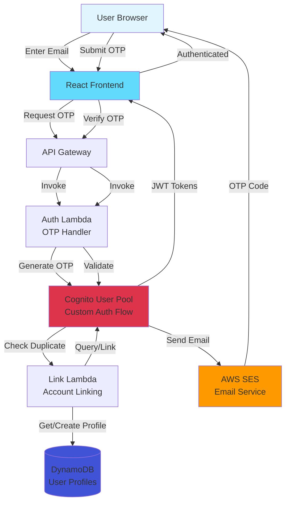
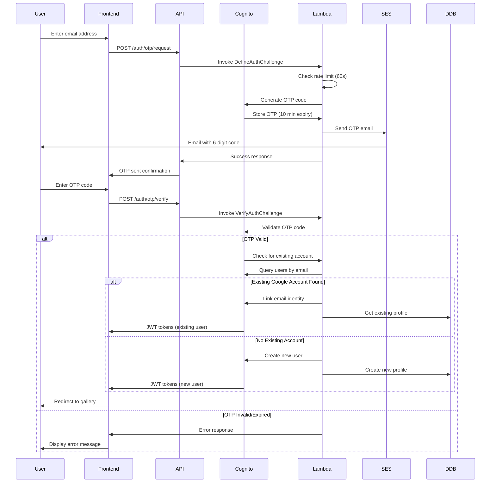

# Design Document

## Overview

This design document outlines the implementation approach for email-based One-Time Password (OTP) authentication in the MadeWithKiro platform. The solution leverages AWS Cognito's custom authentication flows to provide passwordless authentication while maintaining backward compatibility with existing Google OAuth integration. The design emphasizes simplicity, security, and seamless account linking when duplicate emails are detected across authentication methods.

### Key Design Goals

1. **Passwordless Authentication**: Enable users to authenticate using only their email address and a time-limited OTP code
2. **Backward Compatibility**: Preserve all existing Google OAuth functionality without disruption
3. **Automatic Account Linking**: Seamlessly merge authentication methods when the same email is used across different providers
4. **Security**: Implement rate limiting, code expiration, and secure token handling
5. **User Experience**: Provide clear feedback and minimal friction during authentication flows

## Architecture

### High-Level Architecture



### Authentication Flow Sequence



## Components and Interfaces

### Frontend Components

#### 1. OTPAuthPage Component

**Purpose**: Main authentication page with email input and OTP verification

**Props**:

```typescript
interface OTPAuthPageProps {
  onAuthSuccess: (tokens: AuthTokens) => void;
  redirectPath?: string;
}
```

**State**:

```typescript
interface OTPAuthState {
  email: string;
  otpCode: string;
  step: "email" | "verify";
  loading: boolean;
  error: string | null;
  remainingTime: number;
  canResend: boolean;
}
```

**Key Methods**:

- `handleEmailSubmit()`: Request OTP code
- `handleOTPVerify()`: Verify OTP and authenticate
- `handleResendOTP()`: Request new OTP code
- `startCountdown()`: Manage OTP expiration timer

#### 2. OTPInput Component

**Purpose**: Specialized input for 6-digit OTP code entry

**Props**:

```typescript
interface OTPInputProps {
  value: string;
  onChange: (value: string) => void;
  disabled?: boolean;
  error?: boolean;
}
```

**Features**:

- Auto-focus on mount
- Auto-advance between digits
- Paste support for full code
- Mobile-optimized numeric keyboard

#### 3. AuthMethodSelector Component

**Purpose**: Allow users to choose between Google OAuth and Email OTP

**Props**:

```typescript
interface AuthMethodSelectorProps {
  onGoogleAuth: () => void;
  onEmailAuth: () => void;
}
```

### Backend Components

#### 1. Define Auth Challenge Lambda

**Purpose**: Cognito trigger to define custom authentication flow

**Handler**: `defineAuthChallenge`

**Input**:

```typescript
interface DefineAuthChallengeEvent {
  request: {
    userAttributes: Record<string, string>;
    session: ChallengeSession[];
  };
  response: {
    challengeName: string;
    issueTokens: boolean;
    failAuthentication: boolean;
  };
}
```

**Logic**:

- Check if user exists
- Determine if OTP challenge needed
- Set challenge parameters
- Enforce rate limiting

#### 2. Create Auth Challenge Lambda

**Purpose**: Generate and send OTP code

**Handler**: `createAuthChallenge`

**Input**:

```typescript
interface CreateAuthChallengeEvent {
  request: {
    userAttributes: Record<string, string>;
    challengeName: string;
  };
  response: {
    publicChallengeParameters: Record<string, string>;
    privateChallengeParameters: Record<string, string>;
  };
}
```

**Logic**:

- Generate 6-digit random code
- Store code in Cognito session
- Send email via SES
- Set 10-minute expiration
- Log metrics to CloudWatch

#### 3. Verify Auth Challenge Lambda

**Purpose**: Validate OTP code and handle account linking

**Handler**: `verifyAuthChallenge`

**Input**:

```typescript
interface VerifyAuthChallengeEvent {
  request: {
    userAttributes: Record<string, string>;
    privateChallengeParameters: Record<string, string>;
    challengeAnswer: string;
  };
  response: {
    answerCorrect: boolean;
  };
}
```

**Logic**:

- Compare submitted code with stored code
- Check expiration time
- Query for existing accounts by email
- Link accounts if duplicate found
- Return validation result

#### 4. Pre-Authentication Lambda

**Purpose**: Check for duplicate accounts and initiate linking

**Handler**: `preAuthentication`

**Input**:

```typescript
interface PreAuthenticationEvent {
  request: {
    userAttributes: Record<string, string>;
    validationData: Record<string, string>;
  };
}
```

**Logic**:

- Query Cognito for users with same email
- Check across all identity providers
- Prepare account linking if needed
- Log authentication attempts

### API Endpoints

#### POST /auth/otp/request

**Purpose**: Request OTP code for email address

**Request**:

```typescript
{
  email: string;
}
```

**Response**:

```typescript
{
  success: boolean;
  message: string;
  expiresIn: number; // seconds
}
```

**Error Codes**:

- 400: Invalid email format
- 429: Rate limit exceeded
- 500: Email delivery failed

#### POST /auth/otp/verify

**Purpose**: Verify OTP code and authenticate

**Request**:

```typescript
{
  email: string;
  code: string;
}
```

**Response**:

```typescript
{
  success: boolean;
  tokens: {
    idToken: string;
    accessToken: string;
    refreshToken: string;
  };
  user: {
    userId: string;
    email: string;
    authMethods: string[]; // ['google', 'email']
  };
  isNewUser: boolean;
  linkedAccount: boolean;
}
```

**Error Codes**:

- 400: Invalid code format
- 401: Incorrect or expired code
- 500: Authentication failed

## Data Models

### Cognito User Attributes

```typescript
interface CognitoUserAttributes {
  sub: string; // Cognito user ID (UUID)
  email: string; // User email address
  email_verified: boolean; // Email verification status
  "custom:auth_methods": string; // JSON array: ["google", "email"]
  "custom:primary_method": string; // "google" | "email"
  "custom:linked_at": string; // ISO timestamp of account linking
}
```

### DynamoDB User Profile Schema

```typescript
interface UserProfile {
  PK: string; // "USER#<cognitoUserId>"
  SK: string; // "PROFILE"
  userId: string; // Cognito sub
  email: string; // User email
  firstName: string; // User first name
  lastName: string; // User last name
  awsBuilderHandle?: string; // AWS Builder Center handle
  linkedInUsername?: string; // LinkedIn username
  authMethods: string[]; // ["google", "email"]
  createdAt: string; // ISO timestamp
  updatedAt: string; // ISO timestamp
  GSI1PK: string; // "EMAIL#<email>"
  GSI1SK: string; // "PROFILE"
}
```

**GSI1 (Email Index)**:

- Purpose: Query users by email address for duplicate detection
- Keys: GSI1PK (partition), GSI1SK (sort)
- Projection: All attributes

### OTP Session Data (Cognito Session)

```typescript
interface OTPSession {
  code: string; // Hashed 6-digit code
  email: string; // Target email address
  createdAt: number; // Unix timestamp
  expiresAt: number; // Unix timestamp (createdAt + 600s)
  attempts: number; // Verification attempts
  lastRequestAt: number; // Last OTP request timestamp
}
```

### Email Template

```typescript
interface OTPEmailTemplate {
  subject: string;
  body: {
    code: string;
    expiresIn: string;
    appName: string;
  };
}
```

**Template**:

```
Subject: Your MadeWithKiro verification code

Your verification code is: {{code}}

This code will expire in {{expiresIn}} minutes.

If you didn't request this code, please ignore this email.

Do not share this code with anyone.
```

## Correctness Properties

_A property is a characteristic or behavior that should hold true across all valid executions of a system-essentially, a formal statement about what the system should do. Properties serve as the bridge between human-readable specifications and machine-verifiable correctness guarantees._

### Property 1: OTP Code Generation and Delivery

_For any_ valid email address, when an OTP is requested, the system should generate a 6-digit code and send it via email service.

**Validates: Requirements 1.1, 2.1, 6.1, 6.2**

### Property 2: OTP Expiration Time Consistency

_For any_ generated OTP code, the expiration time should be exactly 10 minutes (600 seconds) from the generation timestamp.

**Validates: Requirements 1.2**

### Property 3: Valid OTP Authentication Success

_For any_ valid OTP code submitted within the expiration window, authentication should succeed and return valid JWT tokens.

**Validates: Requirements 1.3, 2.2, 5.2**

### Property 4: New Account Creation

_For any_ successful OTP authentication where no existing account with that email exists, the system should create both a Cognito user account and a corresponding DynamoDB profile with matching user identifiers.

**Validates: Requirements 1.4, 1.5, 2.3**

### Property 5: Invalid OTP Rejection

_For any_ incorrect OTP code, the system should reject authentication and return an error message indicating the code is incorrect.

**Validates: Requirements 2.4**

### Property 6: Duplicate Account Detection

_For any_ OTP authentication attempt, the system should query for existing accounts with the same email address before creating a new account.

**Validates: Requirements 3.1**

### Property 7: Account Linking Preservation

_For any_ OTP authentication where an existing Google account with the same email is found, the system should link the email authentication method to the existing account while preserving the original user ID and profile data.

**Validates: Requirements 3.2, 3.3**

### Property 8: Multi-Method Authentication

_For any_ account with linked authentication methods, both Google OAuth and email OTP should successfully authenticate the user and return the same user profile.

**Validates: Requirements 3.5**

### Property 9: Error Message Specificity

_For any_ failed OTP verification, the error message should correctly distinguish between expired codes and incorrect codes.

**Validates: Requirements 4.3**

### Property 10: Cognito User Identifier Consistency

_For any_ user profile access, the system should use the Cognito sub (user identifier) as the primary key regardless of authentication method used.

**Validates: Requirements 5.3**

### Property 11: Rate Limiting Enforcement

_For any_ email address, when an OTP request is made, subsequent requests within 60 seconds should be rejected with a rate limit error including remaining wait time.

**Validates: Requirements 7.1, 7.2**

### Property 12: Rate Limit Reset

_For any_ email address that has been rate limited, after 60 seconds have elapsed, a new OTP request should succeed.

**Validates: Requirements 7.4**

### Property 13: Secure Code Storage

_For any_ OTP code stored in Cognito, the code should be hashed or encrypted before storage, not stored in plain text.

**Validates: Requirements 6.5**

## Error Handling

### Error Categories

#### 1. Validation Errors (400)

**Scenarios**:

- Invalid email format
- Invalid OTP code format (not 6 digits)
- Missing required fields

**Response**:

```typescript
{
  error: "VALIDATION_ERROR",
  message: "Invalid email format",
  field: "email"
}
```

#### 2. Authentication Errors (401)

**Scenarios**:

- Incorrect OTP code
- Expired OTP code
- Account locked due to failed attempts

**Response**:

```typescript
{
  error: "AUTH_ERROR",
  message: "Incorrect or expired code",
  code: "INVALID_OTP" | "EXPIRED_OTP" | "ACCOUNT_LOCKED"
}
```

#### 3. Rate Limiting Errors (429)

**Scenarios**:

- Too many OTP requests
- Requests within 60-second window

**Response**:

```typescript
{
  error: "RATE_LIMIT_ERROR",
  message: "Please wait before requesting a new code",
  retryAfter: number // seconds
}
```

#### 4. Server Errors (500)

**Scenarios**:

- Email delivery failure
- Cognito service errors
- DynamoDB errors

**Response**:

```typescript
{
  error: "SERVER_ERROR",
  message: "Unable to send verification code",
  code: "EMAIL_DELIVERY_FAILED" | "SERVICE_ERROR"
}
```

### Error Recovery Strategies

#### Frontend Error Handling

1. **Network Errors**: Retry with exponential backoff (max 3 attempts)
2. **Validation Errors**: Display inline field errors
3. **Rate Limiting**: Show countdown timer and disable submit button
4. **Expired OTP**: Automatically show resend option
5. **Server Errors**: Display user-friendly message with retry option

#### Backend Error Handling

1. **Email Delivery Failures**: Log to CloudWatch, return error to user
2. **Cognito Errors**: Log error details, return generic auth error
3. **DynamoDB Errors**: Retry with exponential backoff (max 3 attempts)
4. **Rate Limit Violations**: Log to CloudWatch for monitoring

### Logging Strategy

All errors should be logged to CloudWatch with the following structure:

```typescript
{
  timestamp: string;
  level: "ERROR" | "WARN" | "INFO";
  component: string;
  errorType: string;
  message: string;
  email: string; // hashed for privacy
  requestId: string;
  stackTrace?: string;
}
```

## Testing Strategy

### Unit Testing

Unit tests will verify individual functions and components in isolation:

**Frontend Unit Tests**:

- OTP input component validation and formatting
- Email validation logic
- Countdown timer functionality
- Error message display logic
- Form state management

**Backend Unit Tests**:

- OTP code generation (6 digits, randomness)
- Expiration time calculation
- Email template rendering
- Rate limit calculation logic
- Account linking logic

**Example Unit Tests**:

```typescript
// Test OTP code generation
test("generates 6-digit numeric code", () => {
  const code = generateOTPCode();
  expect(code).toMatch(/^\d{6}$/);
});

// Test expiration calculation
test("sets expiration to 10 minutes from now", () => {
  const now = Date.now();
  const expiration = calculateExpiration(now);
  expect(expiration - now).toBe(600000); // 10 minutes in ms
});

// Test email validation
test("validates email format", () => {
  expect(isValidEmail("user@example.com")).toBe(true);
  expect(isValidEmail("invalid-email")).toBe(false);
});
```

### Property-Based Testing

Property-based tests will verify universal properties across many randomly generated inputs using **fast-check** (JavaScript/TypeScript property testing library).

Each property test will run a minimum of 100 iterations with randomly generated data.

**Property Test Examples**:

```typescript
// Property 1: OTP Code Generation and Delivery
test("Property 1: OTP generation for any valid email", () => {
  fc.assert(
    fc.asyncProperty(fc.emailAddress(), async (email) => {
      const result = await requestOTP(email);
      expect(result.success).toBe(true);
      expect(result.codeSent).toBe(true);
      // Verify email was sent (check mock or logs)
    }),
    { numRuns: 100 }
  );
});

// Property 2: OTP Expiration Time Consistency
test("Property 2: Expiration time is always 10 minutes", () => {
  fc.assert(
    fc.property(fc.integer({ min: 0, max: Date.now() }), (timestamp) => {
      const expiration = calculateExpiration(timestamp);
      expect(expiration - timestamp).toBe(600000);
    }),
    { numRuns: 100 }
  );
});

// Property 7: Account Linking Preservation
test("Property 7: Account linking preserves user data", () => {
  fc.assert(
    fc.asyncProperty(
      fc.record({
        email: fc.emailAddress(),
        firstName: fc.string(),
        lastName: fc.string(),
      }),
      async (userData) => {
        // Create Google account
        const googleUser = await createGoogleAccount(userData);
        const originalProfile = await getProfile(googleUser.id);

        // Authenticate with OTP using same email
        await authenticateWithOTP(userData.email);

        // Verify profile unchanged
        const linkedProfile = await getProfile(googleUser.id);
        expect(linkedProfile).toEqual(originalProfile);
        expect(linkedProfile.authMethods).toContain("google");
        expect(linkedProfile.authMethods).toContain("email");
      }
    ),
    { numRuns: 100 }
  );
});

// Property 11: Rate Limiting Enforcement
test("Property 11: Rate limiting blocks rapid requests", () => {
  fc.assert(
    fc.asyncProperty(fc.emailAddress(), async (email) => {
      // First request should succeed
      const first = await requestOTP(email);
      expect(first.success).toBe(true);

      // Immediate second request should fail
      const second = await requestOTP(email);
      expect(second.success).toBe(false);
      expect(second.error).toBe("RATE_LIMIT_ERROR");
      expect(second.retryAfter).toBeGreaterThan(0);
    }),
    { numRuns: 100 }
  );
});
```

**Property Test Tags**:
Each property-based test must include a comment tag referencing the design document:

```typescript
/**
 * Feature: email-otp-authentication, Property 1: OTP Code Generation and Delivery
 * Validates: Requirements 1.1, 2.1, 6.1, 6.2
 */
```

### Integration Testing

Integration tests will verify end-to-end flows:

1. **Complete OTP Authentication Flow**: Request OTP → Receive email → Verify code → Get tokens
2. **Account Linking Flow**: Create Google account → Authenticate with OTP → Verify linking
3. **Rate Limiting Flow**: Multiple rapid requests → Verify blocking → Wait → Verify reset
4. **Error Scenarios**: Invalid codes, expired codes, email delivery failures

### Testing Tools

- **Frontend**: Vitest, React Testing Library, fast-check
- **Backend**: Pytest (Python), moto (AWS mocking), fast-check equivalent
- **E2E**: Playwright or Cypress for full user flows
- **Load Testing**: Artillery or k6 for rate limiting validation

### Test Coverage Goals

- Unit test coverage: >80% for business logic
- Property tests: All 13 correctness properties implemented
- Integration tests: All critical user flows covered
- E2E tests: Happy path and major error scenarios

## Security Considerations

### OTP Code Security

1. **Code Generation**: Use cryptographically secure random number generator
2. **Code Storage**: Hash codes before storing in Cognito session
3. **Code Transmission**: Send only via email, never in URL or logs
4. **Code Expiration**: Strict 10-minute window, no extensions
5. **Code Invalidation**: Invalidate after successful use or expiration

### Rate Limiting

1. **Request Throttling**: 60-second minimum between OTP requests per email
2. **Attempt Limiting**: Track failed verification attempts (future enhancement)
3. **IP-Based Limiting**: Consider IP-based rate limiting for additional protection (future)

### Email Security

1. **Domain Authentication**:
   - Configure SPF record for madewithkiro.com domain
   - Enable AWS-managed DKIM signing in SES
   - Set up DMARC policy for email authentication
   - Verify domain ownership via DNS TXT records
2. **Content Security**: Include warnings about not sharing codes
3. **Delivery Monitoring**: Track bounce rates and delivery failures using SES metrics
4. **Template Security**: Sanitize any dynamic content in emails
5. **Sender Reputation**: Monitor SES reputation metrics and bounce/complaint rates

### Account Linking Security

1. **Email Verification**: Only link accounts with verified email addresses
2. **Consent**: Automatic linking is safe since user proves email ownership via OTP
3. **Audit Trail**: Log all account linking events with timestamps
4. **Rollback**: Maintain ability to unlink accounts if needed (future enhancement)

### Token Security

1. **JWT Validation**: Validate all tokens on backend
2. **Token Expiration**: Use standard Cognito token expiration (1 hour for access tokens)
3. **Refresh Tokens**: Implement secure refresh token rotation
4. **Token Storage**: Store tokens securely in httpOnly cookies or secure storage

### Data Privacy

1. **Email Hashing**: Hash email addresses in logs for privacy
2. **PII Protection**: Never log OTP codes or sensitive user data
3. **GDPR Compliance**: Support user data deletion requests
4. **Data Retention**: Define retention policies for OTP session data

## Deployment Strategy

### Phase 1: Infrastructure Setup

1. **Cognito Configuration**:

   - Create custom authentication flow
   - Configure Lambda triggers
   - Set up email service (SES or Cognito email)
   - Update user pool settings

2. **Lambda Deployment**:

   - Deploy DefineAuthChallenge Lambda
   - Deploy CreateAuthChallenge Lambda
   - Deploy VerifyAuthChallenge Lambda
   - Deploy PreAuthentication Lambda
   - Configure IAM roles and permissions

3. **DynamoDB Updates**:
   - Add GSI1 for email lookups (if not exists)
   - Update profile schema to include authMethods field
   - Backfill existing profiles with authMethods: ['google']

### Phase 2: Backend API

1. **API Gateway**:

   - Add /auth/otp/request endpoint
   - Add /auth/otp/verify endpoint
   - Configure CORS for frontend domain
   - Set up request validation

2. **Lambda Functions**:
   - Implement OTP request handler
   - Implement OTP verification handler
   - Add error handling and logging
   - Configure environment variables

### Phase 3: Frontend Implementation

1. **Authentication Components**:

   - Create OTPAuthPage component
   - Create OTPInput component
   - Update AuthMethodSelector component
   - Add OTP flow to authentication context

2. **UI/UX**:
   - Design OTP input interface
   - Add countdown timer
   - Implement error messaging
   - Add loading states

### Phase 4: Testing and Validation

1. **Testing**:

   - Run unit tests
   - Run property-based tests
   - Execute integration tests
   - Perform manual QA testing

2. **Validation**:
   - Test with real email addresses
   - Verify rate limiting works
   - Test account linking scenarios
   - Validate backward compatibility

### Phase 5: Production Deployment

1. **Gradual Rollout**:

   - Deploy to development environment
   - Test with internal users
   - Deploy to production
   - Monitor CloudWatch metrics

2. **Monitoring**:
   - Set up CloudWatch alarms
   - Monitor OTP delivery rates
   - Track authentication success rates
   - Monitor error rates

### Rollback Plan

If issues are detected:

1. Disable OTP authentication endpoints via API Gateway
2. Revert Cognito configuration changes
3. Maintain Google OAuth functionality
4. Investigate and fix issues
5. Redeploy with fixes

### Feature Flags

Consider using feature flags for:

- OTP authentication availability
- Account linking behavior
- Rate limiting thresholds
- Email template variations

## Performance Considerations

### Expected Load

- **OTP Requests**: ~100 requests/minute during peak
- **OTP Verifications**: ~80 verifications/minute during peak
- **Account Lookups**: ~80 queries/minute during peak

### Optimization Strategies

1. **Cognito**: Use built-in scaling, no action needed
2. **Lambda**: Configure appropriate memory and timeout settings
3. **DynamoDB**: Use on-demand billing or configure auto-scaling
4. **SES**: Request production access and higher sending limits
5. **API Gateway**: Enable caching for non-sensitive endpoints (if applicable)

### Latency Targets

- OTP Request: <2 seconds (including email delivery initiation)
- OTP Verification: <1 second
- Account Linking: <1.5 seconds
- Email Delivery: <30 seconds (SES delivery time)

### Monitoring Metrics

- OTP request success rate
- OTP verification success rate
- Email delivery success rate
- Average response times
- Rate limit trigger frequency
- Account linking frequency

## Future Enhancements

### Post-MVP Features

1. **SMS OTP**: Add SMS as alternative to email
2. **Account Management UI**: Allow users to manage linked authentication methods
3. **Biometric Authentication**: Add fingerprint/face ID support for mobile
4. **Remember Device**: Skip OTP for trusted devices
5. **Advanced Rate Limiting**: IP-based and device-based rate limiting
6. **Account Recovery**: Enhanced account recovery flows
7. **Multi-Factor Authentication**: Require both password and OTP
8. **Audit Logs**: Detailed authentication audit trail in UI

### Scalability Improvements

1. **Caching**: Cache account lookup results
2. **Batch Processing**: Batch email sending for better throughput
3. **Regional Deployment**: Deploy to multiple AWS regions
4. **CDN Integration**: Use CloudFront for API caching where appropriate

## SES Email Domain Configuration

### Domain Setup Requirements

**Domain**: madewithkiro.com

**Email Identity**: noreply@madewithkiro.com

### DNS Records Required

1. **SPF Record** (TXT):

   ```
   Name: madewithkiro.com
   Type: TXT
   Value: v=spf1 include:amazonses.com ~all
   ```

2. **DKIM Records** (CNAME):

   - AWS SES will provide 3 CNAME records after domain verification
   - These must be added to DNS for DKIM signing
   - Format: `<selector>._domainkey.madewithkiro.com`

3. **DMARC Record** (TXT):

   ```
   Name: _dmarc.madewithkiro.com
   Type: TXT
   Value: v=DMARC1; p=quarantine; rua=mailto:postmaster@madewithkiro.com
   ```

4. **Domain Verification** (TXT):
   - AWS SES will provide a verification token
   - Add as TXT record to madewithkiro.com

### SES Configuration Steps

1. **Verify Domain in SES**:

   - Navigate to AWS SES Console
   - Add madewithkiro.com as verified domain
   - Copy DNS verification records

2. **Configure DNS**:

   - Add all required DNS records (SPF, DKIM, DMARC, verification)
   - Wait for DNS propagation (up to 48 hours)
   - Verify domain status in SES console

3. **Request Production Access**:

   - Submit request to move out of SES sandbox
   - Provide use case description (OTP authentication)
   - Wait for AWS approval (typically 24-48 hours)

4. **Create Email Identity**:

   - Add noreply@madewithkiro.com as verified email
   - Configure default FROM address in Cognito

5. **Configure Email Templates**:
   - Create SES email template for OTP codes
   - Test template rendering with sample data

### Email Template in SES

```json
{
  "TemplateName": "OTPVerificationCode",
  "SubjectPart": "Your MadeWithKiro verification code",
  "TextPart": "Your verification code is: {{code}}\n\nThis code will expire in {{expiresIn}} minutes.\n\nIf you didn't request this code, please ignore this email.\n\nDo not share this code with anyone.\n\n---\nMadeWithKiro - Showcase your Kiro creations\nhttps://madewithkiro.com",
  "HtmlPart": "<!DOCTYPE html><html><body><h2>Your verification code is:</h2><h1 style='font-size: 32px; letter-spacing: 8px; font-family: monospace;'>{{code}}</h1><p>This code will expire in <strong>{{expiresIn}} minutes</strong>.</p><p>If you didn't request this code, please ignore this email.</p><p><strong>Do not share this code with anyone.</strong></p><hr><p style='color: #666; font-size: 12px;'>MadeWithKiro - Showcase your Kiro creations<br><a href='https://madewithkiro.com'>https://madewithkiro.com</a></p></body></html>"
}
```

### Monitoring and Maintenance

1. **Monitor Bounce Rates**: Keep below 5% to maintain sender reputation
2. **Monitor Complaint Rates**: Keep below 0.1% to avoid blacklisting
3. **Track Delivery Metrics**: Monitor successful delivery rates in CloudWatch
4. **Review SES Reputation Dashboard**: Regular checks for any issues
5. **Update DNS Records**: Maintain current SPF/DKIM/DMARC records
