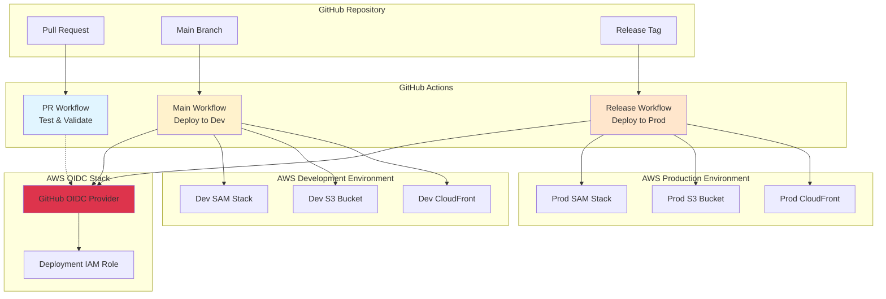

# GitHub Actions CI/CD Design Document

## Overview

This design document outlines the implementation of a comprehensive CI/CD pipeline using GitHub Actions for the MadeWithKiro platform. The solution provides automated testing, building, and deployment workflows that integrate with the existing AWS SAM infrastructure while maintaining security best practices through OIDC authentication.

The CI/CD system consists of multiple GitHub Actions workflows that handle different aspects of the development lifecycle:

- **Pull Request Workflow**: Automated testing and validation for code changes
- **Main Branch Workflow**: Continuous deployment to development environment
- **Release Workflow**: Controlled deployment to production with manual approval
- **OIDC Infrastructure**: Separate SAM stack for secure AWS authentication

## Architecture

The CI/CD architecture follows a multi-environment approach with clear separation between development and production deployments:



## Components and Interfaces

### GitHub Actions Workflows

#### 1. Pull Request Workflow (`pr.yml`)

**Purpose**: Validate code changes through automated testing and linting

**Triggers**:

- Pull request opened
- Pull request updated (new commits)
- Pull request reopened

**Jobs**:

- Calls `_test.yml` reusable workflow with PR-specific parameters
- Calls `_build.yml` reusable workflow for validation builds

**Interfaces**:

- Input: Pull request code changes
- Output: Test results, build status, validation reports

#### 2. Development Deployment Workflow (`deploy-dev.yml`)

**Purpose**: Continuous deployment to development environment

**Triggers**:

- Push to main branch (after PR merge)

**Jobs**:

- Calls `_test.yml` reusable workflow
- Calls `_build.yml` reusable workflow with dev parameters
- Calls `_deploy.yml` reusable workflow with dev environment config
- Calls `_notify.yml` reusable workflow for deployment notifications

**Interfaces**:

- Input: Main branch code
- Output: Development environment deployment

#### 3. Production Deployment Workflow (`deploy-prod.yml`)

**Purpose**: Controlled deployment to production with manual approval

**Triggers**:

- Release tag created (pattern: `v*`)

**Jobs**:

- Calls `_test.yml` reusable workflow
- Calls `_build.yml` reusable workflow with prod parameters
- Manual approval gate
- Calls `_deploy.yml` reusable workflow with prod environment config
- Calls `_notify.yml` reusable workflow for deployment notifications

**Interfaces**:

- Input: Release tag
- Output: Production environment deployment

#### 4. Reusable Test Workflow (`_test.yml`)

**Purpose**: Standardized testing across all workflows

**Parameters**:

- `run-frontend-tests`: Boolean to enable/disable frontend tests
- `run-backend-tests`: Boolean to enable/disable backend tests
- `test-timeout`: Timeout for test execution

**Jobs**:

- `frontend-test`: Run Vitest tests, TypeScript compilation, ESLint
- `backend-test`: Run pytest tests, Python linting, type checking
- `sam-validate`: Validate SAM template syntax and structure

#### 5. Reusable Build Workflow (`_build.yml`)

**Purpose**: Standardized build process across environments

**Parameters**:

- `environment`: Target environment (dev/prod)
- `build-frontend`: Boolean to enable frontend build
- `build-backend`: Boolean to enable backend build
- `cache-enabled`: Boolean to enable/disable caching

**Jobs**:

- `build-frontend`: Build React application with Vite
- `build-backend`: Build SAM application

#### 6. Reusable Deployment Workflow (`_deploy.yml`)

**Purpose**: Standardized deployment process across environments

**Parameters**:

- `environment`: Target environment (dev/prod)
- `sam-config-env`: SAM configuration environment
- `require-approval`: Boolean for manual approval requirement

**Jobs**:

- `deploy-infrastructure`: Deploy SAM stack
- `deploy-frontend`: Upload frontend to S3 and invalidate CloudFront
- `health-check`: Verify deployment health

#### 7. Reusable Notification Workflow (`_notify.yml`)

**Purpose**: Standardized notifications across workflows

**Parameters**:

- `workflow-status`: Success/failure status
- `environment`: Target environment
- `deployment-url`: URL of deployed application
- `discord-webhook-url`: Discord webhook URL for notifications

**Jobs**:

- `send-notifications`: Send status updates to Discord channel

### OIDC Infrastructure Stack

#### SAM Template (`oidc-template.yaml`)

**Purpose**: Manage GitHub Actions authentication infrastructure separately from application

**Resources**:

- GitHub OIDC Identity Provider
- Single IAM Role for deployments to both environments
- IAM Policies with least privilege permissions for both dev and prod

**Outputs**:

- Deployment role ARN
- OIDC provider ARN

### Workflow Components

#### Reusable Actions

**Setup Action** (`actions/setup`):

- Install Bun and dependencies
- Install Python and uv
- Install AWS SAM CLI
- Configure dependency caching

**AWS Authentication Action** (`actions/aws-auth`):

- Configure AWS credentials using OIDC
- Assume appropriate IAM role based on environment
- Set up AWS CLI and SAM CLI authentication

**Cache Dependencies Action** (`actions/cache-deps`):

- Cache Bun dependencies with lock file hashing
- Cache Python dependencies with requirements.txt hashing
- Cache SAM build artifacts when appropriate
- Restore cached dependencies when available

## Data Models

### Workflow Configuration

```yaml
# Workflow metadata structure
name: string
on:
  pull_request: object
  push: object
  release: object
jobs:
  job_name:
    runs-on: string
    environment: string (optional)
    needs: array (optional)
    steps: array
```

### Environment Configuration

```yaml
# Environment-specific settings
environment:
  name: string # "development" | "production"
  aws_region: string
  sam_config_env: string # "dev" | "prod"
  stack_name: string
  s3_bucket: string
  cloudfront_distribution: string
  iam_role_arn: string
```

### OIDC Configuration

```yaml
# GitHub OIDC trust policy
trust_policy:
  Version: "2012-10-17"
  Statement:
    - Effect: "Allow"
      Principal:
        Federated: !Ref GitHubOIDCProvider
      Action: "sts:AssumeRoleWithWebIdentity"
      Condition:
        StringEquals:
          "token.actions.githubusercontent.com:aud": "sts.amazonaws.com"
        StringLike:
          "token.actions.githubusercontent.com:sub":
            - "repo:organization/repository:ref:refs/heads/main"
            - "repo:organization/repository:ref:refs/tags/*"
```

## Error Handling

### Workflow Error Handling

**Test Failures**:

- Fail workflow immediately on test failures
- Generate detailed test reports with failure reasons
- Comment on PR with test results summary
- Prevent deployment if tests fail

**Build Failures**:

- Capture build logs and error messages
- Fail workflow with clear error indication
- Notify team through GitHub notifications
- Provide troubleshooting guidance in workflow output

**Deployment Failures**:

- Implement retry logic for transient failures
- Capture CloudFormation stack events on failure
- Rollback to previous version if deployment fails
- Send notifications to team with failure details

### AWS Authentication Errors

**OIDC Token Issues**:

- Validate OIDC token before AWS operations
- Provide clear error messages for token validation failures
- Include troubleshooting steps in workflow documentation

**IAM Permission Errors**:

- Implement least privilege IAM policies
- Provide specific error messages for permission issues
- Include required permissions in error output

### Environment-Specific Error Handling

**Development Environment**:

- Allow more permissive error handling
- Provide detailed debugging information
- Continue with deployment even if non-critical steps fail

**Production Environment**:

- Implement strict error handling
- Require manual intervention for any failures
- Maintain audit trail of all deployment attempts

## Testing Strategy

_A property is a characteristic or behavior that should hold true across all valid executions of a system-essentially, a formal statement about what the system should do. Properties serve as the bridge between human-readable specifications and machine-verifiable correctness guarantees._

### Correctness Properties

Property 1: Dependency caching consistency
_For any_ workflow run with unchanged dependencies, the system should restore dependencies from cache instead of downloading them, and execution time should be significantly reduced compared to fresh installs
**Validates: Requirements 7.1, 7.2, 7.4**

Property 2: Cache invalidation on dependency changes
_For any_ workflow run where dependencies have changed, the system should invalidate the existing cache and rebuild dependencies, ensuring the new dependencies are properly cached for future runs
**Validates: Requirements 7.5**

Property 3: Parallel job execution independence
_For any_ set of independent workflow jobs, they should execute concurrently without blocking each other, and total execution time should be less than the sum of individual job times
**Validates: Requirements 8.3**

Property 4: Job dependency ordering
_For any_ workflow with job dependencies, dependent jobs should never start before their prerequisites complete successfully, maintaining proper execution order
**Validates: Requirements 8.4**

Property 5: Result aggregation completeness
_For any_ workflow with parallel jobs, the system should wait for all jobs to complete before aggregating results and proceeding to dependent stages
**Validates: Requirements 8.5**

Property 6: Configuration source consistency
_For any_ workflow requiring configuration, the system should load settings from the appropriate environment-specific sources and use consistent values throughout the workflow execution
**Validates: Requirements 10.3**

Property 7: Configuration validation before deployment
_For any_ deployment workflow, the system should validate all required configuration settings before proceeding with deployment operations, failing early if any settings are invalid or missing
**Validates: Requirements 10.5**

### Unit Testing Strategy

**Workflow Configuration Testing**:

- Validate YAML syntax and structure of all workflow files
- Test workflow triggers respond to correct events (PR, push, release)
- Verify job dependencies and execution order
- Test environment-specific configuration loading

**OIDC Infrastructure Testing**:

- Validate SAM template syntax for OIDC stack
- Test IAM role creation and permission policies
- Verify OIDC provider configuration
- Test role assumption from GitHub Actions

**Integration Testing**:

- Test end-to-end workflow execution in test repository
- Verify deployment to test AWS environments
- Test rollback procedures and recovery mechanisms
- Validate notification and reporting systems

**Security Testing**:

- Test OIDC token validation and role assumption
- Verify secrets are not exposed in logs or outputs
- Test IAM permission boundaries and least privilege
- Validate secure artifact handling

### Property-Based Testing Strategy

The system will use GitHub Actions workflow testing with the following approach:

**Testing Framework**: GitHub Actions workflow testing using act (local runner) and test repositories
**Test Iterations**: Minimum 100 test runs per property to ensure reliability
**Property Test Configuration**: Each property-based test will run multiple iterations with different inputs

**Property Test Implementation**:

- Use test repositories with varying dependency configurations
- Generate different workflow scenarios (success, failure, mixed results)
- Test with different timing and load conditions
- Validate behavior across different GitHub Actions runner environments

## Implementation Details

### Workflow File Structure

```
# Root directory templates
oidc-template.yaml             # OIDC infrastructure SAM template
oidc-samconfig.toml           # OIDC stack configuration

.github/
├── workflows/
│   # Main workflow files
│   ├── pr.yml                 # Pull request validation
│   ├── deploy-dev.yml         # Development deployment
│   ├── deploy-prod.yml        # Production deployment
│   ├── rollback.yml           # Manual rollback workflow
│   # Reusable workflows
│   ├── _test.yml              # Reusable test workflow
│   ├── _build.yml             # Reusable build workflow
│   ├── _deploy.yml            # Reusable deployment workflow
│   └── _notify.yml            # Reusable notification workflow
└── actions/
    ├── setup/                 # Reusable setup action
    ├── aws-auth/              # AWS OIDC authentication action
    └── cache-deps/            # Dependency caching action
```

### Environment Configuration

**GitHub Environments**:

- `development`: Auto-deployment from main branch
- `production`: Manual approval required, restricted to maintainers

**GitHub Secrets**:

- `AWS_REGION`: AWS region for deployments
- `DEPLOYMENT_ROLE_ARN`: Single deployment role ARN for both environments
- `DISCORD_WEBHOOK_URL`: Discord notification webhook

### Deployment Strategy

**Development Environment**:

1. Triggered on main branch push
2. Run tests and build artifacts
3. Deploy SAM stack with dev configuration
4. Upload frontend to dev S3 bucket
5. Invalidate dev CloudFront distribution
6. Run smoke tests on deployed environment

**Production Environment**:

1. Triggered on release tag creation
2. Run comprehensive test suite
3. Build production artifacts
4. Wait for manual approval
5. Deploy SAM stack with prod configuration
6. Upload frontend to prod S3 bucket
7. Invalidate prod CloudFront distribution
8. Run production health checks
9. Send deployment notifications

### Security Implementation

**OIDC Configuration**:

```yaml
# Trust policy for GitHub Actions
{
  "Version": "2012-10-17",
  "Statement":
    [
      {
        "Effect": "Allow",
        "Principal":
          {
            "Federated": "arn:aws:iam::ACCOUNT:oidc-provider/token.actions.githubusercontent.com",
          },
        "Action": "sts:AssumeRoleWithWebIdentity",
        "Condition":
          {
            "StringEquals":
              {
                "token.actions.githubusercontent.com:aud": "sts.amazonaws.com",
              },
            "StringLike":
              {
                "token.actions.githubusercontent.com:sub":
                  [
                    "repo:organization/repository:ref:refs/heads/main",
                    "repo:organization/repository:ref:refs/tags/*",
                  ],
              },
          },
      },
    ],
}
```

**IAM Permissions**:

- CloudFormation: Full access to managed stacks
- S3: Read/write access to deployment buckets
- CloudFront: Invalidation permissions
- Lambda: Function management for SAM deployments
- DynamoDB: Table management for application data
- Cognito: User pool management
- SES: Email service configuration

### Monitoring and Observability

**Workflow Monitoring**:

- GitHub Actions built-in logging and status reporting
- Custom workflow status badges in README
- Discord notifications for deployment status
- CloudWatch integration for AWS resource monitoring

**Deployment Tracking**:

- Git commit SHA tracking in deployments
- Deployment timestamp and duration logging
- Environment-specific deployment history
- Rollback capability with version tracking

**Error Reporting**:

- Detailed error logs in GitHub Actions
- CloudFormation stack event logging
- Application-level error monitoring integration
- Automated incident response for critical failures

### Performance Optimization

**Caching Strategy**:

- Bun dependency caching with lock file hashing
- Python dependency caching with requirements.txt hashing
- SAM build artifact caching when dependencies unchanged
- Docker layer caching for custom build environments

**Parallel Execution**:

- Frontend and backend tests run in parallel
- Independent build processes execute concurrently
- Multi-environment deployments can run simultaneously
- Artifact uploads parallelized across regions

**Resource Optimization**:

- Use GitHub-hosted runners for standard workflows
- Self-hosted runners for resource-intensive operations
- Conditional job execution based on changed files
- Optimized Docker images for faster startup times

### Rollback and Recovery

**Automated Rollback Triggers**:

- Health check failures after deployment
- Critical error thresholds exceeded
- Manual rollback initiation by maintainers

**Rollback Process**:

1. Identify previous stable version
2. Restore CloudFormation stack to previous state
3. Restore frontend files from backup
4. Invalidate caches to ensure consistency
5. Verify system health after rollback
6. Notify team of rollback completion

**Recovery Procedures**:

- Database backup restoration if needed
- Configuration rollback for environment variables
- DNS failover for critical service disruptions
- Manual intervention procedures for complex failures

### Integration Points

**Existing Infrastructure**:

- Integrates with current SAM template structure
- Preserves existing Makefile commands for local development
- Maintains compatibility with current deployment scripts
- Extends existing environment configuration patterns

**External Services**:

- GitHub repository and branch protection rules
- AWS CloudFormation for infrastructure management
- AWS S3 for static asset hosting
- AWS CloudFront for content delivery
- Discord for team notifications

**Development Workflow**:

- Maintains current PR review process
- Integrates with existing testing frameworks
- Preserves local development environment setup
- Extends current deployment validation procedures
