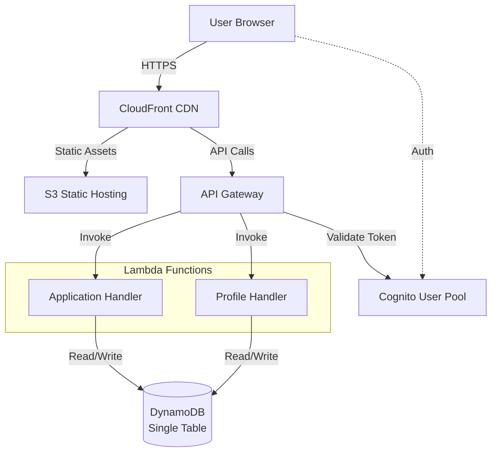

# Design Document

## Overview

MadeWithKiro is a serverless showcase platform built on AWS that enables users to display applications they've created with Kiro. The system leverages AWS Cognito for authentication, DynamoDB for data persistence, Lambda for business logic, and a React frontend with TypeScript. The architecture prioritizes rapid development, mobile-first design, and zero-configuration deployment through AWS SAM and Makefile automation.

### Key Design Principles

1. **Speed to Market**: Minimal viable features with shadcn/ui components
2. **Serverless Architecture**: AWS Lambda + DynamoDB for automatic scaling
3. **Mobile-First**: Responsive design starting at 320px viewport
4. **Single-Table Design**: Simplified DynamoDB schema for POC efficiency
5. **Zero Manual Configuration**: Complete infrastructure as code via AWS SAM

## Architecture

### High-Level System Architecture



### Request Flow

**Authentication Flow:**

1. User clicks "Sign In" → Redirected to Cognito Hosted UI
2. User authenticates → Cognito returns JWT tokens (ID, Access, Refresh)
3. React app stores tokens in memory and localStorage
4. AuthContext provides authentication state to all components

**API Request Flow:**

1. React component triggers API call via service layer
2. Service layer attaches JWT token to Authorization header
3. API Gateway validates token with Cognito authorizer
4. Lambda function receives validated user context
5. Lambda executes business logic and queries DynamoDB
6. Response flows back through API Gateway to React app

### Technology Stack

**Frontend:**

- React 18 with TypeScript
- Vite for build tooling
- Tailwind CSS for styling
- shadcn/ui for UI components
- lucide-react for icons
- Tanstack Router
- Tanstack Query
- zod for schema validation
- Bun as package manager

**Backend:**

- AWS Lambda (Python 3.13 runtime)
- API Gateway (REST API with Cognito authorizer)
- DynamoDB (single-table design with GSI)
- Cognito User Pools (authentication)
- boto3 for AWS SDK
- Pydantic for data validation
- uv for Python package management

**Infrastructure:**

- AWS SAM for infrastructure as code
- CloudFormation for resource provisioning
- Makefile for deployment automation
- Lambda functions bundled as zip files

## Components and Interfaces

### Frontend Components

#### 1. Authentication Components

**AuthProvider (Context)**

```typescript
interface AuthContextType {
  user: CognitoUser | null;
  isAuthenticated: boolean;
  isLoading: boolean;
  signIn: () => Promise<void>;
  signOut: () => Promise<void>;
  getAccessToken: () => Promise<string>;
}
```

**ProtectedRoute**

- Wraps routes requiring authentication
- Redirects to sign-in if not authenticated
- Shows loading state during auth check

#### 2. Profile Components

**ProfileForm**

- Input fields for all profile attributes
- Client-side validation for required fields
- URL format validation for social links
- Submit and cancel actions

**ProfileView**

- Display user information
- Social link buttons (LinkedIn, GitHub, AWS Builder Center)
- List of user's applications
- Edit button (only for own profile)

#### 3. Application Components

**ApplicationCard**

- Display app name, description, tags
- Creator information with profile link
- Links to live app and GitHub repo
- Responsive card layout

**ApplicationForm**

- Input fields for app details
- Tag input with multi-select
- URL validation
- Submit and cancel actions

**ApplicationGallery**

- Grid layout of application cards
- Tag filter sidebar (client-side filtering)
- Empty state when no apps
- Responsive grid (1 col mobile, 2-3 cols desktop)
- Filters applications by selected tags in-memory after fetching all apps
- Extracts unique tags from all applications for filter options

#### 4. Layout Components

**Navigation**

- Logo and app name
- Links to Gallery, Profile, Add App
- Sign In/Sign Out button
- Mobile hamburger menu

**Layout**

- Consistent header and footer
- Main content area
- Mobile-responsive structure

### Backend Components

#### 1. Lambda Functions

**Profile Handler (`/profile`)**

Endpoints:

- `GET /profile/{userId}` - Get user profile
- `POST /profile` - Create profile (authenticated)
- `PUT /profile` - Update profile (authenticated)

Responsibilities:

- Validate profile data
- Enforce required fields
- Store/retrieve from DynamoDB
- Return user profile with applications count

**Application Handler (`/applications`)**

Endpoints:

- `GET /applications` - List all applications (public)
- `GET /applications?userId={userId}` - List user's applications
- `POST /applications` - Create application (authenticated)

Responsibilities:

- Validate application data using Pydantic models
- URL format validation
- Associate app with authenticated user
- Query DynamoDB for all applications or user-specific applications
- Return all results (tag filtering performed client-side in React)

#### 2. API Gateway Configuration

**Cognito Authorizer:**

- Validates JWT tokens from Authorization header
- Extracts user identity (sub claim)
- Passes user context to Lambda

**CORS Configuration:**

- Allow origins: CloudFront distribution URL
- Allow methods: GET, POST, PUT, OPTIONS
- Allow headers: Authorization, Content-Type
- Expose headers: Content-Length

**Request Validation:**

- Validate request body schemas
- Validate query parameters
- Return 400 for invalid requests

### Service Layer (Frontend)

**ProfileService**

```typescript
interface ProfileService {
  getProfile(userId: string): Promise<UserProfile>;
  createProfile(profile: CreateProfileRequest): Promise<UserProfile>;
  updateProfile(profile: UpdateProfileRequest): Promise<UserProfile>;
}
```

**ApplicationService**

```typescript
interface ApplicationService {
  listApplications(): Promise<Application[]>;
  createApplication(app: CreateApplicationRequest): Promise<Application>;
  getApplicationsByUser(userId: string): Promise<Application[]>;
  filterApplicationsByTags(
    applications: Application[],
    tags: string[]
  ): Application[]; // Client-side filtering
  extractUniqueTags(applications: Application[]): string[]; // Client-side tag extraction
}
```

## Data Models

### DynamoDB Single-Table Design

**Table Name:** `MadeWithKiro`

**Primary Key:**

- Partition Key (PK): String
- Sort Key (SK): String

**Global Secondary Index (GSI1):**

- GSI1PK: String
- GSI1SK: String

### Entity Patterns

#### User Profile Entity

```typescript
interface UserProfileEntity {
  PK: string; // "USER#<userId>"
  SK: string; // "PROFILE"
  GSI1PK: string; // "PROFILE"
  GSI1SK: string; // "USER#<userId>"
  entityType: "PROFILE";
  userId: string;
  firstName: string;
  lastName: string;
  awsBuilderHandle: string;
  linkedInUsername?: string;
  githubUsername?: string;
  createdAt: string; // ISO 8601 timestamp
  updatedAt: string; // ISO 8601 timestamp
}
```

**Access Patterns:**

- Get profile by userId: Query where PK = "USER#<userId>" AND SK = "PROFILE"
- List all profiles: Query GSI1 where GSI1PK = "PROFILE"

#### Application Entity

```typescript
interface ApplicationEntity {
  PK: string; // "APP#<appId>"
  SK: string; // "METADATA"
  GSI1PK: string; // "USER#<userId>"
  GSI1SK: string; // "APP#<createdAt>#<appId>"
  entityType: "APPLICATION";
  appId: string;
  userId: string;
  name: string;
  description: string;
  appUrl: string;
  githubUrl?: string;
  tags: string[];
  createdAt: string; // ISO 8601 timestamp
  updatedAt: string; // ISO 8601 timestamp
}
```

**Access Patterns:**

- Get application by appId: Query where PK = "APP#<appId>" AND SK = "METADATA"
- List all applications: Scan with filter entityType = "APPLICATION"
- List user's applications: Query GSI1 where GSI1PK = "USER#<userId>" AND GSI1SK begins_with "APP#"

**Note:** Tag filtering is performed client-side in the React application after fetching all applications.

### TypeScript Type Definitions

```typescript
// Frontend types
interface UserProfile {
  userId: string;
  firstName: string;
  lastName: string;
  awsBuilderHandle: string;
  linkedInUsername?: string;
  githubUsername?: string;
  createdAt: string;
  updatedAt: string;
}

interface Application {
  appId: string;
  userId: string;
  userName: string; // Denormalized for display
  name: string;
  description: string;
  appUrl: string;
  githubUrl?: string;
  tags: string[];
  createdAt: string;
}

interface CreateProfileRequest {
  firstName: string;
  lastName: string;
  awsBuilderHandle: string;
  linkedInUsername?: string;
  githubUsername?: string;
}

interface UpdateProfileRequest extends CreateProfileRequest {
  userId: string;
}

interface CreateApplicationRequest {
  name: string;
  description: string;
  appUrl: string;
  githubUrl?: string;
  tags: string[];
}

interface ApplicationFilters {
  userId?: string;
  tags?: string[];
}
```

### Python Data Models (Backend)

**Pydantic Models for Validation:**

```python
from pydantic import BaseModel, HttpUrl, Field, validator
from typing import Optional, List
from datetime import datetime

class CreateProfileRequest(BaseModel):
    firstName: str = Field(..., min_length=1, max_length=50)
    lastName: str = Field(..., min_length=1, max_length=50)
    awsBuilderHandle: str = Field(..., min_length=1, max_length=50)
    linkedInUsername: Optional[str] = Field(None, max_length=50)
    githubUsername: Optional[str] = Field(None, max_length=50)

class UpdateProfileRequest(CreateProfileRequest):
    userId: str

class UserProfile(BaseModel):
    userId: str
    firstName: str
    lastName: str
    awsBuilderHandle: str
    linkedInUsername: Optional[str] = None
    githubUsername: Optional[str] = None
    createdAt: str
    updatedAt: str

class CreateApplicationRequest(BaseModel):
    name: str = Field(..., min_length=1, max_length=100)
    description: str = Field(..., min_length=1, max_length=500)
    appUrl: HttpUrl
    githubUrl: Optional[HttpUrl] = None
    tags: List[str] = Field(..., min_items=1, max_items=10)

    @validator('tags')
    def validate_tags(cls, v):
        if not v:
            raise ValueError('At least one tag is required')
        return [tag.strip() for tag in v if tag.strip()]

class Application(BaseModel):
    appId: str
    userId: str
    userName: str
    name: str
    description: str
    appUrl: str
    githubUrl: Optional[str] = None
    tags: List[str]
    createdAt: str
```

##

Correctness Properties

_A property is a characteristic or behavior that should hold true across all valid executions of a system—essentially, a formal statement about what the system should do. Properties serve as the bridge between human-readable specifications and machine-verifiable correctness guarantees._

### Property 1: Profile required fields validation

_For any_ profile creation or update request, if any required field (firstName, lastName, awsBuilderHandle) is missing or empty, the system should reject the request with a validation error.

**Validates: Requirements 1.3, 2.3**

### Property 2: Profile optional fields acceptance

_For any_ profile creation or update request with all required fields present, the system should accept the request regardless of whether optional fields (linkedInUsername, githubUsername) are provided.

**Validates: Requirements 1.4**

### Property 3: Profile persistence round-trip

_For any_ valid profile data, creating a profile and then retrieving it should return the same profile information.

**Validates: Requirements 1.5**

### Property 4: Profile update persistence

_For any_ valid profile update, saving changes and then retrieving the profile should reflect all the updated values.

**Validates: Requirements 2.4**

### Property 5: Profile edit cancellation preserves state

_For any_ profile, if a user starts editing but cancels, the profile data should remain unchanged from its pre-edit state.

**Validates: Requirements 2.5**

### Property 6: Application required fields validation

_For any_ application creation request, if any required field (name, description, appUrl, or tags array) is missing or empty, the system should reject the request with a validation error.

**Validates: Requirements 3.1**

### Property 7: Application optional fields acceptance

_For any_ application creation request with all required fields present, the system should accept the request regardless of whether the optional githubUrl is provided.

**Validates: Requirements 3.2**

### Property 8: Application persistence round-trip

_For any_ valid application data, creating an application and then retrieving it should return the same application information.

**Validates: Requirements 3.3**

### Property 9: Application user association

_For any_ authenticated user creating an application, the created application's userId should match the authenticated user's ID.

**Validates: Requirements 3.4**

### Property 10: URL format validation

_For any_ URL field (appUrl, githubUrl), the system should reject malformed URLs and accept properly formatted URLs (http:// or https:// protocol).

**Validates: Requirements 3.5**

### Property 11: Gallery displays all applications

_For any_ set of applications in the database, the gallery should display all of them when no filters are applied.

**Validates: Requirements 4.1**

### Property 12: Application card contains required information

_For any_ application card rendered in the gallery, the output should contain the application name, description, all tags, and creator information.

**Validates: Requirements 4.2**

### Property 13: Application card contains valid links

_For any_ application card rendered in the gallery, the output should contain clickable links with correct href attributes for the live app URL and GitHub URL (if present).

**Validates: Requirements 4.3**

### Property 14: Gallery tag extraction

_For any_ set of applications in the gallery, the system should display all unique tags that appear across all applications.

**Validates: Requirements 5.1**

### Property 15: Single tag filtering

_For any_ tag selected in the gallery, only applications containing that tag should be displayed.

**Validates: Requirements 5.2**

### Property 16: Multiple tag filtering (OR logic)

_For any_ set of selected tags, the gallery should display applications that contain at least one of the selected tags.

**Validates: Requirements 5.3**

### Property 17: Tag filter clearing

_For any_ active tag filters, clearing all filters should result in displaying all applications again.

**Validates: Requirements 5.4**

### Property 18: Profile page displays required information

_For any_ user profile page, the rendered output should contain the user's firstName, lastName, and awsBuilderHandle.

**Validates: Requirements 6.1**

### Property 19: LinkedIn link conditional rendering

_For any_ user profile with a linkedInUsername, the profile page should display a clickable link to the LinkedIn profile with the correct URL format.

**Validates: Requirements 6.2**

### Property 20: GitHub link conditional rendering

_For any_ user profile with a githubUsername, the profile page should display a clickable link to the GitHub profile with the correct URL format.

**Validates: Requirements 6.3**

### Property 21: User profile displays user's applications

_For any_ user profile, the profile page should display all and only the applications created by that user.

**Validates: Requirements 6.4**

### Property 22: Timestamp presence on entity creation

_For any_ entity (profile or application) created in the system, the entity should have valid createdAt and updatedAt timestamps in ISO 8601 format.

**Validates: Requirements 8.4**

### Property 23: Consistent response format

_For any_ API endpoint response, the response should follow a consistent structure with data, error, and status fields.

**Validates: Requirements 8.5**

### Property 24: Validation error specificity

_For any_ invalid data submission, the system should return error messages that specifically identify which fields are invalid and why.

**Validates: Requirements 10.1**

### Property 25: Error state preservation

_For any_ error that occurs during an operation, the application state should remain intact and allow the user to retry the operation.

**Validates: Requirements 10.4**

### Property 26: Missing field highlighting

_For any_ form submission with missing required fields, the system should highlight exactly those fields that are missing or invalid.

**Validates: Requirements 10.5**

## Error Handling

### Frontend Error Handling

**Network Errors:**

- Catch all API call failures
- Display user-friendly error messages
- Maintain form state for retry
- Log errors to console for debugging

**Validation Errors:**

- Display inline validation messages
- Highlight invalid fields
- Prevent form submission until valid
- Show specific error messages per field

**Authentication Errors:**

- Redirect to sign-in on 401 Unauthorized
- Refresh tokens automatically on 403 Forbidden
- Display authentication error messages
- Clear invalid tokens from storage

**Error Boundary:**

- Catch React component errors
- Display fallback UI
- Log errors for monitoring
- Provide "Try Again" action

### Backend Error Handling

**Lambda Error Responses:**

```typescript
interface ErrorResponse {
  error: {
    code: string;
    message: string;
    details?: Record<string, string>;
  };
  statusCode: number;
}
```

**Error Types:**

- `VALIDATION_ERROR` (400): Invalid input data
- `UNAUTHORIZED` (401): Missing or invalid token
- `FORBIDDEN` (403): Insufficient permissions
- `NOT_FOUND` (404): Resource doesn't exist
- `INTERNAL_ERROR` (500): Unexpected server error

**DynamoDB Error Handling:**

- Catch `ConditionalCheckFailedException` for conflicts
- Retry transient errors with exponential backoff
- Log all database errors to CloudWatch
- Return generic error messages to client

**Validation Strategy:**

- Validate all inputs at Lambda entry point using Pydantic models
- Use Pydantic's built-in validation for type checking and constraints
- Return specific field-level errors from Pydantic ValidationError
- Sanitize error messages before returning to client

## Testing Strategy

### Unit Testing

**Frontend Unit Tests:**

- Test utility functions (URL validation, date formatting)
- Test custom hooks (useAuth, useProfile, useApplications)
- Test service layer functions
- Test form validation logic
- Use Vitest as test runner
- Mock API calls with MSW (Mock Service Worker)

**Backend Unit Tests:**

- Test Lambda handler functions (Python)
- Test Pydantic validation models
- Test DynamoDB query builders
- Test error handling paths
- Use pytest as test runner
- Mock boto3 DynamoDB client with moto

**Example Unit Tests:**

- Valid profile creation with all fields
- Profile creation with only required fields
- URL validation with various formats
- Tag filtering with single tag
- Empty gallery state
- Authentication error handling

### Property-Based Testing

**Testing Library:** fast-check (JavaScript/TypeScript property-based testing library)

**Configuration:**

- Minimum 100 iterations per property test
- Use custom arbitraries for domain models
- Seed random generation for reproducibility

**Property Test Implementation:**

- Each property test MUST reference its design document property number
- Use comment format: `// Feature: madewithkiro-mvp, Property X: [property description]`
- Generate random valid and invalid inputs
- Verify properties hold across all generated inputs

**Custom Arbitraries:**

```typescript
// Generate random user profiles
const profileArbitrary = fc.record({
  firstName: fc.string({ minLength: 1, maxLength: 50 }),
  lastName: fc.string({ minLength: 1, maxLength: 50 }),
  awsBuilderHandle: fc.string({ minLength: 1, maxLength: 50 }),
  linkedInUsername: fc.option(fc.string({ minLength: 1, maxLength: 50 })),
  githubUsername: fc.option(fc.string({ minLength: 1, maxLength: 50 })),
});

// Generate random applications
const applicationArbitrary = fc.record({
  name: fc.string({ minLength: 1, maxLength: 100 }),
  description: fc.string({ minLength: 1, maxLength: 500 }),
  appUrl: fc.webUrl(),
  githubUrl: fc.option(fc.webUrl()),
  tags: fc.array(fc.string({ minLength: 1, maxLength: 20 }), {
    minLength: 1,
    maxLength: 10,
  }),
});

// Generate invalid URLs
const invalidUrlArbitrary = fc.oneof(
  fc.constant("not-a-url"),
  fc.constant("ftp://invalid-protocol.com"),
  fc.constant(""),
  fc.constant("javascript:alert(1)")
);
```

**Property Test Examples:**

_Property 1: Profile required fields validation_

```typescript
// Feature: madewithkiro-mvp, Property 1: Profile required fields validation
fc.assert(
  fc.property(profileArbitrary, (profile) => {
    const invalidProfile = { ...profile, firstName: "" };
    const result = validateProfile(invalidProfile);
    return result.isValid === false && result.errors.includes("firstName");
  }),
  { numRuns: 100 }
);
```

_Property 8: Application persistence round-trip_

```typescript
// Feature: madewithkiro-mvp, Property 8: Application persistence round-trip
fc.assert(
  fc.asyncProperty(applicationArbitrary, async (app) => {
    const created = await createApplication(app);
    const retrieved = await getApplication(created.appId);
    return deepEqual(created, retrieved);
  }),
  { numRuns: 100 }
);
```

### Integration Testing

**API Integration Tests:**

- Test complete request/response cycles
- Use actual DynamoDB Local for testing
- Test authentication flow with Cognito
- Verify CORS headers
- Test error responses

**End-to-End Tests:**

- Test critical user flows (sign up, create app, view gallery)
- Use Playwright or Cypress
- Run against deployed test environment
- Test mobile and desktop viewports

### Test Organization

```
tests/
  unit/
    frontend/
      hooks/
      services/
      utils/
    backend/
      handlers/
      validation/
  property/
    profile.property.test.ts
    application.property.test.ts
    filtering.property.test.ts
  integration/
    api/
      profile.integration.test.ts
      application.integration.test.ts
  e2e/
    user-flows.e2e.test.ts
```

## Deployment and Infrastructure

### AWS SAM Template Structure

**Resources:**

1. Cognito User Pool
2. Cognito User Pool Client
3. DynamoDB Table with GSI
4. Lambda Functions (Profile Handler, Application Handler)
5. API Gateway REST API
6. API Gateway Cognito Authorizer
7. S3 Bucket for static hosting
8. CloudFront Distribution
9. IAM Roles and Policies

**Lambda Packaging:**

- Each Lambda function bundled as a zip file
- SAM builds dependencies into the package
- Use `CodeUri` to specify function directory
- Dependencies installed via `uv` during build
- Python runtime: 3.13

**Parameters:**

- Environment (dev, prod)
- DomainName (optional)
- CognitoCallbackURL

**Outputs:**

- API Gateway URL
- CloudFront Distribution URL
- Cognito User Pool ID
- Cognito Client ID

### Makefile Commands

```makefile
.PHONY: install dev build deploy-dev deploy-prod logs clean test

install:
	bun install
	cd backend && uv pip sync

dev:
	bun run dev

build:
	bun run build

test:
	cd backend && uv run pytest
	bun run test

deploy-dev:
	sam build
	sam deploy --config-env dev --no-confirm-changeset

deploy-prod:
	sam build
	sam deploy --config-env prod --no-confirm-changeset

logs:
	sam logs --stack-name madewithkiro-dev --tail

clean:
	rm -rf dist/
	rm -rf .aws-sam/
	find backend -type d -name __pycache__ -exec rm -rf {} +
	find backend -type d -name .pytest_cache -exec rm -rf {} +
	find backend -type d -name .venv -exec rm -rf {} +
```

### Environment Configuration

**Development Environment:**

- DynamoDB: On-demand billing
- Lambda: 128MB memory, 10s timeout
- API Gateway: No caching
- CloudFront: Disabled (direct S3 access)

**Production Environment:**

- DynamoDB: On-demand billing with auto-scaling
- Lambda: 256MB memory, 30s timeout
- API Gateway: Caching enabled (5 minutes)
- CloudFront: Enabled with edge caching

### Deployment Process

1. Developer runs `make deploy-dev`
2. SAM builds Lambda functions
3. SAM packages artifacts to S3
4. CloudFormation creates/updates stack
5. Frontend build artifacts uploaded to S3
6. CloudFront cache invalidated
7. Deployment complete (< 5 minutes)

### Monitoring and Logging

**CloudWatch Logs:**

- Lambda function logs (automatic)
- API Gateway access logs
- Error logs with stack traces

**CloudWatch Metrics:**

- Lambda invocation count and duration
- API Gateway request count and latency
- DynamoDB read/write capacity
- Error rates by endpoint

**Alarms:**

- Lambda error rate > 5%
- API Gateway 5xx errors > 10
- DynamoDB throttling events

## Security Considerations

### Authentication and Authorization

- All API endpoints (except public reads) require Cognito JWT token
- API Gateway validates tokens before invoking Lambda
- Lambda functions receive validated user context
- User can only modify their own profile and applications

### Data Security

- DynamoDB encryption at rest enabled
- All traffic over HTTPS/TLS
- Cognito password policies enforced
- No sensitive data in logs

### Input Validation

- Client-side validation for UX
- Server-side validation for security
- URL validation to prevent XSS
- SQL injection not applicable (NoSQL database)
- Sanitize all user inputs before storage

### CORS Configuration

- Restrict origins to CloudFront distribution
- Allow only necessary HTTP methods
- Limit allowed headers
- No credentials in CORS requests

## Performance Considerations

### Frontend Performance

- Code splitting by route
- Lazy loading of components
- Memoization of expensive computations
- Debouncing of search/filter inputs
- Image optimization (if added later)

### Backend Performance

- DynamoDB single-table design for efficient queries
- GSI for user-specific queries
- Lambda cold start mitigation (keep functions warm)
- API Gateway caching for public endpoints
- Pagination for large result sets

### Caching Strategy

- CloudFront caching for static assets (1 year)
- API Gateway caching for public gallery (5 minutes)
- Browser caching for API responses
- No caching for authenticated endpoints

## Future Enhancements

### Post-POC Features

1. **Application Management:**

   - Edit existing applications
   - Delete applications
   - Upload application screenshots

2. **Enhanced Discovery:**

   - Search by application name
   - Advanced filtering (multiple criteria)
   - Sorting options (newest, popular)

3. **Social Features:**

   - Like/favorite applications
   - Comments on applications
   - User following

4. **Analytics:**

   - View counts for applications
   - Profile visit tracking
   - Popular tags dashboard

5. **Administration:**
   - Admin dashboard
   - Content moderation
   - Featured applications

### Scalability Improvements

- DynamoDB DAX for caching
- Lambda provisioned concurrency
- ElastiCache for session management
- CloudFront edge functions for personalization
