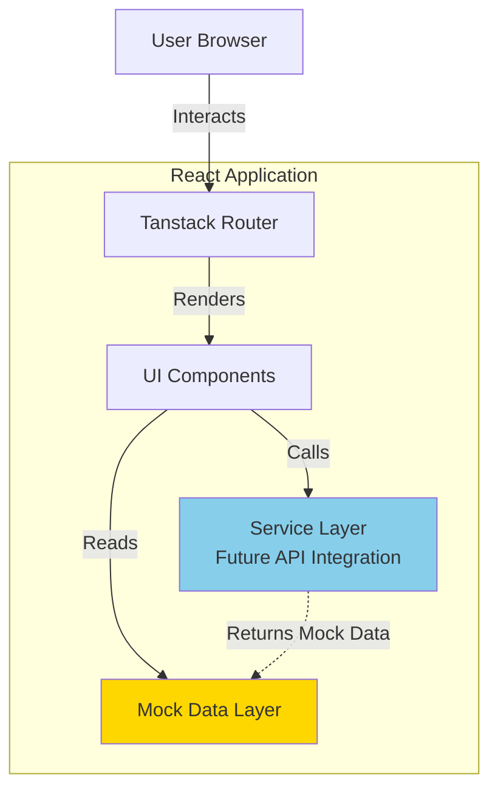

# Design Document

## Overview

MadeWithKiro MVP is a showcase platform UI built with React and TypeScript that displays applications created with Kiro. This design focuses on building all frontend components, interactions, and layouts using mock data, without backend integration or authentication. The architecture prioritizes rapid UI development, mobile-first design, and component reusability using shadcn/ui.

### Key Design Principles

1. **UI-First Development**: Build and test all components with mock data before backend integration
2. **Component Reusability**: Leverage shadcn/ui for consistent, accessible components
3. **Mobile-First**: Responsive design starting at 320px viewport
4. **Client-Side State**: All data management happens in-memory with mock data
5. **Separation of Concerns**: Prepare service layer interfaces for future backend integration

## Architecture

### High-Level System Architecture



### Data Flow

**Component Rendering Flow:**

1. User navigates to a page → Router matches route
2. Page component mounts → Tanstack Query hook fetches data
3. Query returns cached data (instant) or fetches from mock service
4. Component renders with data
5. User interactions update local component state

**Form Submission Flow:**

1. User fills out form → Client-side validation runs
2. User submits form → Validation passes
3. Success message displayed → Form state cleared
4. No data persistence (mock data remains unchanged)
5. Future: Form submission will trigger mutation and invalidate queries

### Technology Stack

**Frontend:**

- React 18 with TypeScript
- Vite for build tooling
- Tailwind CSS for styling
- shadcn/ui for UI components
- lucide-react for icons
- Tanstack Router for client-side routing
- Tanstack Query for data fetching and caching
- zod for schema validation
- Bun as package manager

**Development Tools:**

- Vitest for unit testing
- fast-check for property-based testing
- TypeScript strict mode
- ESLint for code quality

## Components and Interfaces

### Frontend Components

#### 1. Mock Authentication Context

**MockAuthContext**

```typescript
interface MockAuthContextType {
  isAuthenticated: boolean;
  toggleAuth: () => void;
}
```

Provides:

- Simple boolean authentication state
- Toggle function to simulate login/logout
- State persisted in localStorage
- No actual authentication logic
- Used to filter applications by visibility

#### 2. Mock Data Layer

**mockData.ts**

```typescript
interface MockDataStore {
  users: UserProfile[];
  applications: Application[];
  getUserById: (userId: string) => UserProfile | undefined;
  getApplicationsByUserId: (
    userId: string,
    isAuthenticated: boolean
  ) => Application[];
  getAllApplications: (isAuthenticated: boolean) => Application[];
  getAllTags: () => string[];
}
```

Provides:

- At least 3 mock user profiles
- At least 10 mock applications (mix of public and private)
- Helper functions for data access
- Visibility filtering based on authentication state
- Realistic data with various tags and URLs

#### 3. Profile Components

**ProfileForm**

- Input fields for all profile attributes
- Client-side validation for required fields using zod
- URL format validation for social links
- Submit and cancel actions
- Success message on valid submission
- Error messages for validation failures

**ProfileView**

- Display user information from mock data
- Social link buttons (LinkedIn, GitHub, AWS Builder Center)
- Conditional rendering of optional social links
- List of user's applications from mock data
- Edit button to toggle to ProfileForm (only shown when viewing own profile)
- Determines if viewing own profile by comparing userId prop with current authenticated user
- Empty state when user has no applications

**Profile View Modes:**

1. **My Profile** (authenticated user viewing their own profile):
   - Shows all profile information
   - Displays Edit Profile button
   - Shows both public and private applications
2. **Public Profile** (viewing another user's profile):
   - Shows profile information (name, social links)
   - No Edit Profile button
   - Shows only public applications (if unauthenticated) or all applications (if authenticated)

#### 4. Application Components

**ApplicationCard**

- Display app name, description, tags
- Visibility badge (Public/Private)
- Creator information with profile link
- Links to live app and GitHub repo (opens in new tab)
- Responsive card layout using shadcn/ui Card
- Hover effects for interactivity

**ApplicationForm**

- Input fields for app details (name, description, URLs, tags)
- Visibility selector (radio buttons or select: Public/Private)
- Tag input with multi-select or comma-separated input
- URL validation using zod
- Submit and cancel actions
- Success message on valid submission
- Error messages for validation failures

**ApplicationGallery**

- Grid layout of application cards from mock data
- Filters applications based on authentication state
- Tag filter sidebar with checkboxes
- Client-side filtering by selected tags (OR logic)
- Empty state when no apps match filters
- Responsive grid (1 col mobile, 2-3 cols desktop)
- Extracts unique tags from visible applications
- Clear filters button

#### 5. Layout Components

**Navigation**

- Logo and app name
- Links to Gallery, Profile, Add App
- Mock authentication toggle button (for testing)
- Mobile hamburger menu using shadcn/ui Sheet
- Responsive navigation bar
- Active route highlighting

**Layout**

- Consistent header with Navigation
- Main content area with max-width container
- Footer with links
- Mobile-responsive structure

### Service Layer (Frontend)

The service layer provides an abstraction for data access, currently using mock data but designed for easy backend integration later. Tanstack Query handles caching and state management.

**mockDataService.ts**

```typescript
interface DataService {
  // Profile operations
  getProfile(userId: string): Promise<UserProfile | undefined>;
  getAllProfiles(): Promise<UserProfile[]>;

  // Application operations
  getAllApplications(isAuthenticated: boolean): Promise<Application[]>;
  getApplicationsByUserId(
    userId: string,
    isAuthenticated: boolean
  ): Promise<Application[]>;

  // Utility operations
  getAllTags(isAuthenticated: boolean): Promise<string[]>;
  filterApplicationsByTags(
    applications: Application[],
    tags: string[]
  ): Application[];
}
```

**Tanstack Query Integration**

```typescript
// Custom hooks using Tanstack Query
export const useApplications = () => {
  const { isAuthenticated } = useMockAuth();

  return useQuery({
    queryKey: ["applications", isAuthenticated],
    queryFn: () => mockDataService.getAllApplications(isAuthenticated),
    staleTime: Infinity, // Mock data never stales
  });
};

export const useProfile = (userId: string) => {
  return useQuery({
    queryKey: ["profile", userId],
    queryFn: () => mockDataService.getProfile(userId),
    staleTime: Infinity,
  });
};

export const useUserApplications = (userId: string) => {
  const { isAuthenticated } = useMockAuth();

  return useQuery({
    queryKey: ["applications", "user", userId, isAuthenticated],
    queryFn: () =>
      mockDataService.getApplicationsByUserId(userId, isAuthenticated),
    staleTime: Infinity,
  });
};
```

**Future API Service Interface (for reference)**

```typescript
interface ApiService {
  getProfile(userId: string): Promise<UserProfile>;
  createProfile(profile: CreateProfileRequest): Promise<UserProfile>;
  updateProfile(profile: UpdateProfileRequest): Promise<UserProfile>;

  listApplications(): Promise<Application[]>;
  createApplication(app: CreateApplicationRequest): Promise<Application>;
  getApplicationsByUser(userId: string): Promise<Application[]>;
}

// Future mutations with Tanstack Query
export const useCreateApplication = () => {
  const queryClient = useQueryClient();

  return useMutation({
    mutationFn: (app: CreateApplicationRequest) =>
      apiService.createApplication(app),
    onSuccess: () => {
      queryClient.invalidateQueries({ queryKey: ["applications"] });
    },
  });
};
```

## Data Models

### TypeScript Type Definitions

```typescript
// Core domain types
interface UserProfile {
  userId: string;
  firstName: string;
  lastName: string;
  awsBuilderHandle: string;
  linkedInUsername?: string;
  githubUsername?: string;
  createdAt: string;
}

type ApplicationVisibility = "public" | "private";

interface Application {
  appId: string;
  userId: string;
  userName: string; // Denormalized for display
  name: string;
  description: string;
  appUrl: string;
  githubUrl?: string;
  tags: string[];
  visibility: ApplicationVisibility;
  createdAt: string;
}

// Form input types
interface ProfileFormData {
  firstName: string;
  lastName: string;
  awsBuilderHandle: string;
  linkedInUsername?: string;
  githubUsername?: string;
}

interface ApplicationFormData {
  name: string;
  description: string;
  appUrl: string;
  githubUrl?: string;
  tags: string[];
  visibility: ApplicationVisibility;
}

// Validation schemas using zod
import { z } from "zod";

const profileSchema = z.object({
  firstName: z.string().min(1, "First name is required").max(50),
  lastName: z.string().min(1, "Last name is required").max(50),
  awsBuilderHandle: z.string().min(1, "AWS Builder handle is required").max(50),
  linkedInUsername: z.string().max(50).optional(),
  githubUsername: z.string().max(50).optional(),
});

const applicationSchema = z.object({
  name: z.string().min(1, "Application name is required").max(100),
  description: z.string().min(1, "Description is required").max(500),
  appUrl: z.string().url("Must be a valid URL"),
  githubUrl: z.string().url("Must be a valid URL").optional().or(z.literal("")),
  tags: z.array(z.string()).min(1, "At least one tag is required").max(10),
  visibility: z.enum(["public", "private"]),
});
```

##

Correctness Properties

_A property is a characteristic or behavior that should hold true across all valid executions of a system—essentially, a formal statement about what the system should do. Properties serve as the bridge between human-readable specifications and machine-verifiable correctness guarantees._

### Property 1: Profile required fields validation

_For any_ profile creation or update request, if any required field (firstName, lastName, awsBuilderHandle) is missing or empty, the system should reject the request with a validation error.

**Validates: Requirements 1.3, 2.3**

### Property 2: Profile optional fields acceptance

_For any_ profile creation or update request with all required fields present, the system should accept the request regardless of whether optional fields (linkedInUsername, githubUsername) are provided.

**Validates: Requirements 1.4**

### Property 3: Profile persistence round-trip

_For any_ valid profile data, creating a profile and then retrieving it should return the same profile information.

**Validates: Requirements 1.5**

### Property 4: Profile update persistence

_For any_ valid profile update, saving changes and then retrieving the profile should reflect all the updated values.

**Validates: Requirements 2.4**

### Property 5: Profile edit cancellation preserves state

_For any_ profile, if a user starts editing but cancels, the profile data should remain unchanged from its pre-edit state.

**Validates: Requirements 2.5**

### Property 6: Application required fields validation

_For any_ application creation request, if any required field (name, description, appUrl, or tags array) is missing or empty, the system should reject the request with a validation error.

**Validates: Requirements 3.1**

### Property 7: Application optional fields acceptance

_For any_ application creation request with all required fields present, the system should accept the request regardless of whether the optional githubUrl is provided.

**Validates: Requirements 3.2**

### Property 8: Application persistence round-trip

_For any_ valid application data, creating an application and then retrieving it should return the same application information.

**Validates: Requirements 3.3**

### Property 9: Application user association

_For any_ authenticated user creating an application, the created application's userId should match the authenticated user's ID.

**Validates: Requirements 3.4**

### Property 10: URL format validation

_For any_ URL field (appUrl, githubUrl), the system should reject malformed URLs and accept properly formatted URLs (http:// or https:// protocol).

**Validates: Requirements 3.5**

### Property 11: Gallery displays all applications

_For any_ set of applications in the database, the gallery should display all of them when no filters are applied.

**Validates: Requirements 4.1**

### Property 12: Application card contains required information

_For any_ application card rendered in the gallery, the output should contain the application name, description, all tags, and creator information.

**Validates: Requirements 4.2**

### Property 13: Application card contains valid links

_For any_ application card rendered in the gallery, the output should contain clickable links with correct href attributes for the live app URL and GitHub URL (if present).

**Validates: Requirements 4.3**

### Property 14: Gallery tag extraction

_For any_ set of applications in the gallery, the system should display all unique tags that appear across all applications.

**Validates: Requirements 5.1**

### Property 15: Single tag filtering

_For any_ tag selected in the gallery, only applications containing that tag should be displayed.

**Validates: Requirements 5.2**

### Property 16: Multiple tag filtering (OR logic)

_For any_ set of selected tags, the gallery should display applications that contain at least one of the selected tags.

**Validates: Requirements 5.3**

### Property 17: Tag filter clearing

_For any_ active tag filters, clearing all filters should result in displaying all applications again.

**Validates: Requirements 5.4**

### Property 18: Profile page displays required information

_For any_ user profile page, the rendered output should contain the user's firstName, lastName, and awsBuilderHandle.

**Validates: Requirements 6.1**

### Property 19: LinkedIn link conditional rendering

_For any_ user profile with a linkedInUsername, the profile page should display a clickable link to the LinkedIn profile with the correct URL format.

**Validates: Requirements 6.2**

### Property 20: GitHub link conditional rendering

_For any_ user profile with a githubUsername, the profile page should display a clickable link to the GitHub profile with the correct URL format.

**Validates: Requirements 6.3**

### Property 21: User profile displays user's applications

_For any_ user profile, the profile page should display all and only the applications created by that user.

**Validates: Requirements 6.4**

### Property 22: Edit button shown only on own profile

_For any_ authenticated user viewing their own profile, the profile page should display an edit button.

**Validates: Requirements 6.7**

### Property 23: Edit button hidden on other profiles

_For any_ user viewing another user's profile, the profile page should NOT display an edit button.

**Validates: Requirements 6.8**

### Property 24: Mock data contains required user fields

_For any_ user in the mock data, the user object should contain all required fields (userId, firstName, lastName, awsBuilderHandle, createdAt).

**Validates: Requirements 7.1**

### Property 25: Mock data contains required application fields

_For any_ application in the mock data, the application object should contain all required fields (appId, userId, userName, name, description, appUrl, tags, createdAt).

**Validates: Requirements 7.2**

### Property 26: Validation error specificity

_For any_ invalid data submission, the system should return error messages that specifically identify which fields are invalid and why.

**Validates: Requirements 9.1**

### Property 27: Error state preservation

_For any_ error that occurs during form submission, the form state should remain intact and allow the user to retry the operation.

**Validates: Requirements 9.3**

### Property 28: Missing field highlighting

_For any_ form submission with missing required fields, the system should highlight exactly those fields that are missing or invalid.

**Validates: Requirements 9.4**

### Property 29: Error message clearing

_For any_ form field with a validation error, when the user corrects the error, the error message for that field should be cleared.

**Validates: Requirements 9.5**

## Error Handling

### Form Validation

**Validation Strategy:**

- Use zod schemas for all form validation
- Validate on blur for individual fields
- Validate on submit for entire form
- Display inline error messages below fields
- Highlight invalid fields with red border
- Prevent form submission until all validation passes

**Validation Error Display:**

```typescript
interface FieldError {
  field: string;
  message: string;
}

interface FormState {
  values: Record<string, any>;
  errors: FieldError[];
  touched: Record<string, boolean>;
  isSubmitting: boolean;
}
```

**Error Message Examples:**

- "First name is required"
- "Must be a valid URL"
- "At least one tag is required"
- "Maximum 50 characters allowed"

### Component Error Handling

**Error Boundary:**

- Catch React component errors
- Display fallback UI with error message
- Log errors to console for debugging
- Provide "Try Again" button to reset error boundary
- Prevent entire app from crashing

**Empty States:**

- Gallery with no applications
- Profile with no applications
- No applications matching selected tags
- Each empty state has descriptive message and optional action

## Testing Strategy

### Unit Testing

**Frontend Unit Tests:**

- Test utility functions (URL validation, date formatting, tag extraction)
- Test mock data service functions
- Test form validation logic with zod schemas
- Test filtering functions (tag filtering, user filtering)
- Use Vitest as test runner
- Test React components with React Testing Library

**Example Unit Tests:**

- Valid profile form submission with all fields
- Profile form submission with only required fields
- URL validation with various formats (valid and invalid)
- Tag filtering with single tag
- Tag filtering with multiple tags
- Empty gallery state rendering
- Profile with no applications rendering
- Navigation link rendering and routing

### Property-Based Testing

**Testing Library:** fast-check (JavaScript/TypeScript property-based testing library)

**Configuration:**

- Minimum 100 iterations per property test
- Use custom arbitraries for domain models
- Seed random generation for reproducibility

**Property Test Implementation:**

- Each property test MUST reference its design document property number
- Use comment format: `// Feature: madewithkiro-mvp, Property X: [property description]`
- Generate random valid and invalid inputs
- Verify properties hold across all generated inputs

**Custom Arbitraries:**

```typescript
// Generate random user profiles
const profileArbitrary = fc.record({
  firstName: fc.string({ minLength: 1, maxLength: 50 }),
  lastName: fc.string({ minLength: 1, maxLength: 50 }),
  awsBuilderHandle: fc.string({ minLength: 1, maxLength: 50 }),
  linkedInUsername: fc.option(fc.string({ minLength: 1, maxLength: 50 })),
  githubUsername: fc.option(fc.string({ minLength: 1, maxLength: 50 })),
});

// Generate random applications
const applicationArbitrary = fc.record({
  name: fc.string({ minLength: 1, maxLength: 100 }),
  description: fc.string({ minLength: 1, maxLength: 500 }),
  appUrl: fc.webUrl(),
  githubUrl: fc.option(fc.webUrl()),
  tags: fc.array(fc.string({ minLength: 1, maxLength: 20 }), {
    minLength: 1,
    maxLength: 10,
  }),
});

// Generate invalid URLs
const invalidUrlArbitrary = fc.oneof(
  fc.constant("not-a-url"),
  fc.constant("ftp://invalid-protocol.com"),
  fc.constant(""),
  fc.constant("javascript:alert(1)")
);
```

**Property Test Examples:**

_Property 1: Profile required fields validation_

```typescript
// Feature: madewithkiro-mvp, Property 1: Profile required fields validation
fc.assert(
  fc.property(profileArbitrary, (profile) => {
    const invalidProfile = { ...profile, firstName: "" };
    const result = validateProfile(invalidProfile);
    return result.isValid === false && result.errors.includes("firstName");
  }),
  { numRuns: 100 }
);
```

_Property 8: Application form validation round-trip_

```typescript
// Feature: madewithkiro-mvp, Property 8: Application form validation round-trip
fc.assert(
  fc.property(applicationArbitrary, (app) => {
    const validationResult = applicationSchema.safeParse(app);
    return validationResult.success === true;
  }),
  { numRuns: 100 }
);
```

### Component Testing

**Component Tests:**

- Test component rendering with mock data
- Test user interactions (clicks, form inputs)
- Test conditional rendering (optional fields, empty states)
- Test responsive behavior
- Use React Testing Library
- Use Vitest as test runner

**Example Component Tests:**

- ApplicationCard renders all required information
- ProfileView displays social links conditionally
- ApplicationGallery filters by tags correctly
- ProfileForm validates required fields
- Navigation highlights active route

### Test Organization

```
src/
  components/
    __tests__/
      ApplicationCard.test.tsx
      ApplicationForm.test.tsx
      ApplicationGallery.test.tsx
      ProfileForm.test.tsx
      ProfileView.test.tsx
      Navigation.test.tsx
  services/
    __tests__/
      mockDataService.test.ts
  utils/
    __tests__/
      validation.test.ts
      filtering.test.ts
  __tests__/
    property/
      profile.property.test.ts
      application.property.test.ts
      filtering.property.test.ts
```

## Development Workflow

### Local Development

**Setup:**

```bash
# Install dependencies
bun install

# Start development server
bun run dev
```

**Development Server:**

- Vite dev server with hot module replacement
- Runs on http://localhost:5173
- Fast refresh for React components
- TypeScript type checking in IDE

### Build Process

**Production Build:**

```bash
# Build for production
bun run build

# Preview production build locally
bun run preview
```

**Build Output:**

- Optimized JavaScript bundles
- CSS extracted and minified
- Assets hashed for cache busting
- Source maps for debugging

### Testing Workflow

**Run Tests:**

```bash
# Run all tests
bun run test

# Run tests in watch mode
bun run test:watch

# Run tests with coverage
bun run test:coverage
```

## Performance Considerations

### Frontend Performance

- Code splitting by route using Tanstack Router
- Lazy loading of components
- Memoization of expensive computations (tag extraction, filtering)
- Debouncing of filter inputs
- Optimized re-renders with React.memo

### Mock Data Performance

- Mock data loaded once at app initialization
- Tanstack Query caches all data with `staleTime: Infinity`
- Filtering and searching performed in-memory
- No network latency
- Instant UI updates
- Query deduplication prevents redundant fetches

### Responsive Design

- Mobile-first CSS with Tailwind
- Touch-friendly interactive elements (44x44px minimum)
- Optimized layouts for different screen sizes
- Fast rendering on mobile devices

## Future Backend Integration

### API Integration Preparation

The service layer is designed for easy backend integration:

**Current (Mock Data):**

```typescript
// mockDataService.ts
export const getAllApplications = (): Application[] => {
  return mockApplications;
};
```

**Future (API Integration):**

```typescript
// apiService.ts
export const getAllApplications = async (): Promise<Application[]> => {
  const response = await fetch("/api/applications");
  return response.json();
};
```

**Migration Path:**

1. Create new `apiService.ts` with same interface as `mockDataService.ts`
2. Update query functions in custom hooks to use `apiService`
3. Adjust `staleTime` and `cacheTime` for real API data
4. Add loading states and error handling in components
5. Add authentication headers when auth is implemented
6. Add mutations for create/update operations

### Authentication Integration

When authentication is added in a separate spec:

1. Add AuthContext and AuthProvider
2. Wrap protected routes with authentication check
3. Add user context to application creation
4. Show/hide edit buttons based on ownership
5. Add sign in/sign out buttons to navigation

### Data Persistence

When backend is added:

1. Replace mock data service with API service in query functions
2. Add mutations for create/update/delete operations
3. Implement optimistic updates for better UX
4. Configure appropriate `staleTime` and `cacheTime` for real data
5. Add error handling for network failures
6. Use query invalidation to refresh data after mutations
