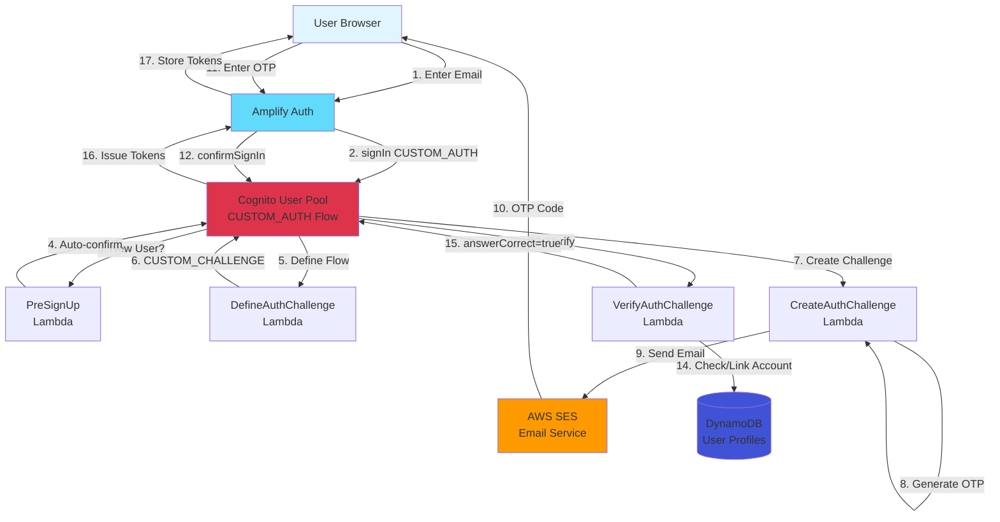

# Design Document

## Overview

This design document outlines the refactoring of the MadeWithKiro email OTP authentication system to follow AWS's recommended passwordless authentication pattern. The refactor eliminates the current hybrid approach (self-signed JWTs + DynamoDB OTP storage) in favor of a clean Cognito-native implementation using custom authentication Lambda triggers.

### Key Design Goals

1. **Cognito-Native Tokens**: Use Cognito's token issuance instead of self-signed JWTs
2. **Simplified Architecture**: Single authentication path through Cognito Lambda triggers
3. **Amplify Integration**: Frontend uses Amplify Auth APIs for consistent token management
4. **Backward Compatibility**: Maintain account linking with existing Google OAuth users
5. **Security**: Proper OTP handling with rate limiting and expiration

### Current vs. Target Architecture

**Current (Hybrid) Approach:**

- `handler.py` stores OTP in DynamoDB `ACCOUNT#` records
- Issues self-signed JWT tokens using `AUTH_JWT_SECRET`
- Cognito Lambda triggers exist but are bypassed
- Inconsistent token format between OTP and Google OAuth

**Target (Cognito-Native) Approach:**

- OTP stored in Cognito's `privateChallengeParameters`
- Cognito issues all tokens (consistent with Google OAuth)
- Lambda triggers handle complete authentication flow
- Frontend uses Amplify Auth APIs

## Architecture

### High-Level Architecture



### Authentication Flow Sequence

```mermaid
sequenceDiagram
    participant User
    participant Amplify
    participant Cognito
    participant PreSignUp
    participant Define
    participant Create
    participant Verify
    participant SES
    participant DDB

    User->>Amplify: Enter email
    Amplify->>Cognito: signIn(email, CUSTOM_AUTH)

    alt New User
        Cognito->>PreSignUp: PreSignUp trigger
        PreSignUp->>Cognito: autoConfirmUser=true, autoVerifyEmail=true
    end

    Cognito->>Define: DefineAuthChallenge
    Define->>Cognito: challengeName=CUSTOM_CHALLENGE

    Cognito->>Create: CreateAuthChallenge
    Create->>Create: Generate 6-digit OTP
    Create->>SES: Send OTP email
    SES->>User: Email with code
    Create->>Cognito: privateChallengeParameters={otp, expires}

    Cognito->>Amplify: Challenge: CUSTOM_CHALLENGE
    Amplify->>User: Show OTP input

    User->>Amplify: Enter OTP code
    Amplify->>Cognito: confirmSignIn(code)

    Cognito->>Verify: VerifyAuthChallenge
    Verify->>Verify: Validate OTP & expiration

    alt Valid OTP
        Verify->>DDB: Query GSI1 for existing profile
        alt Existing Profile Found
            Verify->>DDB: Update authMethods
        else New User
            Verify->>DDB: Create profile
        end
        Verify->>Cognito: answerCorrect=true
    else Invalid OTP
        Verify->>Cognito: answerCorrect=false
    end

    Cognito->>Define: DefineAuthChallenge (check result)

    alt Answer Correct
        Define->>Cognito: issueTokens=true
        Cognito->>Amplify: Tokens (id, access, refresh)
        Amplify->>User: Authentication complete
    else Answer Incorrect
        Define->>Cognito: Continue challenge or fail
    end
```

## Components and Interfaces

### Frontend Components

#### 1. OTPAuthPage Component (Refactored)

**Purpose**: Handle OTP authentication using Amplify Auth APIs

**Key Changes from Current:**

- Replace direct API calls with Amplify `signIn` and `confirmSignIn`
- Remove custom token storage logic
- Use Amplify's built-in token management

**State:**

```typescript
interface OTPAuthState {
  email: string;
  otpCode: string;
  step: "email" | "verify";
  loading: boolean;
  error: string | null;
  challengeResponse: SignInOutput | null;
}
```

**Key Methods:**

```typescript
// Initiate OTP authentication
async function handleEmailSubmit(email: string): Promise<void> {
  const result = await signIn({
    username: email,
    options: {
      authFlowType: "CUSTOM_WITHOUT_SRP",
    },
  });
  // Handle challenge response
}

// Verify OTP code
async function handleOTPVerify(code: string): Promise<void> {
  const result = await confirmSignIn({
    challengeResponse: code,
  });
  // Handle authentication result
}
```

#### 2. AuthContext (Refactored)

**Purpose**: Manage authentication state using Amplify

**Key Changes:**

- Remove custom token management
- Use Amplify's `getCurrentUser` and `fetchAuthSession`
- Unified auth state for both Google OAuth and OTP

**Interface:**

```typescript
interface AuthContextValue {
  user: AuthUser | null;
  isAuthenticated: boolean;
  isLoading: boolean;
  signInWithGoogle: () => Promise<void>;
  signInWithOTP: (email: string) => Promise<SignInOutput>;
  confirmOTP: (code: string) => Promise<SignInOutput>;
  signOut: () => Promise<void>;
  refreshSession: () => Promise<void>;
}
```

### Backend Components (Lambda Triggers)

#### 1. PreSignUp Lambda

**Purpose**: Auto-confirm new users and verify email

**Handler:** `pre_signup.lambda_handler`

**Input:**

```python
{
    "request": {
        "userAttributes": {
            "email": "user@example.com"
        },
        "validationData": {}
    },
    "response": {
        "autoConfirmUser": False,
        "autoVerifyEmail": False
    }
}
```

**Logic:**

1. Set `autoConfirmUser = True` for OTP users
2. Set `autoVerifyEmail = True` (email verified via OTP)
3. Log user creation event

**Output:**

```python
{
    "response": {
        "autoConfirmUser": True,
        "autoVerifyEmail": True
    }
}
```

#### 2. DefineAuthChallenge Lambda (Refactored)

**Purpose**: Control authentication flow and enforce rate limiting

**Handler:** `define_auth_challenge.lambda_handler`

**Logic:**

```python
def lambda_handler(event, context):
    session = event['request'].get('session', [])

    # First attempt - issue challenge
    if len(session) == 0:
        event['response']['challengeName'] = 'CUSTOM_CHALLENGE'
        event['response']['issueTokens'] = False
        event['response']['failAuthentication'] = False
        return event

    # Check last challenge result
    last_challenge = session[-1]

    if last_challenge.get('challengeResult') == True:
        # OTP verified - issue tokens
        event['response']['issueTokens'] = True
        event['response']['failAuthentication'] = False
    elif len(session) >= 5:
        # Too many attempts - fail
        event['response']['issueTokens'] = False
        event['response']['failAuthentication'] = True
    else:
        # Continue with challenge
        event['response']['challengeName'] = 'CUSTOM_CHALLENGE'
        event['response']['issueTokens'] = False
        event['response']['failAuthentication'] = False

    return event
```

#### 3. CreateAuthChallenge Lambda (Refactored)

**Purpose**: Generate OTP and send via email

**Handler:** `create_auth_challenge.lambda_handler`

**Key Changes:**

- Store OTP in `privateChallengeParameters` only
- No DynamoDB storage
- Rate limiting via session metadata

**Logic:**

```python
def lambda_handler(event, context):
    email = event['request']['userAttributes'].get('email')
    session = event['request'].get('session', [])

    # Check rate limiting (60s cooldown)
    if should_rate_limit(session):
        # Return rate limit error via publicChallengeParameters
        event['response']['publicChallengeParameters'] = {
            'error': 'RATE_LIMITED',
            'retryAfter': calculate_retry_after(session)
        }
        return event

    # Generate OTP
    otp_code = generate_otp_code()  # 6-digit secure random
    created_at = int(time.time())
    expires_at = created_at + 600  # 10 minutes

    # Send email via SES
    send_otp_email(email, otp_code)

    # Store in Cognito session (NOT DynamoDB)
    event['response']['privateChallengeParameters'] = {
        'otp_code': otp_code,
        'created_at': str(created_at),
        'expires_at': str(expires_at)
    }

    event['response']['publicChallengeParameters'] = {
        'email': mask_email(email),
        'expiresIn': '600'
    }

    return event
```

#### 4. VerifyAuthChallenge Lambda (Refactored)

**Purpose**: Validate OTP and handle account linking

**Handler:** `verify_auth_challenge.lambda_handler`

**Key Changes:**

- Read OTP from `privateChallengeParameters`
- Handle account linking in DynamoDB
- No self-signed token generation

**Logic:**

```python
def lambda_handler(event, context):
    private_params = event['request']['privateChallengeParameters']
    user_answer = event['request']['challengeAnswer']
    user_attributes = event['request']['userAttributes']

    stored_otp = private_params.get('otp_code')
    expires_at = int(private_params.get('expires_at', 0))
    email = user_attributes.get('email')
    user_sub = user_attributes.get('sub')

    # Check expiration
    if int(time.time()) > expires_at:
        event['response']['answerCorrect'] = False
        return event

    # Verify OTP (timing-safe comparison)
    if not secrets.compare_digest(user_answer, stored_otp):
        event['response']['answerCorrect'] = False
        return event

    # OTP valid - handle account linking
    handle_account_linking(email, user_sub)

    event['response']['answerCorrect'] = True
    return event


def handle_account_linking(email: str, user_sub: str):
    """Check for existing profile and link or create."""
    existing = find_profile_by_email(email)  # Query GSI1

    if existing:
        # Update authMethods to include 'email'
        update_auth_methods(existing['userId'], 'email')
    else:
        # Create new profile
        create_profile(user_sub, email, auth_methods=['email'])
```

### API Changes

#### Removed Endpoints

The following endpoints from `handler.py` will be removed:

- `POST /auth/otp/request` - Replaced by Cognito InitiateAuth
- `POST /auth/otp/verify` - Replaced by Cognito RespondToAuthChallenge
- `POST /auth/otp/refresh` - Replaced by Amplify token refresh

#### Cognito API Usage

**Initiate Authentication:**

```typescript
// Frontend using Amplify
const result = await signIn({
  username: email,
  options: {
    authFlowType: "CUSTOM_WITHOUT_SRP",
  },
});
```

**Verify OTP:**

```typescript
// Frontend using Amplify
const result = await confirmSignIn({
  challengeResponse: otpCode,
});
```

## Data Models

### Cognito User Attributes

```typescript
interface CognitoUserAttributes {
  sub: string; // Cognito user ID (UUID)
  email: string; // User email address
  email_verified: boolean; // Always true for OTP users
  "custom:auth_methods": string; // JSON: ["email"] or ["google", "email"]
}
```

### DynamoDB User Profile (Unchanged)

```typescript
interface UserProfile {
  PK: string; // "USER#<cognitoUserId>"
  SK: string; // "PROFILE"
  userId: string; // Cognito sub
  email: string; // User email
  firstName: string; // User first name
  lastName: string; // User last name
  authMethods: string[]; // ["email"] or ["google", "email"]
  createdAt: string; // ISO timestamp
  updatedAt: string; // ISO timestamp
  GSI1PK: string; // "EMAIL#<email>"
  GSI1SK: string; // "PROFILE"
}
```

### Cognito Session Parameters

**privateChallengeParameters (not visible to client):**

```typescript
{
  otp_code: string; // 6-digit OTP code
  created_at: string; // Unix timestamp
  expires_at: string; // Unix timestamp (created_at + 600)
}
```

**publicChallengeParameters (visible to client):**

```typescript
{
  email: string;         // Masked email (use***@domain.com)
  expiresIn: string;     // Seconds until expiration ("600")
  error?: string;        // "RATE_LIMITED" if rate limited
  retryAfter?: string;   // Seconds until retry allowed
}
```

## Correctness Properties

_A property is a characteristic or behavior that should hold true across all valid executions of a system-essentially, a formal statement about what the system should do. Properties serve as the bridge between human-readable specifications and machine-verifiable correctness guarantees._

### Property 1: Cognito Token Issuance

_For any_ successful OTP authentication, the returned tokens SHALL be issued by Cognito (verifiable via the token's `iss` claim matching the Cognito User Pool URL).

**Validates: Requirements 1.1, 1.2, 2.4**

### Property 2: Token Format Consistency

_For any_ user with both Google OAuth and email OTP authentication methods, tokens issued via either method SHALL have the same format, issuer, and be validated using the same Cognito JWKS.

**Validates: Requirements 1.4**

### Property 3: OTP Storage Location

_For any_ OTP authentication flow, the OTP code SHALL be stored only in Cognito's `privateChallengeParameters` and SHALL NOT create any `ACCOUNT#` records in DynamoDB.

**Validates: Requirements 2.3, 9.1**

### Property 4: New User Auto-Confirmation

_For any_ new user authenticating via OTP, the PreSignUp trigger SHALL set `autoConfirmUser=true` and `autoVerifyEmail=true`, resulting in a confirmed user with verified email.

**Validates: Requirements 3.2, 3.3**

### Property 5: Profile Creation with Cognito Sub

_For any_ new OTP user, after successful authentication, a DynamoDB profile SHALL be created with `userId` equal to the Cognito `sub` attribute and `authMethods` containing `'email'`.

**Validates: Requirements 3.4, 3.5**

### Property 6: OTP Generation Security

_For any_ generated OTP code, the code SHALL be exactly 6 digits and generated using `secrets.randbelow()` for cryptographic security.

**Validates: Requirements 7.1**

### Property 7: OTP Expiration Enforcement

_For any_ OTP code, the expiration time SHALL be exactly 600 seconds (10 minutes) from creation, and verification attempts after expiration SHALL fail.

**Validates: Requirements 7.2**

### Property 8: Rate Limiting Enforcement

_For any_ email address, if an OTP was requested within the last 60 seconds, subsequent OTP requests SHALL be rejected with a rate limit error including the remaining wait time.

**Validates: Requirements 7.3**

### Property 9: Maximum Attempts Enforcement

_For any_ authentication session, if 5 incorrect OTP attempts are made, the DefineAuthChallenge trigger SHALL set `failAuthentication=true`.

**Validates: Requirements 7.4**

### Property 10: Account Linking Preservation

_For any_ OTP authentication where an existing Google-authenticated profile exists with the same email, the original `userId` and profile data SHALL be preserved, and `authMethods` SHALL be updated to include `'email'`.

**Validates: Requirements 5.2, 5.3**

### Property 11: Linked Account Profile Consistency

_For any_ user with linked authentication methods, signing in via OTP or Google OAuth SHALL return access to the same DynamoDB profile (same `userId`).

**Validates: Requirements 5.4**

### Property 12: OTP Code Not Logged

_For any_ OTP generation or verification, the actual 6-digit code value SHALL NOT appear in CloudWatch logs.

**Validates: Requirements 7.5**

## Error Handling

### Error Categories

#### 1. Challenge Errors (from publicChallengeParameters)

**Rate Limited:**

```typescript
{
  error: 'RATE_LIMITED',
  retryAfter: '45'  // seconds
}
```

**Frontend Handling:** Display countdown timer, disable submit button

#### 2. Verification Errors (from Cognito)

**Incorrect Code:**

- Cognito returns challenge again with `answerCorrect=false`
- Frontend shows "Incorrect code" message

**Expired Code:**

- VerifyAuthChallenge returns `answerCorrect=false`
- Frontend shows "Code expired" message with resend option

**Max Attempts Exceeded:**

- DefineAuthChallenge sets `failAuthentication=true`
- Cognito returns `NotAuthorizedException`
- Frontend shows "Too many attempts" message

#### 3. Cognito Errors

**UserNotFoundException:**

- New user flow - PreSignUp creates user
- Should not occur with proper flow

**NotAuthorizedException:**

- Authentication failed (max attempts or other)
- Frontend shows generic auth error

### Error Response Mapping

```typescript
function mapCognitoError(error: Error): UserFacingError {
  if (error.name === "NotAuthorizedException") {
    return {
      message: "Authentication failed. Please try again.",
      action: "restart",
    };
  }
  if (error.name === "UserNotFoundException") {
    return {
      message: "Unable to create account. Please try again.",
      action: "restart",
    };
  }
  // ... other mappings
}
```

## Testing Strategy

### Unit Testing

**Backend Unit Tests:**

- OTP code generation (6 digits, randomness distribution)
- Expiration time calculation (exactly 600 seconds)
- Rate limit calculation logic
- Email masking function

**Frontend Unit Tests:**

- OTP input component validation
- Error message display logic
- Countdown timer functionality

### Property-Based Testing

Property-based tests will use **fast-check** (TypeScript) and **hypothesis** (Python) with minimum 100 iterations per property.

**Example Property Tests:**

```python
# Property 7: OTP Expiration Enforcement
# Feature: otp-auth-refactor, Property 7: OTP Expiration Enforcement
# Validates: Requirements 7.2
@given(st.integers(min_value=0, max_value=int(time.time())))
def test_otp_expiration_is_600_seconds(created_at):
    expires_at = calculate_expiration_time(created_at)
    assert expires_at - created_at == 600
```

```typescript
// Property 1: Cognito Token Issuance
// Feature: otp-auth-refactor, Property 1: Cognito Token Issuance
// Validates: Requirements 1.1, 1.2, 2.4
test("tokens are issued by Cognito", () => {
  fc.assert(
    fc.asyncProperty(fc.emailAddress(), async (email) => {
      const tokens = await authenticateWithOTP(email, validOTP);
      const decoded = decodeJwt(tokens.idToken);
      expect(decoded.iss).toMatch(/cognito-idp\..+\.amazonaws\.com/);
    }),
    { numRuns: 100 }
  );
});
```

### Integration Testing

1. **Complete OTP Flow:** Email → OTP sent → Verify → Tokens received
2. **Account Linking:** Google user → OTP auth → Profile linked
3. **Rate Limiting:** Multiple rapid requests → Rate limit enforced
4. **Expiration:** Wait 10+ minutes → Code rejected

## Security Considerations

### OTP Security

1. **Generation:** Use `secrets.randbelow(1000000)` for cryptographic randomness
2. **Storage:** Only in Cognito `privateChallengeParameters` (encrypted by Cognito)
3. **Transmission:** Via SES email only, never in URLs or logs
4. **Comparison:** Use `secrets.compare_digest()` for timing-safe comparison
5. **Expiration:** Strict 10-minute window, no extensions

### Token Security

1. **Issuance:** Cognito-only, no self-signed tokens
2. **Validation:** Use Cognito JWKS for verification
3. **Storage:** Amplify handles secure storage
4. **Refresh:** Standard Cognito refresh token flow

### Rate Limiting

1. **Per-Email:** 60-second cooldown between OTP requests
2. **Per-Session:** Maximum 5 verification attempts
3. **Implementation:** Via Cognito session metadata (no external state)

## Migration Plan

### Phase 1: Backend Updates

1. Update PreSignUp Lambda for auto-confirmation
2. Refactor DefineAuthChallenge (remove DynamoDB rate limiting)
3. Refactor CreateAuthChallenge (remove DynamoDB storage)
4. Refactor VerifyAuthChallenge (read from privateChallengeParameters)
5. Update SAM template with new Lambda configurations

### Phase 2: Frontend Updates

1. Update AuthContext to use Amplify Auth APIs
2. Refactor OTPAuthPage to use `signIn` and `confirmSignIn`
3. Remove custom token storage logic
4. Update error handling for Cognito errors

### Phase 3: Cleanup

1. Remove `handler.py` OTP endpoints
2. Remove `AUTH_JWT_SECRET` from environment
3. Remove DynamoDB `ACCOUNT#` record creation
4. Update API Gateway to remove deprecated endpoints

### Phase 4: Testing & Validation

1. Run all property-based tests
2. Test account linking with existing Google users
3. Verify token consistency between auth methods
4. Test rate limiting and expiration

### Rollback Plan

If issues are detected:

1. Re-enable `handler.py` endpoints via API Gateway
2. Revert Lambda trigger code
3. Frontend can fall back to direct API calls
4. Investigate and fix issues before re-attempting migration

## Performance Considerations

### Expected Latency

- **OTP Request:** < 2 seconds (Lambda + SES)
- **OTP Verification:** < 500ms (Lambda only)
- **Token Issuance:** Handled by Cognito (< 100ms)

### Optimization

- Lambda triggers are lightweight (no DynamoDB writes for OTP storage)
- Cognito handles token caching and refresh
- SES email delivery is asynchronous

## Deployment Configuration

### SAM Template Updates

```yaml
# Cognito User Pool Lambda Triggers
CognitoUserPool:
  Type: AWS::Cognito::UserPool
  Properties:
    LambdaConfig:
      PreSignUp: !GetAtt PreSignUpFunction.Arn
      DefineAuthChallenge: !GetAtt DefineAuthChallengeFunction.Arn
      CreateAuthChallenge: !GetAtt CreateAuthChallengeFunction.Arn
      VerifyAuthChallengeResponse: !GetAtt VerifyAuthChallengeFunction.Arn
```

### Environment Variables

**Required:**

- `TABLE_NAME`: DynamoDB table name
- `SES_EMAIL_IDENTITY`: Sender email address
- `SES_TEMPLATE_NAME`: SES template for OTP emails

**Removed:**

- `AUTH_JWT_SECRET`: No longer needed (Cognito handles tokens)
