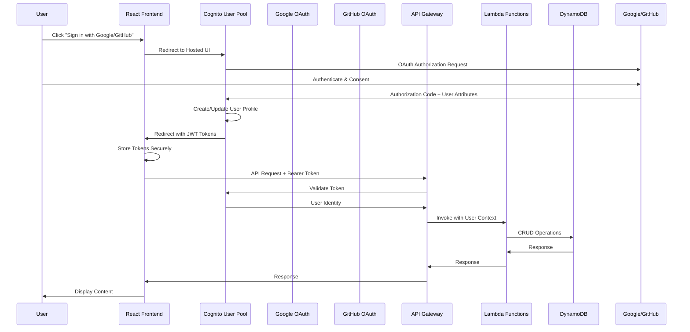
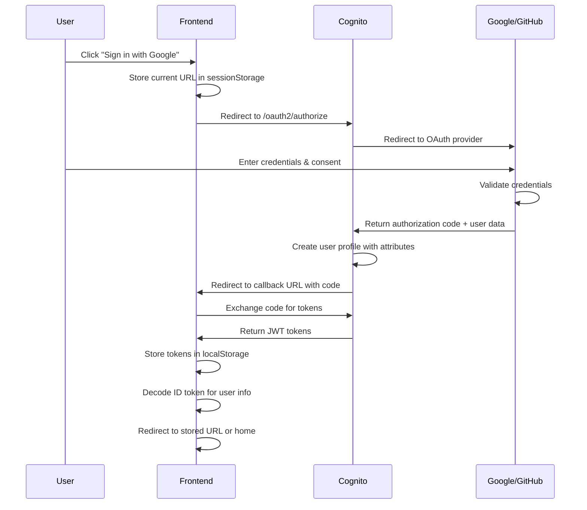
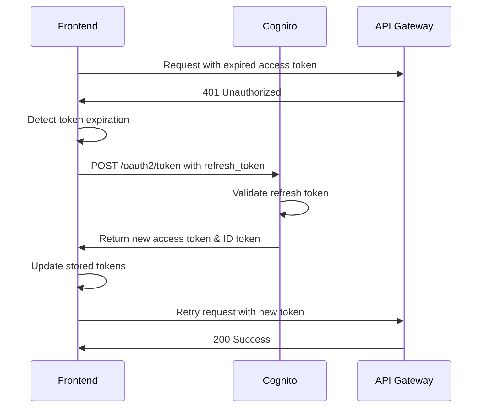
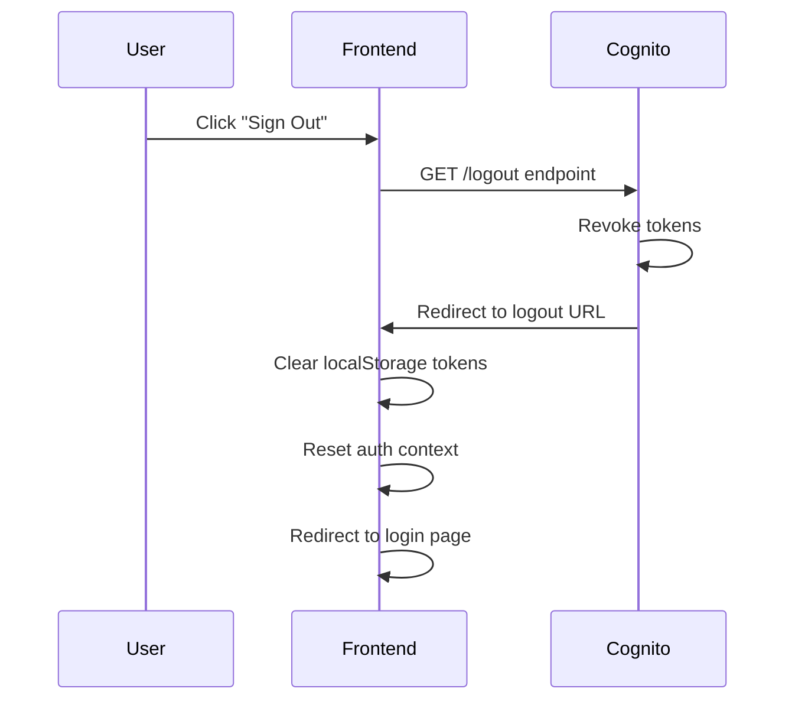

# Design Document: Social Authentication

## Overview

This design document outlines the implementation of social authentication using Google and GitHub as identity providers for the MadeWithKiro platform. The solution replaces traditional username/password authentication with OAuth 2.0-based social login, leveraging AWS Cognito User Pools for identity management and AWS SAM for infrastructure provisioning.

The design focuses on:

- Seamless OAuth integration with Google and GitHub
- Infrastructure-as-code using AWS SAM templates
- Automatic profile population with social account data including profile pictures
- Secure token management and session handling
- Environment-specific configuration for development and production

## Architecture

### High-Level Architecture



### Component Interaction

1. **Frontend (React)**: Initiates OAuth flow, manages tokens, displays UI
2. **Cognito User Pool**: Manages identity providers, user profiles, and token issuance
3. **Identity Providers**: Google and GitHub OAuth services
4. **SAM Template**: Defines infrastructure including Cognito configuration
5. **API Gateway**: Validates tokens and routes requests
6. **Lambda Functions**: Business logic execution with authenticated user context

## Components and Interfaces

### 1. AWS SAM Template Configuration

#### Identity Provider Resources

**Google Identity Provider**

```yaml
GoogleIdentityProvider:
  Type: AWS::Cognito::UserPoolIdentityProvider
  Properties:
    UserPoolId: !Ref CognitoUserPool
    ProviderName: Google
    ProviderType: Google
    ProviderDetails:
      client_id: !Ref GoogleClientId
      client_secret: !Ref GoogleClientSecretParameter
      authorize_scopes: "profile email openid"
    AttributeMapping:
      email: email
      given_name: given_name
      family_name: family_name
      picture: picture
      username: sub
```

**GitHub Identity Provider**

```yaml
GitHubIdentityProvider:
  Type: AWS::Cognito::UserPoolIdentityProvider
  Properties:
    UserPoolId: !Ref CognitoUserPool
    ProviderName: GitHub
    ProviderType: OIDC
    ProviderDetails:
      client_id: !Ref GitHubClientId
      client_secret: !Ref GitHubClientSecretParameter
      authorize_scopes: "read:user user:email"
      attributes_request_method: GET
      oidc_issuer: "https://github.com"
      authorize_url: "https://github.com/login/oauth/authorize"
      token_url: "https://github.com/login/oauth/access_token"
      attributes_url: "https://api.github.com/user"
    AttributeMapping:
      email: email
      name: name
      picture: avatar_url
      username: sub
```

#### Cognito User Pool Updates

**Custom Attributes for Profile Picture**

```yaml
CognitoUserPool:
  Type: AWS::Cognito::UserPool
  Properties:
    Schema:
      - Name: email
        AttributeDataType: String
        Required: true
        Mutable: false
      - Name: given_name
        AttributeDataType: String
        Required: false
        Mutable: true
      - Name: family_name
        AttributeDataType: String
        Required: false
        Mutable: true
      - Name: picture
        AttributeDataType: String
        Required: false
        Mutable: true
```

**User Pool Client Configuration**

```yaml
CognitoUserPoolClient:
  Type: AWS::Cognito::UserPoolClient
  DependsOn:
    - GoogleIdentityProvider
    - GitHubIdentityProvider
  Properties:
    UserPoolId: !Ref CognitoUserPool
    SupportedIdentityProviders:
      - Google
      - GitHub
    AllowedOAuthFlows:
      - code
      - implicit
    AllowedOAuthScopes:
      - email
      - openid
      - profile
    CallbackURLs:
      - !Ref CognitoCallbackURL
    LogoutURLs:
      - !Ref CognitoCallbackURL
    ExplicitAuthFlows: [] # Disable username/password flows
```

#### Parameters

```yaml
Parameters:
  GoogleClientId:
    Type: String
    Description: Google OAuth Client ID
    NoEcho: false

  GoogleClientSecretParameter:
    Type: AWS::SSM::Parameter::Value<String>
    Description: SSM Parameter name containing Google OAuth Client Secret
    Default: /madewithkiro/${Environment}/google-client-secret

  GitHubClientId:
    Type: String
    Description: GitHub OAuth Client ID
    NoEcho: false

  GitHubClientSecretParameter:
    Type: AWS::SSM::Parameter::Value<String>
    Description: SSM Parameter name containing GitHub OAuth Client Secret
    Default: /madewithkiro/${Environment}/github-client-secret

  CognitoCallbackURL:
    Type: String
    Description: OAuth callback URL (environment-specific)
```

**SSM Parameter Store Setup:**

Before deployment, create encrypted parameters:

```bash
# Development environment
aws ssm put-parameter \
  --name "/madewithkiro/dev/google-client-secret" \
  --value "<your-google-client-secret>" \
  --type "SecureString" \
  --description "Google OAuth client secret for dev environment"

aws ssm put-parameter \
  --name "/madewithkiro/dev/github-client-secret" \
  --value "<your-github-client-secret>" \
  --type "SecureString" \
  --description "GitHub OAuth client secret for dev environment"

# Production environment
aws ssm put-parameter \
  --name "/madewithkiro/prod/google-client-secret" \
  --value "<your-google-client-secret>" \
  --type "SecureString" \
  --description "Google OAuth client secret for prod environment"

aws ssm put-parameter \
  --name "/madewithkiro/prod/github-client-secret" \
  --value "<your-github-client-secret>" \
  --type "SecureString" \
  --description "GitHub OAuth client secret for prod environment"
```

### 2. Frontend Authentication Service

#### Authentication Context

```typescript
interface AuthUser {
  userId: string;
  email: string;
  givenName: string;
  familyName: string;
  picture?: string;
  provider: "Google" | "GitHub";
}

interface AuthContextType {
  user: AuthUser | null;
  isAuthenticated: boolean;
  isLoading: boolean;
  signInWithGoogle: () => Promise<void>;
  signInWithGitHub: () => Promise<void>;
  signOut: () => Promise<void>;
  refreshToken: () => Promise<void>;
}
```

#### OAuth Flow Handler

```typescript
class CognitoAuthService {
  private userPoolId: string;
  private clientId: string;
  private domain: string;
  private redirectUri: string;

  signInWithProvider(provider: "Google" | "GitHub"): void {
    const authUrl =
      `${this.domain}/oauth2/authorize?` +
      `identity_provider=${provider}&` +
      `redirect_uri=${this.redirectUri}&` +
      `response_type=code&` +
      `client_id=${this.clientId}&` +
      `scope=email openid profile`;

    window.location.href = authUrl;
  }

  async handleCallback(code: string): Promise<AuthTokens> {
    // Exchange authorization code for tokens
    const response = await fetch(`${this.domain}/oauth2/token`, {
      method: "POST",
      headers: { "Content-Type": "application/x-www-form-urlencoded" },
      body: new URLSearchParams({
        grant_type: "authorization_code",
        client_id: this.clientId,
        code: code,
        redirect_uri: this.redirectUri,
      }),
    });

    return response.json();
  }

  async getUserInfo(accessToken: string): Promise<AuthUser> {
    const response = await fetch(`${this.domain}/oauth2/userInfo`, {
      headers: { Authorization: `Bearer ${accessToken}` },
    });

    return response.json();
  }
}
```

#### Token Storage

```typescript
class TokenManager {
  private readonly ACCESS_TOKEN_KEY = "access_token";
  private readonly REFRESH_TOKEN_KEY = "refresh_token";
  private readonly ID_TOKEN_KEY = "id_token";

  storeTokens(tokens: AuthTokens): void {
    localStorage.setItem(this.ACCESS_TOKEN_KEY, tokens.access_token);
    localStorage.setItem(this.REFRESH_TOKEN_KEY, tokens.refresh_token);
    localStorage.setItem(this.ID_TOKEN_KEY, tokens.id_token);
  }

  getAccessToken(): string | null {
    return localStorage.getItem(this.ACCESS_TOKEN_KEY);
  }

  clearTokens(): void {
    localStorage.removeItem(this.ACCESS_TOKEN_KEY);
    localStorage.removeItem(this.REFRESH_TOKEN_KEY);
    localStorage.removeItem(this.ID_TOKEN_KEY);
  }

  async refreshAccessToken(): Promise<string> {
    const refreshToken = localStorage.getItem(this.REFRESH_TOKEN_KEY);
    // Implement token refresh logic
  }
}
```

### 3. Login UI Component

```typescript
const LoginPage: React.FC = () => {
  const { signInWithGoogle, signInWithGitHub, isLoading } = useAuth();

  return (
    <div className="login-container">
      <h1>Sign in to MadeWithKiro</h1>
      <button
        onClick={signInWithGoogle}
        disabled={isLoading}
        className="social-login-button google"
      >
        <GoogleIcon />
        Sign in with Google
      </button>
      <button
        onClick={signInWithGitHub}
        disabled={isLoading}
        className="social-login-button github"
      >
        <GitHubIcon />
        Sign in with GitHub
      </button>
    </div>
  );
};
```

### 4. OAuth Callback Handler

```typescript
const CallbackPage: React.FC = () => {
  const navigate = useNavigate();
  const { handleCallback } = useAuth();
  const [error, setError] = useState<string | null>(null);

  useEffect(() => {
    const params = new URLSearchParams(window.location.search);
    const code = params.get("code");
    const errorParam = params.get("error");
    const state = params.get("state");

    if (errorParam) {
      setError(getErrorMessage(errorParam));
      return;
    }

    if (code) {
      handleCallback(code)
        .then(() => {
          const redirectTo =
            sessionStorage.getItem("redirect_after_login") || "/";
          sessionStorage.removeItem("redirect_after_login");
          navigate(redirectTo);
        })
        .catch((err) => setError(err.message));
    }
  }, []);

  if (error) {
    return <ErrorDisplay message={error} />;
  }

  return <LoadingSpinner message="Completing sign in..." />;
};
```

### 5. Protected Route Component

```typescript
const ProtectedRoute: React.FC<{ children: React.ReactNode }> = ({
  children,
}) => {
  const { isAuthenticated, isLoading } = useAuth();
  const location = useLocation();

  if (isLoading) {
    return <LoadingSpinner />;
  }

  if (!isAuthenticated) {
    sessionStorage.setItem("redirect_after_login", location.pathname);
    return <Navigate to="/login" replace />;
  }

  return <>{children}</>;
};
```

### 6. Profile Picture Display Component

```typescript
interface ProfilePictureProps {
  pictureUrl?: string;
  name: string;
  size?: "small" | "medium" | "large";
}

const ProfilePicture: React.FC<ProfilePictureProps> = ({
  pictureUrl,
  name,
  size = "medium",
}) => {
  const [imageError, setImageError] = useState(false);

  if (!pictureUrl || imageError) {
    return (
      <div className={`avatar-placeholder ${size}`}>
        {name.charAt(0).toUpperCase()}
      </div>
    );
  }

  return (
     setImageError(true)}
    />
  );
};
```

## Data Models

### Cognito User Attributes

```typescript
interface CognitoUserAttributes {
  sub: string; // Unique user ID
  email: string; // User email (verified)
  email_verified: boolean; // Email verification status
  given_name?: string; // First name
  family_name?: string; // Last name
  picture?: string; // Profile picture URL
  identities: string; // JSON array of linked identities
  "cognito:username": string; // Cognito username (provider_sub)
}
```

### Identity Object

```typescript
interface CognitoIdentity {
  userId: string; // Provider's user ID
  providerName: string; // 'Google' or 'GitHub'
  providerType: string; // 'Google' or 'OIDC'
  issuer: string; // Provider's issuer URL
  primary: boolean; // Primary identity flag
  dateCreated: number; // Timestamp
}
```

### JWT Token Structure

```typescript
interface IDToken {
  sub: string; // User ID
  email: string;
  email_verified: boolean;
  given_name?: string;
  family_name?: string;
  picture?: string;
  "cognito:username": string;
  "cognito:groups"?: string[];
  identities: CognitoIdentity[];
  iss: string; // Token issuer
  aud: string; // Client ID
  exp: number; // Expiration timestamp
  iat: number; // Issued at timestamp
}
```

## Data Flow

### 1. Initial Authentication Flow



### 2. Token Refresh Flow



### 3. Sign Out Flow



##

Correctness Properties

_A property is a characteristic or behavior that should hold true across all valid executions of a system-essentially, a formal statement about what the system should do. Properties serve as the bridge between human-readable specifications and machine-verifiable correctness guarantees._

### Property 1: OAuth attribute extraction completeness

_For any_ successful OAuth response from Google, the system should extract and store all required user attributes (email, given_name, family_name).
**Validates: Requirements 1.3**

### Property 2: JWT token validity after authentication

_For any_ completed OAuth flow (Google or GitHub), the returned JWT tokens should be valid, non-expired, and contain the authenticated user's identity claims.
**Validates: Requirements 1.4, 2.4**

### Property 3: First-time user profile creation

_For any_ user authenticating for the first time with either provider, a new user profile should be created in Cognito with all mapped attributes from the identity provider.
**Validates: Requirements 1.5, 2.5**

### Property 4: GitHub attribute extraction completeness

_For any_ successful OAuth response from GitHub, the system should extract and store all required user attributes (email, name).
**Validates: Requirements 2.3**

### Property 5: Automatic token refresh on expiration

_For any_ API request made with an expired access token, the frontend should automatically attempt to refresh the token using the refresh token before retrying the request.
**Validates: Requirements 4.2**

### Property 6: Session persistence across browser sessions

_For any_ authenticated user with a valid refresh token, closing and reopening the browser should restore the authenticated session without requiring re-authentication.
**Validates: Requirements 4.3**

### Property 7: Re-authentication requirement on refresh token expiration

_For any_ user with an expired refresh token, attempting to access protected resources should redirect to the login page requiring full re-authentication.
**Validates: Requirements 4.4**

### Property 8: OAuth error propagation

_For any_ error returned by an identity provider during OAuth flow, the system should redirect to the frontend with the error parameter preserved in the URL.
**Validates: Requirements 5.1**

### Property 9: Error message display

_For any_ authentication error received by the frontend, a user-friendly error message should be displayed to the user.
**Validates: Requirements 5.2**

### Property 10: Network error retry availability

_For any_ network error during authentication, the UI should provide a retry mechanism to attempt authentication again.
**Validates: Requirements 5.4**

### Property 11: Provider independence on failure

_For any_ identity provider failure, the alternative identity provider button should remain functional and allow authentication attempts.
**Validates: Requirements 5.5**

### Property 12: Protected route redirect preservation

_For any_ unauthenticated user attempting to access a protected route, the system should store the intended destination URL and redirect there after successful authentication.
**Validates: Requirements 6.1, 6.2**

### Property 13: Token revocation on sign-out

_For any_ user who signs out, all issued tokens should be revoked and subsequent API requests with those tokens should return unauthorized errors.
**Validates: Requirements 7.1, 7.4**

### Property 14: Local token cleanup on sign-out

_For any_ sign-out action, all authentication tokens stored in localStorage should be completely removed.
**Validates: Requirements 7.2**

### Property 15: Google profile picture retrieval and storage

_For any_ user authenticating with Google, if a profile picture URL is provided by Google, it should be stored in the user's Cognito picture attribute.
**Validates: Requirements 9.4, 10.1, 10.3**

### Property 16: GitHub name parsing

_For any_ GitHub user with a name attribute, the system should parse the name into given_name and family_name components (splitting on the first space).
**Validates: Requirements 9.6**

### Property 17: GitHub avatar retrieval and storage

_For any_ user authenticating with GitHub, if an avatar URL is provided by GitHub, it should be stored in the user's Cognito picture attribute.
**Validates: Requirements 9.7, 10.2, 10.3**

### Property 18: Profile picture rendering

_For any_ user profile display, if a picture URL exists in the user attributes, the frontend should render an img element with that URL as the source.
**Validates: Requirements 10.4**

### Property 19: Profile picture fallback

_For any_ user profile display where the picture URL is missing or fails to load, the system should display a default avatar with the user's initial.
**Validates: Requirements 10.5**

## Error Handling

### OAuth Provider Errors

**Error Types:**

- `access_denied`: User denied permission on consent screen
- `invalid_request`: Malformed OAuth request
- `unauthorized_client`: Client not authorized for this grant type
- `unsupported_response_type`: OAuth response type not supported
- `invalid_scope`: Requested scope is invalid
- `server_error`: Provider internal error
- `temporarily_unavailable`: Provider temporarily unavailable

**Handling Strategy:**

```typescript
function handleOAuthError(error: string, errorDescription?: string): void {
  const errorMessages: Record<string, string> = {
    access_denied: "You cancelled the sign-in process. Please try again.",
    invalid_request: "Authentication request was invalid. Please try again.",
    unauthorized_client:
      "This application is not authorized. Please contact support.",
    server_error:
      "The authentication provider encountered an error. Please try again later.",
    temporarily_unavailable:
      "The authentication service is temporarily unavailable. Please try again later.",
  };

  const message =
    errorMessages[error] || "An unexpected error occurred during sign-in.";
  displayError(message);
  logError({ error, errorDescription, timestamp: Date.now() });
}
```

### Token Errors

**Error Types:**

- Token expired
- Token invalid
- Token revoked
- Refresh token expired

**Handling Strategy:**

```typescript
async function handleTokenError(error: TokenError): Promise<void> {
  if (error.type === "expired" && hasValidRefreshToken()) {
    try {
      await refreshAccessToken();
      return; // Retry original request
    } catch (refreshError) {
      // Refresh failed, require re-authentication
      redirectToLogin();
    }
  } else {
    // Token invalid or refresh token expired
    clearTokens();
    redirectToLogin();
  }
}
```

### Network Errors

**Handling Strategy:**

```typescript
async function handleNetworkError(
  error: NetworkError,
  retryCount: number = 0
): Promise<void> {
  const MAX_RETRIES = 3;
  const RETRY_DELAY = 1000 * Math.pow(2, retryCount); // Exponential backoff

  if (retryCount < MAX_RETRIES) {
    await delay(RETRY_DELAY);
    return retryRequest(retryCount + 1);
  } else {
    displayError(
      "Unable to connect. Please check your internet connection and try again."
    );
    showRetryButton();
  }
}
```

### Profile Picture Loading Errors

**Handling Strategy:**

```typescript
function handleImageLoadError(event: Event): void {
  const img = event.target as HTMLImageElement;
  const userName = img.getAttribute("data-user-name") || "User";

  // Replace with default avatar
  img.style.display = "none";
  const placeholder = createDefaultAvatar(userName);
  img.parentElement?.appendChild(placeholder);

  // Log for monitoring
  logImageLoadError(img.src);
}
```

## Testing Strategy

### Unit Testing

**Frontend Components:**

- Login page renders both social login buttons
- Callback handler processes authorization codes correctly
- Token manager stores and retrieves tokens correctly
- Profile picture component handles missing URLs gracefully
- Error display component shows appropriate messages
- Protected route redirects unauthenticated users

**Authentication Service:**

- OAuth URL construction includes correct parameters
- Token exchange requests are properly formatted
- User info extraction handles all attribute types
- Token refresh logic triggers at appropriate times
- Sign-out clears all stored tokens

**Utility Functions:**

- GitHub name parsing handles various formats (single name, multiple names, empty)
- Error message mapping returns correct messages for all error codes
- URL validation correctly identifies invalid redirect URLs

### Property-Based Testing

Property-based tests will use a testing library appropriate for TypeScript/JavaScript (e.g., fast-check) and Python (e.g., Hypothesis) to verify universal properties across many randomly generated inputs.

**Test Configuration:**

- Minimum 100 iterations per property test
- Each property test tagged with format: `**Feature: social-authentication, Property {number}: {property_text}**`
- Tests should generate realistic user data, OAuth responses, and error conditions

**Property Test Examples:**

1. **OAuth Attribute Extraction**: Generate random OAuth responses with various attribute combinations and verify all required attributes are extracted
2. **Token Validity**: Generate random token payloads and verify they decode correctly and contain required claims
3. **Name Parsing**: Generate random name strings and verify parsing produces valid given_name and family_name
4. **Session Persistence**: Generate random token sets and verify session restoration works across simulated browser restarts
5. **Error Handling**: Generate random OAuth error codes and verify appropriate error messages are displayed

### Integration Testing

**OAuth Flow Testing:**

- Mock Google OAuth provider and test complete authentication flow
- Mock GitHub OAuth provider and test complete authentication flow
- Test callback handling with various authorization codes
- Test error scenarios (denied access, invalid codes, network failures)

**Token Management:**

- Test token refresh when access token expires
- Test re-authentication when refresh token expires
- Test token revocation on sign-out
- Test concurrent requests with token refresh

**Infrastructure Testing:**

- Validate SAM template syntax and structure
- Verify Cognito User Pool configuration
- Verify Identity Provider configurations
- Verify User Pool Client settings
- Test deployment to development environment
- Test deployment to production environment

### End-to-End Testing

**User Flows:**

1. New user signs in with Google → Profile created → Redirected to home
2. New user signs in with GitHub → Profile created → Redirected to home
3. User accesses protected route → Redirected to login → Signs in → Redirected to original route
4. User signs out → Tokens cleared → Redirected to login
5. User with expired access token → Token refreshed automatically → Request succeeds
6. User with expired refresh token → Redirected to login → Must re-authenticate

**Error Scenarios:**

1. User denies OAuth consent → Error message displayed → Can retry
2. Network error during OAuth → Error message displayed → Retry button shown
3. Invalid OAuth callback → Error message displayed
4. Profile picture URL fails to load → Default avatar displayed

## Security Considerations

### Token Security

1. **Storage**: Tokens stored in localStorage (acceptable for SPAs, consider httpOnly cookies for enhanced security)
2. **Transmission**: All token exchanges over HTTPS only
3. **Expiration**: Short-lived access tokens (60 minutes), longer refresh tokens (30 days)
4. **Revocation**: Tokens revoked on sign-out via Cognito global sign-out

### OAuth Security

1. **State Parameter**: Include state parameter in OAuth requests to prevent CSRF attacks
2. **PKCE**: Consider implementing PKCE (Proof Key for Code Exchange) for additional security
3. **Redirect URI Validation**: Strict validation of callback URLs in Cognito configuration
4. **Scope Limitation**: Request only necessary scopes from identity providers

### API Security

1. **Token Validation**: API Gateway validates all tokens with Cognito before invoking Lambda
2. **User Context**: Lambda functions receive validated user identity from API Gateway
3. **Authorization**: Implement resource-level authorization in Lambda functions
4. **Rate Limiting**: API Gateway throttling to prevent abuse

### Infrastructure Security

1. **Secrets Management**: OAuth client secrets stored in AWS Systems Manager Parameter Store as SecureString (encrypted with KMS)
2. **IAM Roles**: Least privilege IAM roles for Lambda functions with permissions to read SSM parameters
3. **Encryption**: DynamoDB encryption at rest enabled
4. **Network Security**: API Gateway and Lambda in VPC (if required)

## Deployment Strategy

### Prerequisites

1. **Google OAuth Setup:**

   - Create project in Google Cloud Console
   - Enable Google+ API
   - Create OAuth 2.0 credentials
   - Configure authorized redirect URIs
   - Obtain client ID and client secret

2. **GitHub OAuth Setup:**
   - Create OAuth App in GitHub Developer Settings
   - Configure callback URL
   - Obtain client ID and client secret

### Environment Configuration

**Development Environment:**

```bash
# .env.dev
GOOGLE_CLIENT_ID=<dev-google-client-id>
GOOGLE_CLIENT_SECRET=<dev-google-client-secret>
GITHUB_CLIENT_ID=<dev-github-client-id>
GITHUB_CLIENT_SECRET=<dev-github-client-secret>
CALLBACK_URL=http://localhost:5173/callback
```

**Production Environment:**

```bash
# .env.prod
GOOGLE_CLIENT_ID=<prod-google-client-id>
GOOGLE_CLIENT_SECRET=<prod-google-client-secret>
GITHUB_CLIENT_ID=<prod-github-client-id>
GITHUB_CLIENT_SECRET=<prod-github-client-secret>
CALLBACK_URL=https://madewithkiro.com/callback
```

### Deployment Commands

```bash
# First, store secrets in SSM Parameter Store (one-time setup per environment)
# Development
aws ssm put-parameter \
  --name "/madewithkiro/dev/google-client-secret" \
  --value "$GOOGLE_CLIENT_SECRET" \
  --type "SecureString"

aws ssm put-parameter \
  --name "/madewithkiro/dev/github-client-secret" \
  --value "$GITHUB_CLIENT_SECRET" \
  --type "SecureString"

# Production
aws ssm put-parameter \
  --name "/madewithkiro/prod/google-client-secret" \
  --value "$GOOGLE_CLIENT_SECRET" \
  --type "SecureString"

aws ssm put-parameter \
  --name "/madewithkiro/prod/github-client-secret" \
  --value "$GITHUB_CLIENT_SECRET" \
  --type "SecureString"

# Deploy to development (secrets read from SSM automatically)
make deploy-dev \
  --parameter-overrides \
    GoogleClientId=$GOOGLE_CLIENT_ID \
    GitHubClientId=$GITHUB_CLIENT_ID \
    CognitoCallbackURL=$CALLBACK_URL

# Deploy to production (secrets read from SSM automatically)
make deploy-prod \
  --parameter-overrides \
    GoogleClientId=$GOOGLE_CLIENT_ID \
    GitHubClientId=$GITHUB_CLIENT_ID \
    CognitoCallbackURL=$CALLBACK_URL
```

### Post-Deployment Verification

1. Verify Cognito User Pool created with correct configuration
2. Verify Google Identity Provider configured
3. Verify GitHub Identity Provider configured
4. Verify User Pool Client supports both providers
5. Test Google OAuth flow end-to-end
6. Test GitHub OAuth flow end-to-end
7. Verify tokens are issued correctly
8. Verify profile pictures are retrieved and displayed

## Monitoring and Observability

### CloudWatch Metrics

- **Authentication Success Rate**: Percentage of successful OAuth flows
- **Authentication Errors**: Count of OAuth errors by type
- **Token Refresh Rate**: Frequency of token refresh operations
- **Provider Availability**: Uptime of Google and GitHub OAuth endpoints
- **Profile Picture Load Success**: Percentage of successful profile picture loads

### CloudWatch Logs

- OAuth request/response logs (sanitized, no secrets)
- Token refresh attempts and outcomes
- Authentication errors with context
- Profile picture load failures

### Alarms

- High authentication error rate (> 5% in 5 minutes)
- Token refresh failures (> 10 in 5 minutes)
- Identity provider unavailability
- Unusual sign-out rate (potential security issue)

## Performance Considerations

### Frontend Performance

1. **Code Splitting**: Lazy load authentication components
2. **Token Caching**: Cache decoded token claims to avoid repeated decoding
3. **Image Optimization**: Use appropriate image sizes for profile pictures
4. **Lazy Loading**: Lazy load profile pictures in lists

### Backend Performance

1. **Token Validation Caching**: API Gateway caches token validation results
2. **Cognito Connection Pooling**: Reuse Cognito client connections in Lambda
3. **DynamoDB Optimization**: Use efficient query patterns for user lookups

### OAuth Flow Optimization

1. **Minimize Redirects**: Use implicit flow where appropriate (code flow preferred for security)
2. **Parallel Requests**: Fetch user info and tokens in parallel when possible
3. **Caching**: Cache identity provider metadata (OIDC discovery documents)

## Migration Strategy

### Existing Users with Username/Password

If there are existing users with username/password authentication:

1. **Phase 1**: Deploy social authentication alongside existing auth
2. **Phase 2**: Encourage users to link social accounts
3. **Phase 3**: Migrate user data to social-authenticated profiles
4. **Phase 4**: Disable username/password authentication

For this POC, we assume no existing users, so we can deploy social-only authentication immediately.

### Rollback Plan

If issues arise after deployment:

1. **Immediate**: Revert SAM template to previous version
2. **Short-term**: Re-enable username/password authentication if needed
3. **Long-term**: Fix issues and redeploy social authentication

## Future Enhancements

1. **Additional Providers**: Add Apple, Microsoft, Facebook
2. **Account Linking**: Allow users to link multiple social accounts
3. **Profile Picture Upload**: Allow users to upload custom profile pictures
4. **MFA**: Add multi-factor authentication option
5. **Session Management**: Allow users to view and revoke active sessions
6. **Audit Logging**: Detailed audit logs for authentication events
7. **Passwordless**: Add magic link or WebAuthn authentication
