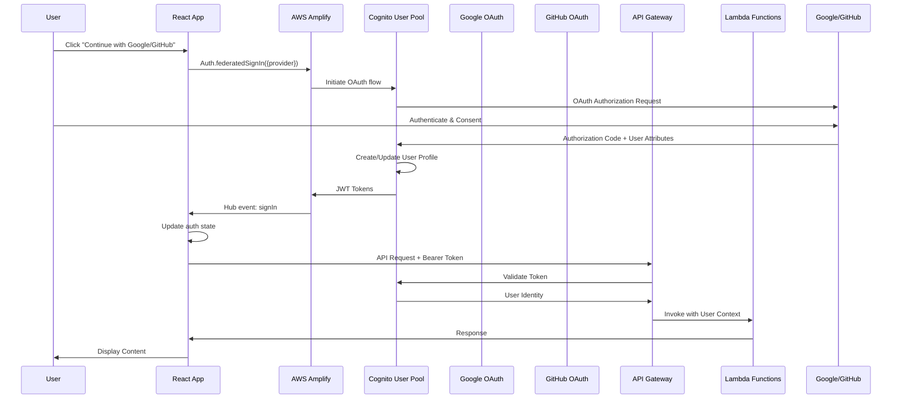
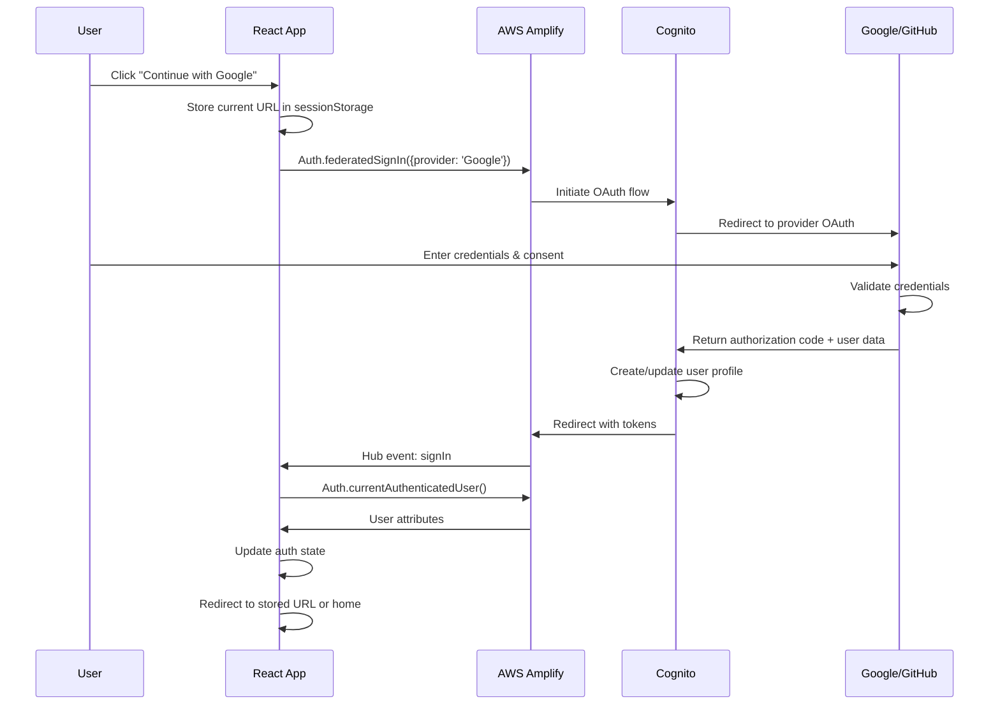
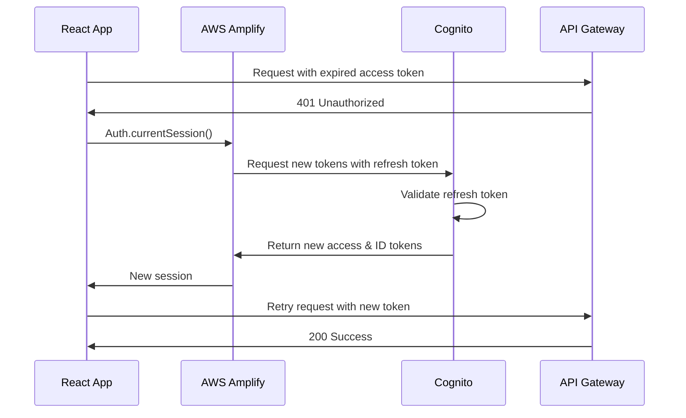
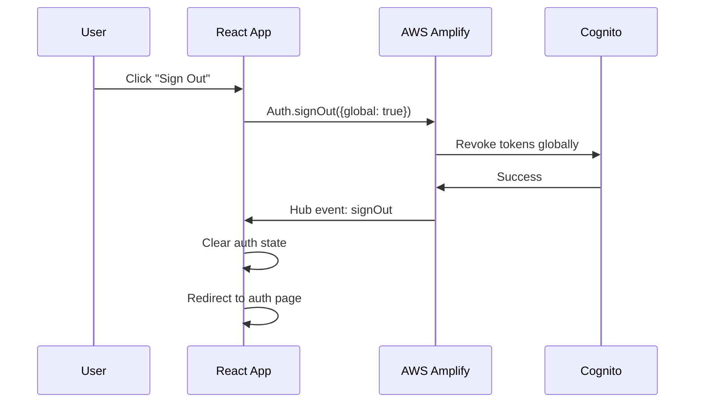

# Design Document: Social Authentication with Cognito SDK

## Overview

This design document outlines the implementation of social authentication using AWS Amplify and the Cognito SDK for the MadeWithKiro platform. The solution provides seamless OAuth-based authentication with Google and GitHub identity providers, giving developers full control over the authentication UI and user experience.

The design focuses on:

- Direct integration with AWS Cognito using AWS Amplify Auth module
- Unified authentication flow (no separate signup/sign-in pages)
- Automatic user creation and sign-in for federated identities
- Secure token management and session handling
- Profile picture retrieval from social providers
- Environment-specific configuration for development and production

## Architecture

### High-Level Architecture



### Component Interaction

1. **React Application**: Initiates OAuth flows, manages auth state, displays UI
2. **AWS Amplify**: Provides SDK methods for Cognito integration
3. **Cognito User Pool**: Manages federated identities and token issuance
4. **Identity Providers**: Google and GitHub OAuth services
5. **SAM Template**: Defines infrastructure including Cognito and Identity Providers
6. **API Gateway**: Validates tokens and routes requests
7. **Lambda Functions**: Business logic execution with authenticated user context

## Components and Interfaces

### 1. AWS SAM Template Configuration

#### Cognito User Pool

```yaml
CognitoUserPool:
  Type: AWS::Cognito::UserPool
  Properties:
    UserPoolName: !Sub "${AWS::StackName}-user-pool"
    AutoVerifiedAttributes:
      - email
    Schema:
      - Name: email
        AttributeDataType: String
        Required: true
        Mutable: false
      - Name: given_name
        AttributeDataType: String
        Required: false
        Mutable: true
      - Name: family_name
        AttributeDataType: String
        Required: false
        Mutable: true
      - Name: picture
        AttributeDataType: String
        Required: false
        Mutable: true
    UsernameConfiguration:
      CaseSensitive: false
```

#### Google Identity Provider

```yaml
GoogleIdentityProvider:
  Type: AWS::Cognito::UserPoolIdentityProvider
  Properties:
    UserPoolId: !Ref CognitoUserPool
    ProviderName: Google
    ProviderType: Google
    ProviderDetails:
      client_id: !Ref GoogleClientId
      client_secret: !Sub "{{resolve:ssm:${GoogleClientSecretParameter}}}"
      authorize_scopes: "profile email openid"
    AttributeMapping:
      email: email
      given_name: given_name
      family_name: family_name
      picture: picture
      username: sub
```

#### GitHub Identity Provider

```yaml
GitHubIdentityProvider:
  Type: AWS::Cognito::UserPoolIdentityProvider
  Properties:
    UserPoolId: !Ref CognitoUserPool
    ProviderName: GitHub
    ProviderType: OIDC
    ProviderDetails:
      client_id: !Ref GitHubClientId
      client_secret: !Sub "{{resolve:ssm:${GitHubClientSecretParameter}}}"
      authorize_scopes: "read:user user:email"
      attributes_request_method: GET
      oidc_issuer: "https://github.com"
      authorize_url: "https://github.com/login/oauth/authorize"
      token_url: "https://github.com/login/oauth/access_token"
      attributes_url: "https://api.github.com/user"
    AttributeMapping:
      email: email
      name: name
      picture: avatar_url
      username: sub
```

#### Cognito User Pool Client

```yaml
CognitoUserPoolClient:
  Type: AWS::Cognito::UserPoolClient
  DependsOn:
    - GoogleIdentityProvider
    - GitHubIdentityProvider
  Properties:
    UserPoolId: !Ref CognitoUserPool
    ClientName: !Sub "${AWS::StackName}-client"
    GenerateSecret: false
    SupportedIdentityProviders:
      - Google
      - GitHub
    AllowedOAuthFlows:
      - code
      - implicit
    AllowedOAuthScopes:
      - email
      - openid
      - profile
      - aws.cognito.signin.user.admin
    CallbackURLs:
      - !Ref CognitoCallbackURL
    LogoutURLs:
      - !Ref CognitoCallbackURL
    AllowedOAuthFlowsUserPoolClient: true
    PreventUserExistenceErrors: ENABLED
```

#### Cognito Identity Pool

```yaml
CognitoIdentityPool:
  Type: AWS::Cognito::IdentityPool
  Properties:
    IdentityPoolName: !Sub "${AWS::StackName}-identity-pool"
    AllowUnauthenticatedIdentities: false
    CognitoIdentityProviders:
      - ClientId: !Ref CognitoUserPoolClient
        ProviderName: !GetAtt CognitoUserPool.ProviderName
```

#### Parameters

```yaml
Parameters:
  Environment:
    Type: String
    Description: Environment name (dev or prod)
    AllowedValues:
      - dev
      - prod
    Default: dev

  GoogleClientId:
    Type: String
    Description: Google OAuth Client ID
    NoEcho: false

  GoogleClientSecretParameter:
    Type: String
    Description: SSM Parameter name containing Google OAuth Client Secret
    Default: /madewithkiro/${Environment}/google-client-secret

  GitHubClientId:
    Type: String
    Description: GitHub OAuth Client ID
    NoEcho: false

  GitHubClientSecretParameter:
    Type: String
    Description: SSM Parameter name containing GitHub OAuth Client Secret
    Default: /madewithkiro/${Environment}/github-client-secret

  CognitoCallbackURL:
    Type: String
    Description: OAuth callback URL (environment-specific)
```

#### Outputs

```yaml
Outputs:
  UserPoolId:
    Description: Cognito User Pool ID
    Value: !Ref CognitoUserPool
    Export:
      Name: !Sub "${AWS::StackName}-UserPoolId"

  UserPoolClientId:
    Description: Cognito User Pool Client ID
    Value: !Ref CognitoUserPoolClient
    Export:
      Name: !Sub "${AWS::StackName}-UserPoolClientId"

  IdentityPoolId:
    Description: Cognito Identity Pool ID
    Value: !Ref CognitoIdentityPool
    Export:
      Name: !Sub "${AWS::StackName}-IdentityPoolId"

  CognitoRegion:
    Description: AWS Region for Cognito
    Value: !Ref AWS::Region
    Export:
      Name: !Sub "${AWS::StackName}-CognitoRegion"
```

### 2. AWS Amplify Configuration

#### Amplify Configuration File

```typescript
// src/config/amplify.ts
import { Amplify } from "aws-amplify";

const amplifyConfig = {
  Auth: {
    region: import.meta.env.VITE_AWS_REGION,
    userPoolId: import.meta.env.VITE_USER_POOL_ID,
    userPoolWebClientId: import.meta.env.VITE_USER_POOL_CLIENT_ID,
    identityPoolId: import.meta.env.VITE_IDENTITY_POOL_ID,
    oauth: {
      domain: import.meta.env.VITE_COGNITO_DOMAIN,
      scope: ["email", "openid", "profile", "aws.cognito.signin.user.admin"],
      redirectSignIn: import.meta.env.VITE_OAUTH_REDIRECT_SIGN_IN,
      redirectSignOut: import.meta.env.VITE_OAUTH_REDIRECT_SIGN_OUT,
      responseType: "code",
    },
  },
};

Amplify.configure(amplifyConfig);

export default amplifyConfig;
```

#### Environment Variables

```bash
# .env.development
VITE_AWS_REGION=us-east-1
VITE_USER_POOL_ID=us-east-1_XXXXXXXXX
VITE_USER_POOL_CLIENT_ID=XXXXXXXXXXXXXXXXXXXXXXXXXX
VITE_IDENTITY_POOL_ID=us-east-1:XXXXXXXX-XXXX-XXXX-XXXX-XXXXXXXXXXXX
VITE_COGNITO_DOMAIN=madewithkiro-dev.auth.us-east-1.amazoncognito.com
VITE_OAUTH_REDIRECT_SIGN_IN=http://localhost:5173/auth/callback
VITE_OAUTH_REDIRECT_SIGN_OUT=http://localhost:5173/

# .env.production
VITE_AWS_REGION=us-east-1
VITE_USER_POOL_ID=us-east-1_YYYYYYYYY
VITE_USER_POOL_CLIENT_ID=YYYYYYYYYYYYYYYYYYYYYYYYYY
VITE_IDENTITY_POOL_ID=us-east-1:YYYYYYYY-YYYY-YYYY-YYYY-YYYYYYYYYYYY
VITE_COGNITO_DOMAIN=madewithkiro.auth.us-east-1.amazoncognito.com
VITE_OAUTH_REDIRECT_SIGN_IN=https://madewithkiro.com/auth/callback
VITE_OAUTH_REDIRECT_SIGN_OUT=https://madewithkiro.com/
```

**Important:** The `VITE_OAUTH_REDIRECT_SIGN_IN` must point to `/auth/callback` route where Amplify will handle the OAuth code exchange for JWT tokens.

### 3. Authentication Service

#### Auth Context

```typescript
// src/contexts/AuthContext.tsx
import {
  createContext,
  useContext,
  useEffect,
  useState,
  ReactNode,
} from "react";
import { Auth, Hub } from "aws-amplify";
import { CognitoUser } from "@aws-amplify/auth";

interface AuthUser {
  userId: string;
  email: string;
  givenName?: string;
  familyName?: string;
  picture?: string;
  provider?: string;
}

interface AuthContextType {
  user: AuthUser | null;
  isAuthenticated: boolean;
  isLoading: boolean;
  signInWithGoogle: () => Promise<void>;
  signInWithGitHub: () => Promise<void>;
  signOut: () => Promise<void>;
  refreshSession: () => Promise<void>;
}

const AuthContext = createContext<AuthContextType | undefined>(undefined);

export const AuthProvider = ({ children }: { children: ReactNode }) => {
  const [user, setUser] = useState<AuthUser | null>(null);
  const [isLoading, setIsLoading] = useState(true);

  useEffect(() => {
    // Check for existing session on mount
    checkUser();

    // Listen for auth events
    const hubListener = Hub.listen("auth", ({ payload: { event, data } }) => {
      switch (event) {
        case "signIn":
          checkUser();
          break;
        case "signOut":
          setUser(null);
          break;
        case "customOAuthState":
          // Handle custom state if needed
          break;
      }
    });

    return () => hubListener();
  }, []);

  const checkUser = async () => {
    try {
      const cognitoUser: CognitoUser = await Auth.currentAuthenticatedUser();
      const attributes = await Auth.userAttributes(cognitoUser);

      const authUser: AuthUser = {
        userId: attributes.find((attr) => attr.Name === "sub")?.Value || "",
        email: attributes.find((attr) => attr.Name === "email")?.Value || "",
        givenName: attributes.find((attr) => attr.Name === "given_name")?.Value,
        familyName: attributes.find((attr) => attr.Name === "family_name")
          ?.Value,
        picture: attributes.find((attr) => attr.Name === "picture")?.Value,
        provider: attributes.find((attr) => attr.Name === "identities")?.Value
          ? JSON.parse(
              attributes.find((attr) => attr.Name === "identities")!.Value
            )[0]?.providerName
          : undefined,
      };

      setUser(authUser);
    } catch (error) {
      setUser(null);
    } finally {
      setIsLoading(false);
    }
  };

  const signInWithGoogle = async () => {
    try {
      await Auth.federatedSignIn({ provider: "Google" as any });
    } catch (error) {
      console.error("Google sign-in error:", error);
      throw error;
    }
  };

  const signInWithGitHub = async () => {
    try {
      await Auth.federatedSignIn({ provider: "GitHub" as any });
    } catch (error) {
      console.error("GitHub sign-in error:", error);
      throw error;
    }
  };

  const signOut = async () => {
    try {
      await Auth.signOut({ global: true });
      setUser(null);
    } catch (error) {
      console.error("Sign-out error:", error);
      throw error;
    }
  };

  const refreshSession = async () => {
    try {
      const session = await Auth.currentSession();
      return session;
    } catch (error) {
      console.error("Session refresh error:", error);
      throw error;
    }
  };

  return (
    <AuthContext.Provider
      value={{
        user,
        isAuthenticated: !!user,
        isLoading,
        signInWithGoogle,
        signInWithGitHub,
        signOut,
        refreshSession,
      }}
    >
      {children}
    </AuthContext.Provider>
  );
};

export const useAuth = () => {
  const context = useContext(AuthContext);
  if (!context) {
    throw new Error("useAuth must be used within AuthProvider");
  }
  return context;
};
```

### 4. Authentication Page Component

```typescript
// src/pages/AuthPage.tsx
import { useAuth } from "@/contexts/AuthContext";
import { Button } from "@/components/ui/button";
import {
  Card,
  CardContent,
  CardDescription,
  CardHeader,
  CardTitle,
} from "@/components/ui/card";
import { Chrome, Github } from "lucide-react";
import { useState } from "react";
import { useNavigate, useSearchParams } from "react-router-dom";

export const AuthPage = () => {
  const { signInWithGoogle, signInWithGitHub } = useAuth();
  const [isLoading, setIsLoading] = useState(false);
  const [error, setError] = useState<string | null>(null);
  const [searchParams] = useSearchParams();
  const navigate = useNavigate();

  // Check for OAuth errors in URL
  useEffect(() => {
    const errorParam = searchParams.get("error");
    const errorDescription = searchParams.get("error_description");

    if (errorParam) {
      setError(getErrorMessage(errorParam, errorDescription));
    }
  }, [searchParams]);

  const handleGoogleSignIn = async () => {
    setIsLoading(true);
    setError(null);
    try {
      await signInWithGoogle();
      // Redirect handled by Hub listener
    } catch (err: any) {
      setError(err.message || "Failed to sign in with Google");
      setIsLoading(false);
    }
  };

  const handleGitHubSignIn = async () => {
    setIsLoading(true);
    setError(null);
    try {
      await signInWithGitHub();
      // Redirect handled by Hub listener
    } catch (err: any) {
      setError(err.message || "Failed to sign in with GitHub");
      setIsLoading(false);
    }
  };

  const getErrorMessage = (
    error: string,
    description?: string | null
  ): string => {
    const errorMessages: Record<string, string> = {
      access_denied: "You cancelled the sign-in process. Please try again.",
      invalid_request: "Authentication request was invalid. Please try again.",
      unauthorized_client:
        "This application is not authorized. Please contact support.",
      server_error:
        "The authentication provider encountered an error. Please try again later.",
      temporarily_unavailable:
        "The authentication service is temporarily unavailable. Please try again later.",
    };

    return (
      errorMessages[error] ||
      description ||
      "An unexpected error occurred during sign-in."
    );
  };

  return (
    <div className="min-h-screen flex items-center justify-center bg-gray-50 px-4">
      <Card className="w-full max-w-md">
        <CardHeader className="text-center">
          <CardTitle className="text-2xl">Welcome to MadeWithKiro</CardTitle>
          <CardDescription>
            Sign in to showcase your Kiro-built applications
          </CardDescription>
        </CardHeader>
        <CardContent className="space-y-4">
          {error && (
            <div className="p-3 text-sm text-red-600 bg-red-50 border border-red-200 rounded-md">
              {error}
            </div>
          )}

          <Button
            onClick={handleGoogleSignIn}
            disabled={isLoading}
            className="w-full"
            variant="outline"
            size="lg"
          >
            <Chrome className="mr-2 h-5 w-5" />
            Continue with Google
          </Button>

          <Button
            onClick={handleGitHubSignIn}
            disabled={isLoading}
            className="w-full"
            variant="outline"
            size="lg"
          >
            <Github className="mr-2 h-5 w-5" />
            Continue with GitHub
          </Button>

          <p className="text-xs text-center text-gray-500 mt-4">
            By continuing, you agree to our Terms of Service and Privacy Policy
          </p>
        </CardContent>
      </Card>
    </div>
  );
};
```

### 5. OAuth Callback Handler

```typescript
// src/pages/AuthCallbackPage.tsx
import { useEffect, useState } from "react";
import { useNavigate } from "react-router-dom";
import { LoadingSpinner } from "@/components/LoadingSpinner";

export const AuthCallbackPage = () => {
  const navigate = useNavigate();
  const [error, setError] = useState<string | null>(null);

  useEffect(() => {
    // Amplify automatically handles the OAuth callback and code exchange
    // The Hub listener in AuthContext will catch the signIn event
    // We just need to wait for it and redirect

    const redirectTo = sessionStorage.getItem("redirect_after_auth") || "/";
    sessionStorage.removeItem("redirect_after_auth");

    // Small delay to ensure Hub event is processed
    const timer = setTimeout(() => {
      navigate(redirectTo, { replace: true });
    }, 1000);

    return () => clearTimeout(timer);
  }, [navigate]);

  if (error) {
    return (
      <div className="min-h-screen flex items-center justify-center">
        <div className="text-center">
          <h2 className="text-xl font-semibold text-red-600 mb-2">
            Authentication Error
          </h2>
          <p className="text-gray-600">{error}</p>
          <button
            onClick={() => navigate("/auth")}
            className="mt-4 px-4 py-2 bg-blue-600 text-white rounded-md"
          >
            Try Again
          </button>
        </div>
      </div>
    );
  }

  return (
    <div className="min-h-screen flex items-center justify-center">
      <div className="text-center">
        <LoadingSpinner />
        <p className="mt-4 text-gray-600">Completing sign in...</p>
      </div>
    </div>
  );
};
```

### 6. Protected Route Component

```typescript
// src/components/ProtectedRoute.tsx
import { useAuth } from "@/contexts/AuthContext";
import { Navigate, useLocation } from "react-router-dom";
import { LoadingSpinner } from "@/components/LoadingSpinner";

interface ProtectedRouteProps {
  children: React.ReactNode;
}

export const ProtectedRoute = ({ children }: ProtectedRouteProps) => {
  const { isAuthenticated, isLoading } = useAuth();
  const location = useLocation();

  if (isLoading) {
    return (
      <div className="min-h-screen flex items-center justify-center">
        <LoadingSpinner />
      </div>
    );
  }

  if (!isAuthenticated) {
    // Store intended destination
    sessionStorage.setItem("redirect_after_auth", location.pathname);
    return <Navigate to="/auth" replace />;
  }

  return <>{children}</>;
};
```

### 7. Profile Picture Component

```typescript
// src/components/ProfilePicture.tsx
import { useState } from "react";
import { User } from "lucide-react";

interface ProfilePictureProps {
  pictureUrl?: string;
  name: string;
  size?: "sm" | "md" | "lg";
}

export const ProfilePicture = ({
  pictureUrl,
  name,
  size = "md",
}: ProfilePictureProps) => {
  const [imageError, setImageError] = useState(false);

  const sizeClasses = {
    sm: "w-8 h-8 text-sm",
    md: "w-12 h-12 text-base",
    lg: "w-24 h-24 text-2xl",
  };

  if (!pictureUrl || imageError) {
    return (
      <div
        className={`${sizeClasses[size]} rounded-full bg-gradient-to-br from-blue-500 to-purple-600 flex items-center justify-center text-white font-semibold`}
      >
        {name.charAt(0).toUpperCase()}
      </div>
    );
  }

  return (
     setImageError(true)}
    />
  );
};
```

### 7. API Client Authentication Integration

The existing `ApiClient` class needs to be enhanced to support authentication tokens. We'll add token management without changing the existing API.

#### Updated API Client with Authentication

```typescript
// src/services/apiClient.ts (additions)
import { Auth } from "aws-amplify";

export class ApiClient {
  // ... existing properties ...

  /**
   * Get current authentication token
   *
   * Retrieves the current access token from Cognito session.
   * Returns null if user is not authenticated.
   *
   * @returns Access token or null
   * @private
   */
  private async getAuthToken(): Promise<string | null> {
    try {
      const session = await Auth.currentSession();
      return session.getAccessToken().getJwtToken();
    } catch (error) {
      // User not authenticated or session expired
      return null;
    }
  }

  /**
   * Build request headers with authentication
   *
   * Adds standard headers (Content-Type, Accept) and Authorization header
   * if user is authenticated.
   *
   * @param requiresAuth - Whether this request requires authentication
   * @returns Headers object with standard and auth headers
   * @private
   */
  private async buildHeaders(requiresAuth: boolean = false): Promise<Headers> {
    const headers = new Headers();
    headers.set("Content-Type", "application/json");
    headers.set("Accept", "application/json");

    // Add auth token if available and required
    if (requiresAuth) {
      const token = await this.getAuthToken();
      if (token) {
        headers.set("Authorization", `Bearer ${token}`);
      }
    }

    return headers;
  }

  /**
   * Handle 401 Unauthorized responses
   *
   * Attempts to refresh the session and retry the request.
   * Redirects to auth page if refresh fails.
   *
   * @template T - The expected response data type
   * @param options - Original request options
   * @returns API response after retry
   * @throws ApiClientError if refresh fails
   * @private
   */
  private async handleUnauthorized<T>(
    options: RequestOptions
  ): Promise<ApiResponse<T>> {
    try {
      // Try to refresh the session
      await Auth.currentSession();

      // Retry the original request
      return this.makeRequest<T>(options, 0);
    } catch (error) {
      // Refresh failed, redirect to auth
      window.location.href = "/auth";
      throw new ApiClientError("Authentication required", "UNAUTHORIZED", 401);
    }
  }

  /**
   * Make an HTTP request with authentication support
   *
   * Enhanced version that handles authentication tokens and 401 responses.
   *
   * @template T - The expected response data type
   * @param options - Request options
   * @param attempt - Current attempt number (default: 0)
   * @returns API response
   * @throws ApiClientError for permanent failures
   * @private
   */
  private async makeRequest<T>(
    options: RequestOptions,
    attempt: number = 0
  ): Promise<ApiResponse<T>> {
    const { method, endpoint, data, params, requiresAuth, signal } = options;

    try {
      // Check if already aborted before making request
      if (signal?.aborted) {
        throw new DOMException("The operation was aborted.", "AbortError");
      }

      // Build URL and headers (with auth if required)
      const url = this.buildURL(endpoint, params);
      const headers = await this.buildHeaders(requiresAuth);

      // Make fetch request
      const response = await fetch(url, {
        method,
        headers,
        body: data ? JSON.stringify(data) : undefined,
        signal,
      });

      // Check if aborted after fetch completes
      if (signal?.aborted) {
        throw new DOMException("The operation was aborted.", "AbortError");
      }

      // Handle 401 Unauthorized (token expired or invalid)
      if (response.status === 401 && requiresAuth && attempt === 0) {
        return this.handleUnauthorized<T>(options);
      }

      // Handle response
      return await this.handleResponse<T>(response);
    } catch (error) {
      // ... existing error handling ...
    }
  }
}
```

#### Auth Service Module

Create a dedicated auth service for token management:

```typescript
// src/services/authService.ts
import { Auth } from "aws-amplify";

/**
 * Authentication Service
 *
 * Provides methods for token management and authentication checks.
 */
export class AuthService {
  /**
   * Get current access token
   *
   * @returns Access token or null if not authenticated
   */
  async getAccessToken(): Promise<string | null> {
    try {
      const session = await Auth.currentSession();
      return session.getAccessToken().getJwtToken();
    } catch (error) {
      return null;
    }
  }

  /**
   * Get current ID token
   *
   * @returns ID token or null if not authenticated
   */
  async getIdToken(): Promise<string | null> {
    try {
      const session = await Auth.currentSession();
      return session.getIdToken().getJwtToken();
    } catch (error) {
      return null;
    }
  }

  /**
   * Check if user is authenticated
   *
   * @returns True if user has valid session
   */
  async isAuthenticated(): Promise<boolean> {
    try {
      await Auth.currentAuthenticatedUser();
      return true;
    } catch (error) {
      return false;
    }
  }

  /**
   * Refresh current session
   *
   * @returns True if refresh succeeded
   */
  async refreshSession(): Promise<boolean> {
    try {
      await Auth.currentSession();
      return true;
    } catch (error) {
      return false;
    }
  }
}

// Export singleton instance
export const authService = new AuthService();
```

#### Updated Request Options

```typescript
// src/services/apiClient.ts
export interface RequestOptions {
  method: "GET" | "POST" | "PUT" | "DELETE";
  endpoint: string;
  data?: unknown;
  params?: Record<string, string>;
  requiresAuth?: boolean; // Now fully implemented
  signal?: AbortSignal;
}
```

### 8. Routing Configuration

```typescript
// src/router.tsx
import { createBrowserRouter } from "react-router-dom";
import { AuthPage } from "@/pages/AuthPage";
import { AuthCallbackPage } from "@/pages/AuthCallbackPage";
import { GalleryPage } from "@/pages/GalleryPage";
import { ProfilePage } from "@/pages/ProfilePage";
import { AddApplicationPage } from "@/pages/AddApplicationPage";
import { ProtectedRoute } from "@/components/ProtectedRoute";
import { Layout } from "@/components/Layout";

export const router = createBrowserRouter([
  {
    path: "/auth",
    element: <AuthPage />,
  },
  {
    path: "/auth/callback",
    element: <AuthCallbackPage />,
  },
  {
    path: "/",
    element: <Layout />,
    children: [
      {
        index: true,
        element: <GalleryPage />,
      },
      {
        path: "profile",
        element: (
          <ProtectedRoute>
            <ProfilePage />
          </ProtectedRoute>
        ),
      },
      {
        path: "add-application",
        element: (
          <ProtectedRoute>
            <AddApplicationPage />
          </ProtectedRoute>
        ),
      },
    ],
  },
]);
```

**Key Routes:**

- `/auth` - Authentication page with Google/GitHub buttons
- `/auth/callback` - OAuth callback handler (Amplify handles code exchange here)
- `/` - Public gallery page
- `/profile` - Protected user profile page
- `/add-application` - Protected application submission page

## Data Models

### Cognito User Attributes

```typescript
interface CognitoUserAttributes {
  sub: string; // Unique user ID
  email: string; // User email (verified)
  email_verified: boolean; // Email verification status
  given_name?: string; // First name
  family_name?: string; // Last name
  picture?: string; // Profile picture URL
  identities: string; // JSON array of linked identities
  "cognito:username": string; // Cognito username (provider_sub)
}
```

### Identity Object

```typescript
interface CognitoIdentity {
  userId: string; // Provider's user ID
  providerName: string; // 'Google' or 'GitHub'
  providerType: string; // 'Google' or 'OIDC'
  issuer: string; // Provider's issuer URL
  primary: boolean; // Primary identity flag
  dateCreated: number; // Timestamp
}
```

### JWT Token Structure

```typescript
interface IDToken {
  sub: string; // User ID
  email: string;
  email_verified: boolean;
  given_name?: string;
  family_name?: string;
  picture?: string;
  "cognito:username": string;
  "cognito:groups"?: string[];
  identities: CognitoIdentity[];
  iss: string; // Token issuer
  aud: string; // Client ID
  exp: number; // Expiration timestamp
  iat: number; // Issued at timestamp
}
```

## Data Flow

### 1. Initial Authentication Flow



### 2. Token Refresh Flow



### 3. Sign Out Flow



## Correctness Properties

_A property is a characteristic or behavior that should hold true across all valid executions of a system-essentially, a formal statement about what the system should do. Properties serve as the bridge between human-readable specifications and machine-verifiable correctness guarantees._

### Property 1: Federated sign-in initiates OAuth flow

_For any_ supported identity provider (Google or GitHub), calling Auth.federatedSignIn should redirect the user to the provider's OAuth authorization page.
**Validates: Requirements 1.2, 2.2, 3.2, 4.2**

### Property 2: Successful authentication creates user profile

_For any_ successful OAuth response from an identity provider, Cognito should create or update a user profile with attributes from the provider.
**Validates: Requirements 1.3, 3.3**

### Property 3: JWT tokens issued after authentication

_For any_ completed OAuth flow, Cognito should issue valid JWT tokens (access, ID, and refresh) to the authenticated user.
**Validates: Requirements 1.4, 2.3, 3.4, 4.3**

### Property 4: Duplicate account prevention

_For any_ user attempting to sign up with an already-linked social account, the system should automatically sign them in instead of creating a duplicate account.
**Validates: Requirements 1.5, 3.5**

### Property 5: Automatic account creation for new users

_For any_ user signing in with a social account for the first time, Cognito should automatically create a new user profile.
**Validates: Requirements 2.4, 4.4**

### Property 6: Session persistence across browser sessions

_For any_ authenticated user with a valid refresh token, closing and reopening the browser should restore the user's session.
**Validates: Requirements 6.3**

### Property 7: Automatic token refresh on expiration

_For any_ API request made with an expired access token, the system should automatically refresh the token using the refresh token.
**Validates: Requirements 6.2**

### Property 8: Re-authentication on refresh token expiration

_For any_ user with an expired refresh token, attempting to access protected resources should redirect to the authentication page.
**Validates: Requirements 6.4**

### Property 9: OAuth error display

_For any_ OAuth error returned by an identity provider, the system should display a user-friendly error message to the user.
**Validates: Requirements 7.1**

### Property 10: Network error retry availability

_For any_ network error during authentication, the UI should provide a retry mechanism.
**Validates: Requirements 7.3**

### Property 11: Provider independence on failure

_For any_ identity provider failure, the alternative provider button should remain functional.
**Validates: Requirements 7.4**

### Property 12: Protected route redirect preservation

_For any_ unauthenticated user attempting to access a protected route, the system should store the intended destination and redirect there after authentication.
**Validates: Requirements 8.1, 8.2**

### Property 13: Default redirect when no destination stored

_For any_ authentication completion without a stored destination URL, the system should redirect to the home page.
**Validates: Requirements 8.3**

### Property 14: Token revocation on sign-out

_For any_ user who signs out, all issued tokens should be revoked globally and subsequent API requests should return unauthorized errors.
**Validates: Requirements 9.1, 9.4**

### Property 15: Local storage cleanup on sign-out

_For any_ sign-out action, all authentication state should be cleared from the application.
**Validates: Requirements 9.2**

### Property 16: Google profile attribute retrieval

_For any_ user authenticating with Google, the system should retrieve and store email, given name, family name, and profile picture.
**Validates: Requirements 10.1**

### Property 17: GitHub profile attribute retrieval

_For any_ user authenticating with GitHub, the system should retrieve and store email, name, and avatar URL.
**Validates: Requirements 10.2**

### Property 18: GitHub name parsing

_For any_ GitHub user with a name attribute, the system should parse it into given_name and family_name.
**Validates: Requirements 10.3**

### Property 19: Profile picture rendering

_For any_ user with a picture URL, the frontend should render an image element with that URL.
**Validates: Requirements 10.4**

### Property 20: Profile picture fallback

_For any_ user without a picture URL or when the image fails to load, the system should display a default avatar with the user's initial.
**Validates: Requirements 10.5**

### Property 21: Authenticated request token inclusion

_For any_ API request with requiresAuth set to true, the request should include an Authorization header with a Bearer token.
**Validates: Requirements 13.1, 13.2**

### Property 22: Public request without token

_For any_ API request with requiresAuth set to false or undefined, the request should not include an Authorization header.
**Validates: Requirements 13.3**

### Property 23: Automatic token refresh on expiration

_For any_ API request that returns 401 Unauthorized, the system should attempt to refresh the token and retry the request once.
**Validates: Requirements 13.4**

### Property 24: Redirect on refresh failure

_For any_ token refresh attempt that fails, the system should redirect the user to the authentication page.
**Validates: Requirements 13.5**

### Property 25: Mock authentication removal

_For any_ codebase search for "MockAuthContext", the system should return zero results after migration.
**Validates: Requirements 14.1, 14.2, 14.3, 14.5**

### Property 26: Dynamic redirect URL detection

_For any_ domain where the application is hosted (localhost or CloudFront), the OAuth redirect URLs should match the current domain.
**Validates: Requirements 16.3, 16.4, 16.5**

## Error Handling

### OAuth Provider Errors

**Error Types:**

- `access_denied`: User denied permission on consent screen
- `invalid_request`: Malformed OAuth request
- `unauthorized_client`: Client not authorized for this grant type
- `server_error`: Provider internal error
- `temporarily_unavailable`: Provider temporarily unavailable

**Handling Strategy:**

```typescript
function handleOAuthError(error: string, errorDescription?: string): string {
  const errorMessages: Record<string, string> = {
    access_denied: "You cancelled the sign-in process. Please try again.",
    invalid_request: "Authentication request was invalid. Please try again.",
    unauthorized_client:
      "This application is not authorized. Please contact support.",
    server_error:
      "The authentication provider encountered an error. Please try again later.",
    temporarily_unavailable:
      "The authentication service is temporarily unavailable. Please try again later.",
  };

  return (
    errorMessages[error] ||
    errorDescription ||
    "An unexpected error occurred during sign-in."
  );
}
```

### Amplify Auth Errors

**Error Types:**

- `UserNotFoundException`: User does not exist
- `NotAuthorizedException`: Invalid credentials or token
- `NetworkError`: Network connectivity issues
- `InvalidParameterException`: Invalid parameters passed to Auth methods

**Handling Strategy:**

```typescript
async function handleAuthError(error: any): Promise<void> {
  if (error.code === "NetworkError") {
    // Show retry button
    showRetryOption();
  } else if (error.code === "NotAuthorizedException") {
    // Clear tokens and redirect to auth
    await Auth.signOut();
    window.location.href = "/auth";
  } else {
    // Display generic error message
    showErrorMessage(error.message || "Authentication failed");
  }
}
```

### Token Refresh Errors

**Handling Strategy:**

```typescript
async function handleTokenRefreshError(error: any): Promise<void> {
  // If refresh token is expired or invalid, sign out and redirect
  if (error.code === "NotAuthorizedException") {
    await Auth.signOut();
    sessionStorage.setItem("redirect_after_auth", window.location.pathname);
    window.location.href = "/auth";
  } else {
    // Log error and continue (may retry on next request)
    console.error("Token refresh failed:", error);
  }
}
```

### Profile Picture Loading Errors

**Handling Strategy:**

```typescript
function handleImageLoadError(event: Event): void {
  const img = event.target as HTMLImageElement;
  const userName = img.getAttribute("data-user-name") || "User";

  // Hide broken image
  img.style.display = "none";

  // Show default avatar (handled by component state)
  console.warn("Failed to load profile picture:", img.src);
}
```

## Testing Strategy

### Unit Testing

**Frontend Components:**

- Auth page renders both social login buttons
- Protected route redirects unauthenticated users
- Profile picture component handles missing URLs gracefully
- Error display component shows appropriate messages
- Auth context provides correct methods and state

**Authentication Service:**

- federatedSignIn calls Amplify Auth correctly
- currentAuthenticatedUser retrieves user attributes
- signOut clears auth state
- Hub listener handles auth events correctly

**Utility Functions:**

- GitHub name parsing handles various formats
- Error message mapping returns correct messages
- URL validation for redirects

### Property-Based Testing

Property-based tests will use fast-check for TypeScript to verify universal properties across many randomly generated inputs.

**Test Configuration:**

- Minimum 100 iterations per property test
- Each property test tagged with format: `**Feature: social-authentication, Property {number}: {property_text}**`
- Tests should generate realistic user data, OAuth responses, and error conditions

**Property Test Examples:**

1. **OAuth Flow Initiation**: Verify federatedSignIn redirects for any valid provider
2. **Token Validity**: Generate random token payloads and verify they decode correctly
3. **Name Parsing**: Generate random name strings and verify parsing produces valid given_name and family_name
4. **Session Persistence**: Verify session restoration works across simulated browser restarts
5. **Error Handling**: Generate random OAuth error codes and verify appropriate error messages

### Integration Testing

**OAuth Flow Testing:**

- Mock Google OAuth provider and test complete authentication flow
- Mock GitHub OAuth provider and test complete authentication flow
- Test Hub event handling for signIn and signOut
- Test error scenarios (denied access, network failures)

**Token Management:**

- Test token refresh when access token expires
- Test re-authentication when refresh token expires
- Test token revocation on sign-out
- Test concurrent requests with token refresh

**Infrastructure Testing:**

- Validate SAM template syntax and structure
- Verify Cognito User Pool configuration
- Verify Identity Provider configurations
- Verify User Pool Client settings
- Test deployment to development environment

### End-to-End Testing

**User Flows:**

1. New user authenticates with Google → Profile created → Redirected to home
2. Returning user authenticates with Google → Signed in → Redirected to home
3. New user authenticates with GitHub → Profile created → Redirected to home
4. User accesses protected route → Redirected to auth → Signs in → Redirected to original route
5. User signs out → Tokens cleared → Redirected to auth page
6. User with expired access token → Token refreshed automatically → Request succeeds

**Error Scenarios:**

1. User denies OAuth consent → Error message displayed → Can retry
2. Network error during OAuth → Error message displayed → Retry button shown
3. Invalid OAuth callback → Error message displayed
4. Profile picture URL fails to load → Default avatar displayed

## Security Considerations

### Token Security

1. **Storage**: Amplify stores tokens securely in browser storage (localStorage with encryption)
2. **Transmission**: All token exchanges over HTTPS only
3. **Expiration**: Short-lived access tokens (60 minutes), longer refresh tokens (30 days)
4. **Revocation**: Global sign-out revokes all tokens across all devices

### OAuth Security

1. **State Parameter**: Amplify automatically includes state parameter to prevent CSRF attacks
2. **PKCE**: Amplify implements PKCE (Proof Key for Code Exchange) automatically
3. **Redirect URI Validation**: Strict validation of callback URLs in Cognito configuration
4. **Scope Limitation**: Request only necessary scopes from identity providers

### API Security

1. **Token Validation**: API Gateway validates all tokens with Cognito before invoking Lambda
2. **User Context**: Lambda functions receive validated user identity from API Gateway
3. **Authorization**: Implement resource-level authorization in Lambda functions
4. **Rate Limiting**: API Gateway throttling to prevent abuse

### Infrastructure Security

1. **Secrets Management**: OAuth client secrets stored in AWS Systems Manager Parameter Store as SecureString (encrypted with KMS)
2. **IAM Roles**: Least privilege IAM roles for Lambda functions
3. **Encryption**: DynamoDB encryption at rest enabled
4. **CORS**: Proper CORS configuration on API Gateway

## Deployment Strategy

### Prerequisites

1. **Google OAuth Setup:**

   - Create project in Google Cloud Console
   - Enable Google+ API
   - Create OAuth 2.0 credentials
   - Configure authorized redirect URIs: `https://<cognito-domain>/oauth2/idpresponse`
   - Obtain client ID and client secret

2. **GitHub OAuth Setup:**
   - Create OAuth App in GitHub Developer Settings
   - Configure callback URL: `https://<cognito-domain>/oauth2/idpresponse`
   - Obtain client ID and client secret

### SSM Parameter Setup

```bash
# Development environment
aws ssm put-parameter \
  --name "/madewithkiro/dev/google-client-secret" \
  --value "<your-google-client-secret>" \
  --type "SecureString" \
  --description "Google OAuth client secret for dev environment"

aws ssm put-parameter \
  --name "/madewithkiro/dev/github-client-secret" \
  --value "<your-github-client-secret>" \
  --type "SecureString" \
  --description "GitHub OAuth client secret for dev environment"

# Production environment
aws ssm put-parameter \
  --name "/madewithkiro/prod/google-client-secret" \
  --value "<your-google-client-secret>" \
  --type "SecureString" \
  --description "Google OAuth client secret for prod environment"

aws ssm put-parameter \
  --name "/madewithkiro/prod/github-client-secret" \
  --value "<your-github-client-secret>" \
  --type "SecureString" \
  --description "GitHub OAuth client secret for prod environment"
```

### Deployment Commands

```bash
# Deploy to development
sam build
sam deploy \
  --config-env dev \
  --parameter-overrides \
    Environment=dev \
    GoogleClientId=$GOOGLE_CLIENT_ID_DEV \
    GitHubClientId=$GITHUB_CLIENT_ID_DEV \
    CognitoCallbackURL=http://localhost:5173/

# Deploy to production
sam build
sam deploy \
  --config-env prod \
  --parameter-overrides \
    Environment=prod \
    GoogleClientId=$GOOGLE_CLIENT_ID_PROD \
    GitHubClientId=$GITHUB_CLIENT_ID_PROD \
    CognitoCallbackURL=https://madewithkiro.com/
```

### Post-Deployment Configuration

1. **Retrieve Cognito Configuration:**

```bash
# Get User Pool ID
aws cloudformation describe-stacks \
  --stack-name madewithkiro-dev \
  --query 'Stacks[0].Outputs[?OutputKey==`UserPoolId`].OutputValue' \
  --output text

# Get User Pool Client ID
aws cloudformation describe-stacks \
  --stack-name madewithkiro-dev \
  --query 'Stacks[0].Outputs[?OutputKey==`UserPoolClientId`].OutputValue' \
  --output text

# Get Identity Pool ID
aws cloudformation describe-stacks \
  --stack-name madewithkiro-dev \
  --query 'Stacks[0].Outputs[?OutputKey==`IdentityPoolId`].OutputValue' \
  --output text
```

2. **Update Frontend Environment Variables:**

   - Copy output values to `.env.development` or `.env.production`
   - Rebuild frontend with `bun run build`
   - Deploy frontend to S3/CloudFront

3. **Verify Configuration:**
   - Test Google OAuth flow
   - Test GitHub OAuth flow
   - Verify tokens are issued correctly
   - Verify profile pictures are retrieved

## Monitoring and Observability

### CloudWatch Metrics

- **Authentication Success Rate**: Percentage of successful OAuth flows
- **Authentication Errors**: Count of OAuth errors by type
- **Token Refresh Rate**: Frequency of token refresh operations
- **Provider Availability**: Uptime of Google and GitHub OAuth endpoints
- **Profile Picture Load Success**: Percentage of successful profile picture loads

### CloudWatch Logs

- OAuth request/response logs (sanitized, no secrets)
- Token refresh attempts and outcomes
- Authentication errors with context
- Profile picture load failures

### Alarms

- High authentication error rate (> 5% in 5 minutes)
- Token refresh failures (> 10 in 5 minutes)
- Identity provider unavailability
- Unusual sign-out rate (potential security issue)

## Performance Considerations

### Frontend Performance

1. **Code Splitting**: Lazy load authentication components
2. **Token Caching**: Amplify caches tokens automatically
3. **Image Optimization**: Use appropriate image sizes for profile pictures
4. **Lazy Loading**: Lazy load profile pictures in lists

### Backend Performance

1. **Token Validation Caching**: API Gateway caches token validation results
2. **Cognito Connection Pooling**: Reuse Cognito connections
3. **DynamoDB Optimization**: Use efficient query patterns for user lookups

### OAuth Flow Optimization

1. **Minimize Redirects**: Use code flow (already implemented)
2. **Parallel Requests**: Amplify handles token exchange efficiently
3. **Caching**: Cache identity provider metadata

## Transition from Mock to Real Authentication

### Migration Steps

1. **Identify Mock Authentication Usage**

   - Search for `MockAuthContext` imports
   - Find all components using mock authentication
   - Identify test files that may need updates

2. **Replace Mock Context with Real Context**

```typescript
// Before (using mock)
import { MockAuthContext } from "@/contexts/MockAuthContext";

// After (using real)
import { AuthProvider, useAuth } from "@/contexts/AuthContext";
```

3. **Update Main Application Entry**

```typescript
// src/main.tsx
import { AuthProvider } from "@/contexts/AuthContext";
import "@/config/amplify"; // Initialize Amplify

ReactDOM.createRoot(document.getElementById("root")!).render(
  <React.StrictMode>
    <AuthProvider>
      <RouterProvider router={router} />
    </AuthProvider>
  </React.StrictMode>
);
```

4. **Update Service Imports**

```typescript
// Before
import { mockDataService } from "@/services/mockDataService";

// After
import { applicationService } from "@/services/applicationService";
import { profileService } from "@/services/profileService";
```

5. **Remove Mock Files**

   - Delete `src/contexts/MockAuthContext.tsx`
   - Delete or update mock-related test utilities
   - Remove mock data services if no longer needed

6. **Update Tests**
   - Replace mock auth in tests with real auth mocks
   - Update test setup to mock Amplify Auth
   - Ensure all tests pass with real authentication

### Verification Checklist

- [ ] All `MockAuthContext` imports removed
- [ ] All components use real `AuthContext`
- [ ] API client uses real authentication tokens
- [ ] Protected routes use real authentication
- [ ] Tests updated and passing
- [ ] No console errors related to authentication
- [ ] OAuth flows work end-to-end

## OAuth Provider Setup Documentation

### Google OAuth Setup

#### Step 1: Create Google Cloud Project

1. Go to [Google Cloud Console](https://console.cloud.google.com/)
2. Click "Select a project" → "New Project"
3. Enter project name: "MadeWithKiro" (or your preferred name)
4. Click "Create"

#### Step 2: Enable Google+ API

1. In the Google Cloud Console, go to "APIs & Services" → "Library"
2. Search for "Google+ API"
3. Click on "Google+ API"
4. Click "Enable"

#### Step 3: Configure OAuth Consent Screen

1. Go to "APIs & Services" → "OAuth consent screen"
2. Select "External" user type
3. Click "Create"
4. Fill in required fields:
   - App name: "MadeWithKiro"
   - User support email: Your email
   - Developer contact email: Your email
5. Click "Save and Continue"
6. Add scopes:
   - `email`
   - `profile`
   - `openid`
7. Click "Save and Continue"
8. Add test users (for development):
   - Add your email and any test user emails
9. Click "Save and Continue"
10. Review and click "Back to Dashboard"

#### Step 4: Create OAuth Credentials

1. Go to "APIs & Services" → "Credentials"
2. Click "Create Credentials" → "OAuth client ID"
3. Select "Web application"
4. Enter name: "MadeWithKiro Web Client"
5. Add Authorized JavaScript origins:
   - Development: `http://localhost:5173`
   - Production: `https://madewithkiro.com`
6. Add Authorized redirect URIs:
   - Development: `https://<your-cognito-domain-dev>.auth.<region>.amazoncognito.com/oauth2/idpresponse`
   - Production: `https://<your-cognito-domain-prod>.auth.<region>.amazoncognito.com/oauth2/idpresponse`
7. Click "Create"
8. Copy the Client ID and Client Secret

#### Step 5: Store Credentials in AWS

```bash
# Development
aws ssm put-parameter \
  --name "/madewithkiro/dev/google-client-id" \
  --value "<your-google-client-id>" \
  --type "String" \
  --description "Google OAuth client ID for dev"

aws ssm put-parameter \
  --name "/madewithkiro/dev/google-client-secret" \
  --value "<your-google-client-secret>" \
  --type "SecureString" \
  --description "Google OAuth client secret for dev"

# Production
aws ssm put-parameter \
  --name "/madewithkiro/prod/google-client-id" \
  --value "<your-google-client-id>" \
  --type "String" \
  --description "Google OAuth client ID for prod"

aws ssm put-parameter \
  --name "/madewithkiro/prod/google-client-secret" \
  --value "<your-google-client-secret>" \
  --type "SecureString" \
  --description "Google OAuth client secret for prod"
```

### GitHub OAuth Setup

#### Step 1: Create GitHub OAuth App

1. Go to [GitHub Developer Settings](https://github.com/settings/developers)
2. Click "OAuth Apps" → "New OAuth App"
3. Fill in application details:
   - Application name: "MadeWithKiro Dev" (or "MadeWithKiro Prod")
   - Homepage URL:
     - Development: `http://localhost:5173`
     - Production: `https://madewithkiro.com`
   - Application description: "Showcase platform for Kiro-built applications"
   - Authorization callback URL:
     - Development: `https://<your-cognito-domain-dev>.auth.<region>.amazoncognito.com/oauth2/idpresponse`
     - Production: `https://<your-cognito-domain-prod>.auth.<region>.amazoncognito.com/oauth2/idpresponse`
4. Click "Register application"
5. Copy the Client ID
6. Click "Generate a new client secret"
7. Copy the Client Secret (you won't be able to see it again)

#### Step 2: Store Credentials in AWS

```bash
# Development
aws ssm put-parameter \
  --name "/madewithkiro/dev/github-client-id" \
  --value "<your-github-client-id>" \
  --type "String" \
  --description "GitHub OAuth client ID for dev"

aws ssm put-parameter \
  --name "/madewithkiro/dev/github-client-secret" \
  --value "<your-github-client-secret>" \
  --type "SecureString" \
  --description "GitHub OAuth client secret for dev"

# Production
aws ssm put-parameter \
  --name "/madewithkiro/prod/github-client-id" \
  --value "<your-github-client-id>" \
  --type "String" \
  --description "GitHub OAuth client ID for prod"

aws ssm put-parameter \
  --name "/madewithkiro/prod/github-client-secret" \
  --value "<your-github-client-secret>" \
  --type "SecureString" \
  --description "GitHub OAuth client secret for prod"
```

### Cognito Domain Setup

After deploying the SAM template, you need to configure a Cognito domain:

```bash
# Get User Pool ID from CloudFormation outputs
USER_POOL_ID=$(aws cloudformation describe-stacks \
  --stack-name madewithkiro-dev \
  --query 'Stacks[0].Outputs[?OutputKey==`UserPoolId`].OutputValue' \
  --output text)

# Create Cognito domain (must be unique across all AWS accounts)
aws cognito-idp create-user-pool-domain \
  --domain madewithkiro-dev-<random-suffix> \
  --user-pool-id $USER_POOL_ID

# The domain will be: madewithkiro-dev-<random-suffix>.auth.<region>.amazoncognito.com
```

### Updating OAuth Redirect URIs

After creating the Cognito domain, update the redirect URIs in Google and GitHub:

1. **Google Cloud Console**:

   - Go to "APIs & Services" → "Credentials"
   - Click on your OAuth client
   - Update "Authorized redirect URIs" with the actual Cognito domain
   - Click "Save"

2. **GitHub OAuth App**:
   - Go to GitHub Developer Settings → OAuth Apps
   - Click on your app
   - Update "Authorization callback URL" with the actual Cognito domain
   - Click "Update application"

## Testing Authentication on Multiple Domains

### Overview

During development and deployment, you'll need to test authentication on multiple domains:

- **Localhost**: `http://localhost:5173` (Vite dev server)
- **CloudFront Dev**: `https://dev.madewithkiro.com` (development environment)
- **CloudFront Prod**: `https://madewithkiro.com` (production environment)

### Multi-Domain OAuth Configuration

#### Option 1: Multiple OAuth Applications (Recommended)

Create separate OAuth applications for each environment:

**Google OAuth:**

- **Dev Application**: "MadeWithKiro Dev"
  - Authorized JavaScript origins: `http://localhost:5173`, `https://dev.madewithkiro.com`
  - Authorized redirect URIs: `https://<cognito-domain-dev>.auth.<region>.amazoncognito.com/oauth2/idpresponse`
- **Prod Application**: "MadeWithKiro Prod"
  - Authorized JavaScript origins: `https://madewithkiro.com`
  - Authorized redirect URIs: `https://<cognito-domain-prod>.auth.<region>.amazoncognito.com/oauth2/idpresponse`

**GitHub OAuth:**

- **Dev Application**: "MadeWithKiro Dev"
  - Homepage URL: `http://localhost:5173` or `https://dev.madewithkiro.com`
  - Authorization callback URL: `https://<cognito-domain-dev>.auth.<region>.amazoncognito.com/oauth2/idpresponse`
- **Prod Application**: "MadeWithKiro Prod"
  - Homepage URL: `https://madewithkiro.com`
  - Authorization callback URL: `https://<cognito-domain-prod>.auth.<region>.amazoncognito.com/oauth2/idpresponse`

#### Option 2: Single OAuth Application with Multiple Origins

For development convenience, you can use a single OAuth application with multiple authorized origins:

**Google OAuth:**

```
Authorized JavaScript origins:
- http://localhost:5173
- https://dev.madewithkiro.com
- https://madewithkiro.com

Authorized redirect URIs:
- https://<cognito-domain-dev>.auth.<region>.amazoncognito.com/oauth2/idpresponse
- https://<cognito-domain-prod>.auth.<region>.amazoncognito.com/oauth2/idpresponse
```

**GitHub OAuth:**

- Create one app with dev callback URL for development
- Create separate app for production (GitHub only allows one callback URL per app)

### Cognito Callback URL Configuration

Configure Cognito User Pool Client with multiple callback URLs:

```yaml
# template.yaml
CognitoUserPoolClient:
  Type: AWS::Cognito::UserPoolClient
  Properties:
    # ... other properties ...
    CallbackURLs:
      - http://localhost:5173/auth/callback
      - https://dev.madewithkiro.com/auth/callback
      - https://madewithkiro.com/auth/callback
    LogoutURLs:
      - http://localhost:5173/
      - https://dev.madewithkiro.com/
      - https://madewithkiro.com/
```

### Environment-Specific Configuration

#### Development Environment (.env.development)

```bash
# AWS Cognito Configuration
VITE_AWS_REGION=us-east-1
VITE_USER_POOL_ID=us-east-1_DEVPOOL123
VITE_USER_POOL_CLIENT_ID=abc123devClientId
VITE_IDENTITY_POOL_ID=us-east-1:dev-identity-pool-id
VITE_COGNITO_DOMAIN=madewithkiro-dev.auth.us-east-1.amazoncognito.com

# OAuth Redirect URLs (automatically detected based on window.location)
VITE_OAUTH_REDIRECT_SIGN_IN=http://localhost:5173/auth/callback
VITE_OAUTH_REDIRECT_SIGN_OUT=http://localhost:5173/

# API Configuration
VITE_API_BASE_URL=https://api-dev.madewithkiro.com
```

#### Production Environment (.env.production)

```bash
# AWS Cognito Configuration
VITE_AWS_REGION=us-east-1
VITE_USER_POOL_ID=us-east-1_PRODPOOL456
VITE_USER_POOL_CLIENT_ID=xyz789prodClientId
VITE_IDENTITY_POOL_ID=us-east-1:prod-identity-pool-id
VITE_COGNITO_DOMAIN=madewithkiro.auth.us-east-1.amazoncognito.com

# OAuth Redirect URLs
VITE_OAUTH_REDIRECT_SIGN_IN=https://madewithkiro.com/auth/callback
VITE_OAUTH_REDIRECT_SIGN_OUT=https://madewithkiro.com/

# API Configuration
VITE_API_BASE_URL=https://api.madewithkiro.com
```

### Dynamic Redirect URL Configuration

For testing on both localhost and CloudFront with the same build, implement dynamic redirect URL detection:

```typescript
// src/config/amplify.ts
import { Amplify } from "aws-amplify";

// Detect current domain
const getCurrentDomain = (): string => {
  if (typeof window === "undefined") return "";
  return window.location.origin;
};

// Determine redirect URLs based on current domain
const getRedirectUrls = () => {
  const currentDomain = getCurrentDomain();

  // If running on localhost, use localhost URLs
  if (currentDomain.includes("localhost")) {
    return {
      redirectSignIn: "http://localhost:5173/auth/callback",
      redirectSignOut: "http://localhost:5173/",
    };
  }

  // Otherwise use the current domain
  return {
    redirectSignIn: `${currentDomain}/auth/callback`,
    redirectSignOut: `${currentDomain}/`,
  };
};

const redirectUrls = getRedirectUrls();

const amplifyConfig = {
  Auth: {
    region: import.meta.env.VITE_AWS_REGION,
    userPoolId: import.meta.env.VITE_USER_POOL_ID,
    userPoolWebClientId: import.meta.env.VITE_USER_POOL_CLIENT_ID,
    identityPoolId: import.meta.env.VITE_IDENTITY_POOL_ID,
    oauth: {
      domain: import.meta.env.VITE_COGNITO_DOMAIN,
      scope: ["email", "openid", "profile", "aws.cognito.signin.user.admin"],
      redirectSignIn: redirectUrls.redirectSignIn,
      redirectSignOut: redirectUrls.redirectSignOut,
      responseType: "code",
    },
  },
};

Amplify.configure(amplifyConfig);

export default amplifyConfig;
```

### Testing Workflow

#### 1. Local Development Testing

```bash
# Start local dev server
bun run dev

# Navigate to http://localhost:5173
# Test authentication flows:
# - Click "Sign in with Google"
# - Click "Sign in with GitHub"
# - Verify redirect back to localhost
# - Check that tokens are stored
# - Test protected routes
# - Test sign out
```

#### 2. CloudFront Dev Testing

```bash
# Build and deploy to dev
bun run build
aws s3 sync dist/ s3://madewithkiro-dev-bucket/
aws cloudfront create-invalidation --distribution-id E1234DEV --paths "/*"

# Navigate to https://dev.madewithkiro.com
# Test same authentication flows
# Verify HTTPS redirect works correctly
# Check CloudWatch logs for any errors
```

#### 3. CloudFront Prod Testing

```bash
# Build and deploy to prod
bun run build
aws s3 sync dist/ s3://madewithkiro-prod-bucket/
aws cloudfront create-invalidation --distribution-id E5678PROD --paths "/*"

# Navigate to https://madewithkiro.com
# Test authentication flows
# Verify production OAuth credentials work
# Monitor for any issues
```

### Testing Checklist

**Localhost Testing:**

- [ ] Google OAuth flow completes successfully
- [ ] GitHub OAuth flow completes successfully
- [ ] Tokens are stored in browser storage
- [ ] Protected routes redirect to auth when unauthenticated
- [ ] Protected routes allow access when authenticated
- [ ] Profile picture loads correctly
- [ ] Sign out clears tokens and redirects
- [ ] Token refresh works on expiration
- [ ] API requests include Bearer token

**CloudFront Dev Testing:**

- [ ] HTTPS connection is secure
- [ ] Google OAuth flow works over HTTPS
- [ ] GitHub OAuth flow works over HTTPS
- [ ] Redirect back to CloudFront URL works
- [ ] Tokens persist across page refreshes
- [ ] API Gateway accepts tokens from Cognito
- [ ] CloudWatch logs show successful authentication
- [ ] No CORS errors in browser console

**CloudFront Prod Testing:**

- [ ] Production OAuth credentials work
- [ ] All authentication flows work in production
- [ ] Performance is acceptable
- [ ] No errors in CloudWatch logs
- [ ] Monitoring and alarms are functioning

### Common Issues and Solutions

#### Issue: "redirect_uri_mismatch" on localhost

**Solution:**

- Ensure `http://localhost:5173` is in Google's Authorized JavaScript origins
- Ensure Cognito callback URL includes `http://localhost:5173/auth/callback`
- Check that dynamic redirect URL detection is working

#### Issue: OAuth works on localhost but not CloudFront

**Solution:**

- Verify CloudFront domain is in OAuth authorized origins
- Check that HTTPS is properly configured
- Ensure Cognito callback URLs include CloudFront domain
- Verify CloudFront distribution is serving the correct build

#### Issue: Tokens not persisting on CloudFront

**Solution:**

- Check browser storage settings (cookies, localStorage)
- Verify CloudFront is not blocking storage
- Check for CORS issues in browser console
- Ensure Amplify is configured correctly for the domain

#### Issue: Different behavior between localhost and CloudFront

**Solution:**

- Check environment variables are correct for each environment
- Verify API base URLs point to correct endpoints
- Check for hardcoded URLs in code
- Test with browser dev tools network tab to compare requests

### Development Best Practices

1. **Use Environment Variables**: Never hardcode URLs or credentials
2. **Test Both Environments**: Always test on localhost AND CloudFront before deploying to prod
3. **Monitor Logs**: Check CloudWatch logs for authentication errors
4. **Use Browser Dev Tools**: Network tab and console are essential for debugging OAuth flows
5. **Clear Browser Storage**: When testing, clear storage between tests to ensure clean state
6. **Document Credentials**: Keep track of which OAuth apps are for which environments
7. **Separate Cognito Pools**: Use separate User Pools for dev and prod to avoid conflicts

### Troubleshooting

#### Common Issues

1. **"redirect_uri_mismatch" error**

   - Verify the redirect URI in Google/GitHub matches exactly with Cognito domain
   - Ensure no trailing slashes
   - Check for http vs https

2. **"invalid_client" error**

   - Verify client ID and secret are correct in SSM Parameter Store
   - Check that SAM template is reading from correct SSM parameters
   - Redeploy SAM template after updating parameters

3. **"User pool client does not exist" error**

   - Ensure User Pool Client has `DependsOn` for both identity providers
   - Verify identity providers are created before the client

4. **Profile picture not loading**
   - Check CORS configuration on image URLs
   - Verify picture attribute is mapped correctly in identity provider
   - Check browser console for image load errors

## Future Enhancements

1. **Additional Providers**: Add Apple, Microsoft, Facebook
2. **Account Linking**: Allow users to link multiple social accounts
3. **Profile Picture Upload**: Allow users to upload custom profile pictures
4. **MFA**: Add multi-factor authentication option
5. **Session Management**: Allow users to view and revoke active sessions
6. **Audit Logging**: Detailed audit logs for authentication events
7. **Passwordless**: Add magic link or WebAuthn authentication
