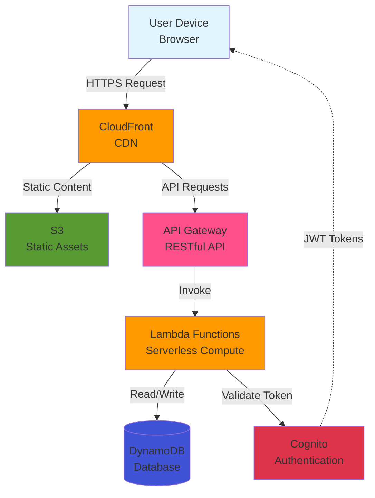
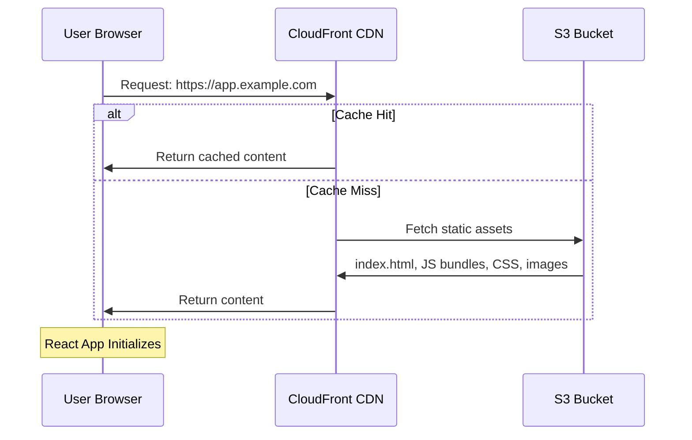
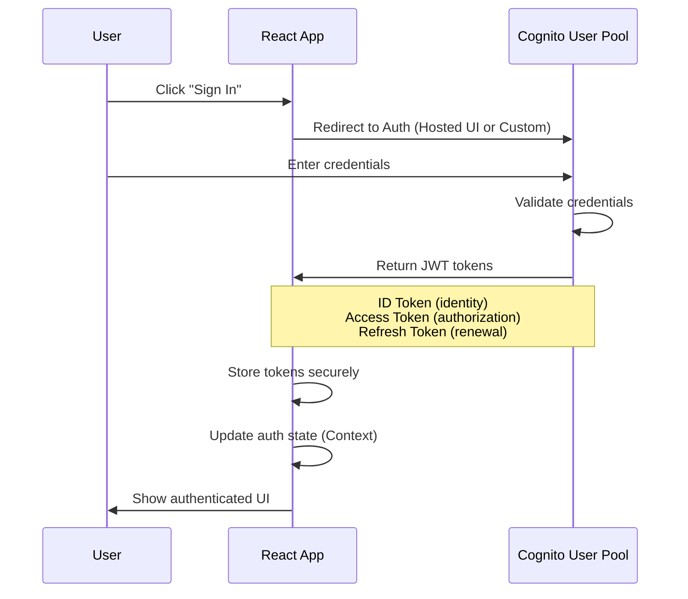
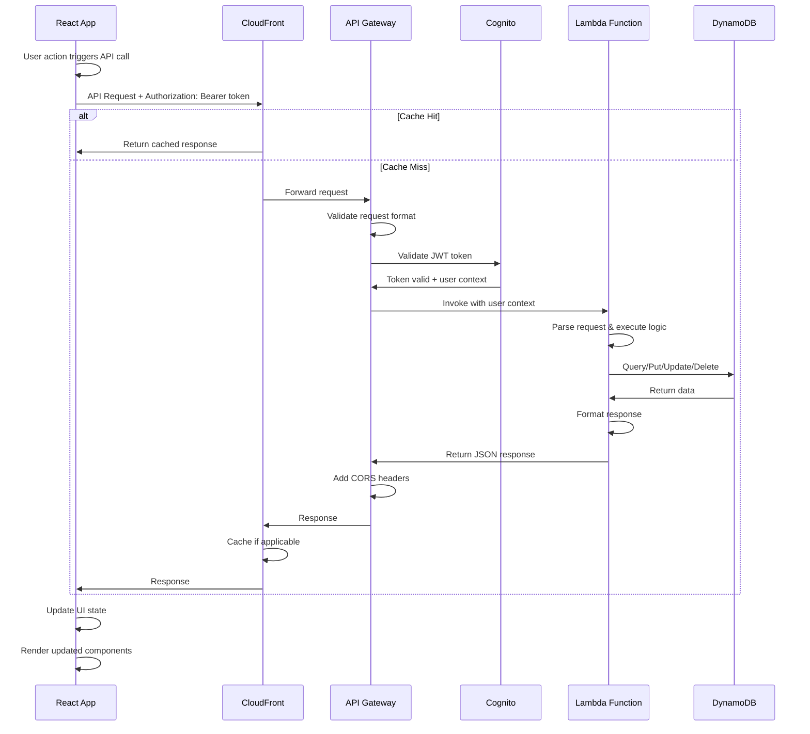
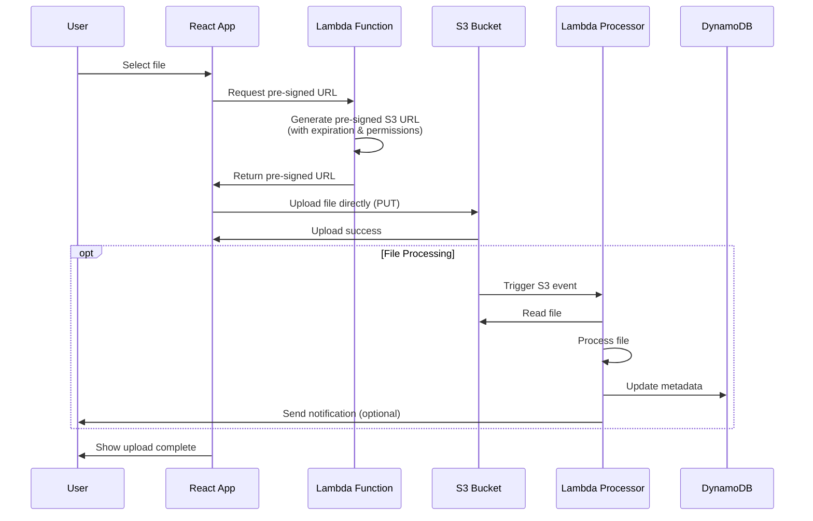
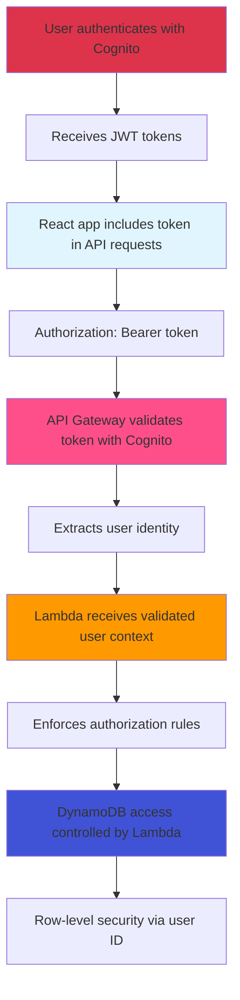
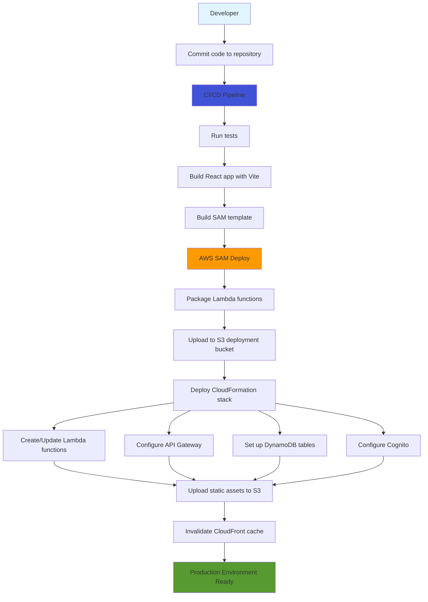

# Architecture Overview

## System Architecture

This application follows a serverless architecture pattern using AWS services, with a React frontend and Lambda-based backend.

## High-Level Architecture

## End-to-End Request Flow

### 1. Initial Page Load (Static Content)

### 2. User Authentication Flow

### 3. API Request Flow (Authenticated)

### 4. File Upload Flow (S3)

## Component Responsibilities

### Frontend (React + TypeScript)

**Responsibilities:**

- User interface rendering
- Client-side routing
- Form validation
- State management
- API communication
- Token management
- Error handling & user feedback

**Key Patterns:**

- Component composition
- Custom hooks for reusable logic
- Context API for global state
- React Query/SWR for data fetching

### CloudFront (CDN)

**Responsibilities:**

- Serve static assets globally
- Cache API responses (when appropriate)
- SSL/TLS termination
- DDoS protection
- Geographic distribution

**Configuration:**

- Origin: S3 bucket for static assets
- Origin: API Gateway for API requests
- Cache behaviors for different paths
- Custom error pages

### API Gateway

**Responsibilities:**

- RESTful API endpoint management
- Request/response transformation
- Rate limiting & throttling
- API versioning
- CORS configuration
- Request validation

**Integration:**

- Lambda proxy integration
- Cognito authorizer for protected routes
- Request/response mapping templates

### Lambda Functions

**Responsibilities:**

- Business logic execution
- Data validation
- Database operations
- External API integration
- File processing
- Background jobs

**Best Practices:**

- Single responsibility per function
- Stateless design
- Environment variable configuration
- Proper error handling
- Logging with CloudWatch

### DynamoDB

**Responsibilities:**

- Persistent data storage
- Fast key-value lookups
- Scalable read/write capacity
- Secondary indexes for queries

**Design Patterns:**

- Single-table design (when appropriate)
- Composite keys (PK + SK)
- GSIs for alternate access patterns
- Optimistic locking with version attributes

### Cognito

**Responsibilities:**

- User registration & authentication
- Password management
- Multi-factor authentication (MFA)
- Social identity federation
- JWT token issuance
- User profile management

**Integration:**

- User Pools for authentication
- Identity Pools for AWS resource access
- Custom attributes for user metadata
- Lambda triggers for custom workflows

### S3

**Responsibilities:**

- Static website hosting
- User-generated content storage
- File uploads/downloads
- Backup storage

**Access Patterns:**

- Public read for static assets
- Pre-signed URLs for secure uploads
- Lifecycle policies for cost optimization
- Versioning for critical data

## Security Flow

### Authentication & Authorization

### Data Flow Security

- **In Transit**: All traffic over HTTPS/TLS
- **At Rest**: DynamoDB encryption enabled
- **Secrets**: Stored in AWS Secrets Manager or Parameter Store
- **IAM Roles**: Least privilege for Lambda execution
- **CORS**: Configured on API Gateway for frontend domain

## Deployment Flow

## Monitoring & Observability

### CloudWatch Integration

- **Lambda Logs**: Automatic logging to CloudWatch Logs
- **API Gateway Logs**: Request/response logging
- **Metrics**: Custom metrics for business KPIs
- **Alarms**: Automated alerts for errors/latency
- **X-Ray**: Distributed tracing for request flows

### Key Metrics to Monitor

- API response times
- Lambda execution duration
- DynamoDB read/write capacity
- Error rates by endpoint
- Authentication success/failure rates
- CloudFront cache hit ratio

## Scalability Considerations

### Automatic Scaling

- **Lambda**: Scales automatically with concurrent requests
- **DynamoDB**: On-demand or provisioned capacity with auto-scaling
- **CloudFront**: Global edge locations scale automatically
- **API Gateway**: Handles scaling automatically

### Performance Optimization

- CloudFront caching for static assets
- API response caching where appropriate
- DynamoDB query optimization with indexes
- Lambda cold start mitigation (provisioned concurrency)
- React code splitting and lazy loading
